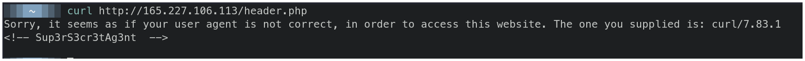
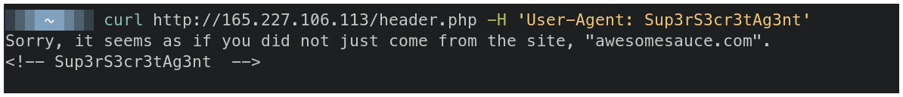
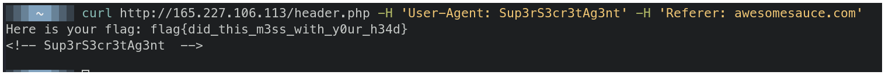

# CTFlearn - Dont't Bump Your Head(er)


## Descripción

Try to bypass my security measure on this site!


## Solución

Este reto se puede hacer completamente desde consola con el comand **curl**.

La página nos responde con un mensaje diciendonos que nuestro **user agent** está incorrecto, pero podemos ver una palabra que está comendata `Sup3rS3cr3tAg3nt`, este debe ser el **user agent** que necesitamos.



Si agregamos una cebecera, y especificamos que el user agent es igual al que obtuvimos anteriormente obtendremos otro mensaje. Este mensaje nos indica que debemos venir desde el sitio **awesomesauce.com**.

```bash
$ curl http://165.227.106.113/header.php -H 'User-Agent: Sup3rS3cr3tAg3nt'
```



Para resolver esto simplemente agregamos otra cabecera con la información que obtuvimos anteriormente.

```bash
$ curl http://165.227.106.113/header.php -H 'User-Agent: Sup3rS3cr3tAg3nt' -H 'Referer: awesomesauce.com'  
```




## Flag

`flag{did_this_m3ss_with_y0ur_h34d}`