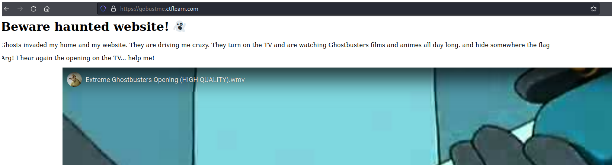
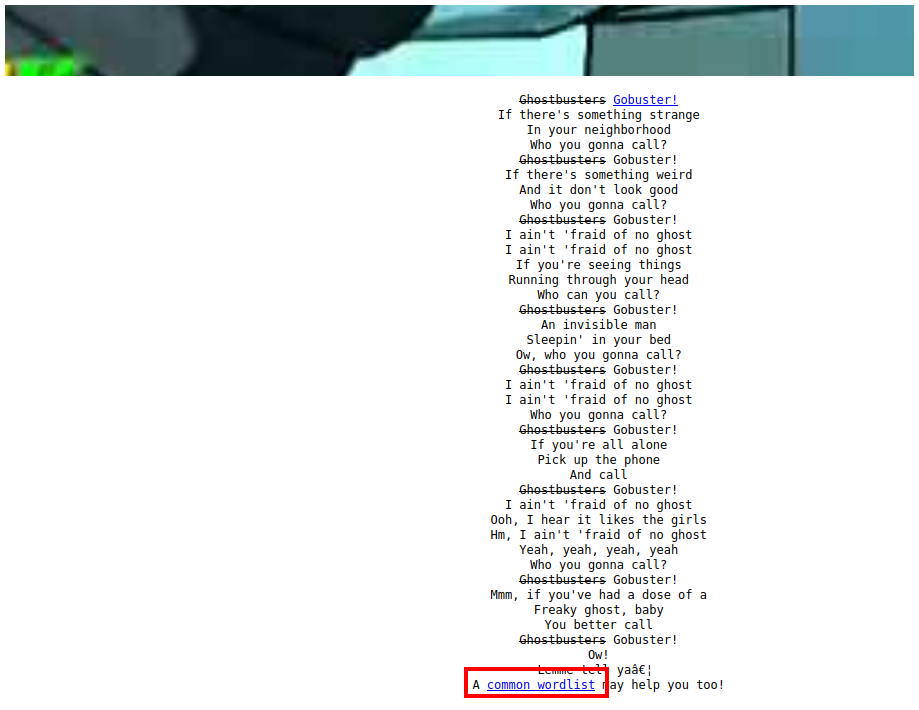
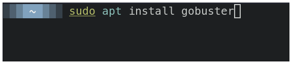
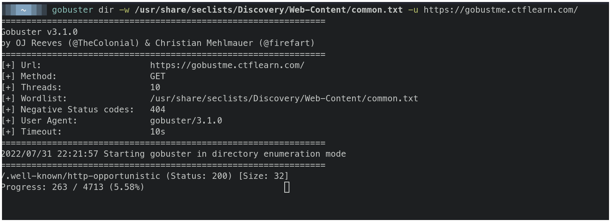
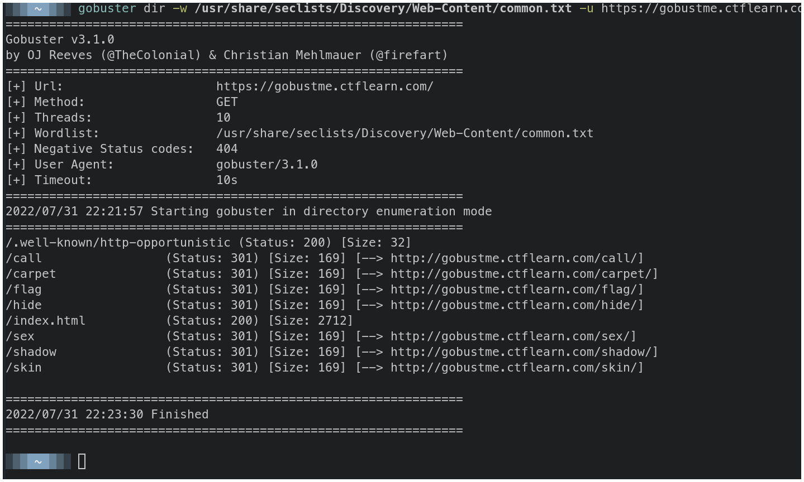
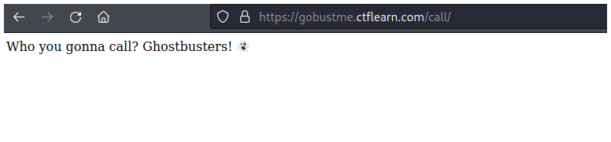
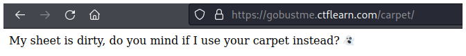
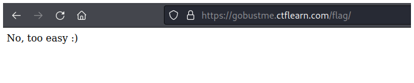
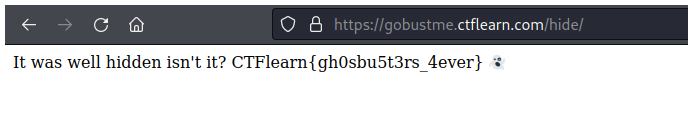

# CTFlearn - Gobustme


## Descripción

Some ghosts made this site 👻, it's a little spooky but theres a bunch of stuff hidden around. 


## Solución

Para este reto debemos usar la herramienta gobuster. O cualquier herramienta para enumerar la verdad, como wfuzz, ffuf, feroxbuster, etc. Pero este reto es más entretenido si usas gobuster.



Primero que todo debes ir al final de la página y veras el diccionario que debes usar.



Una vez que lo hayas descargado y lo tengas a la mano debes instalar gobuster con el siguiente comando.

```bash
sudo apt install gobuster
```



Luego debes especificarle a gobuster que usarás el modo directorio escribiendo `dir`, luego le especificas el diccionario que usarás con `-w common.txt`, y finalmente la URL con `-u https://gobustme.ctflearn.com/`.

```bash
gobuster dir -w /usr/share/seclists/Discovery/Web-Content/common.txt -u https://gobustme.ctflearn.com/
```



Mientras gobuster se ejecuta puedes ver archivos secretos como call, carpet, flag, hide, etc. Después de revisar estos archivos en la página web encontrarás que la flag está en el archivo hide.












## Flag

`CTFlearn{gh0sbu5t3rs_4ever}`