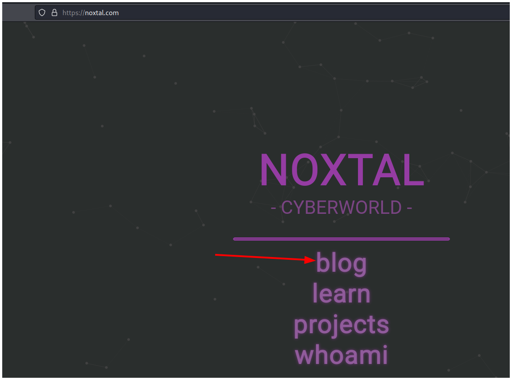
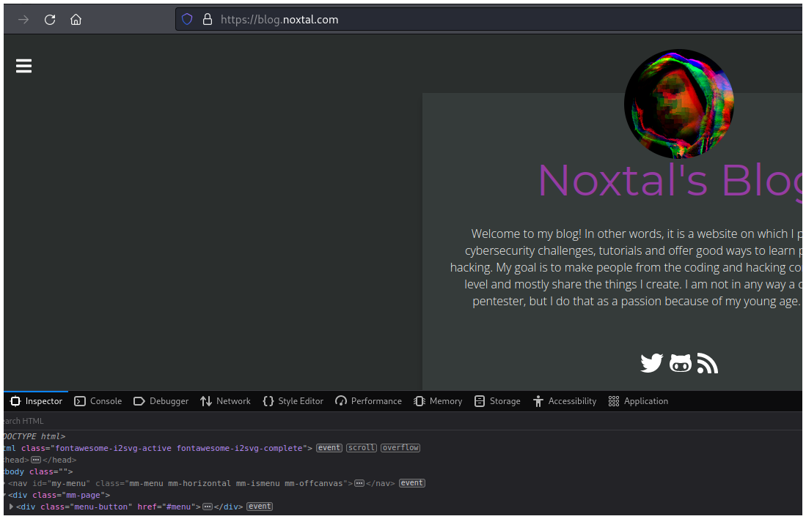
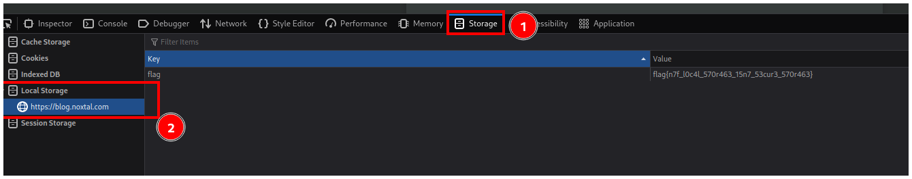

# CTFlearn - My Blog

## Descripción

Hi, I'm Noxtal! I have hidden a flag somewhere in my Cyberworld (AKA blog)... you may find a good application for your memory. ;)

## Hints
- replace the flag{} part with CTFlearn{}.

## Solución

Primero debes ir a su blog.

Luego debes abrir las herramientas de desarrollador.

Después vas a la pestaña **Storage** y en **Local Storage** verás una cookie que en realidad es la flag.

No olvides sustituir **flag{}** por **CTFlearn{}** como dice en el hint de este reto.

## Flag

`CTFlearn{n7f_l0c4l_570r463_15n7_53cur3_570r463}`