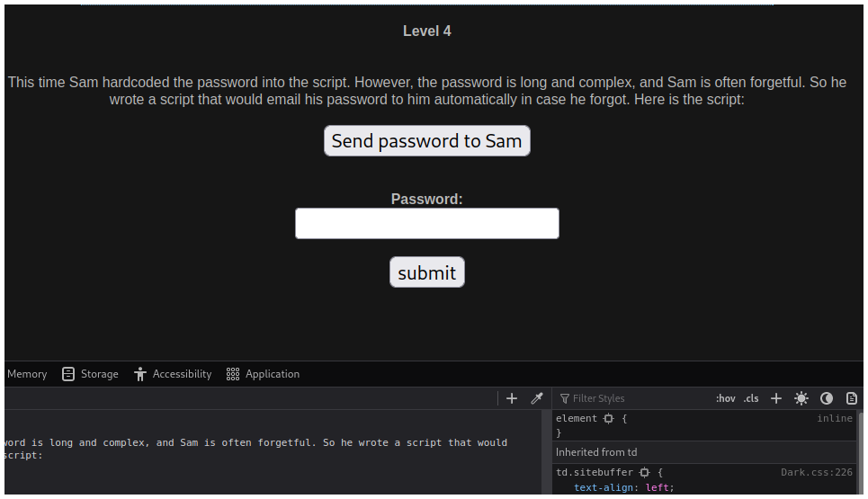
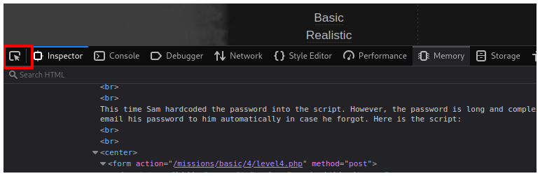
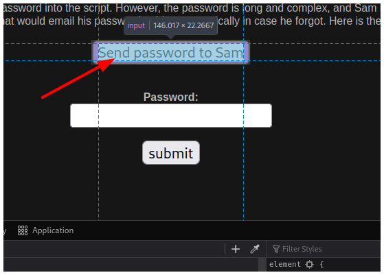
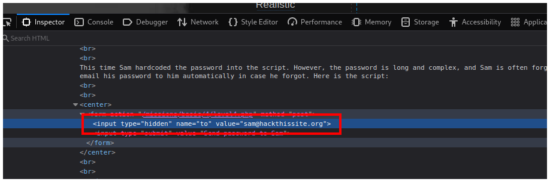
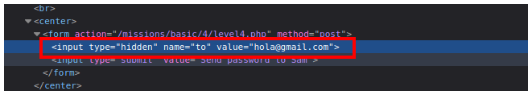
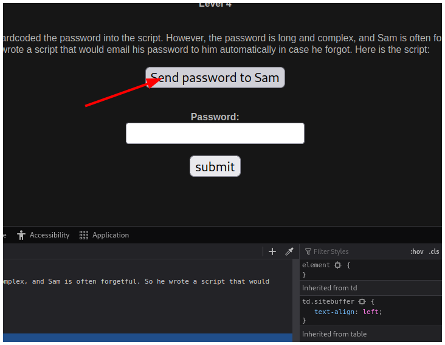
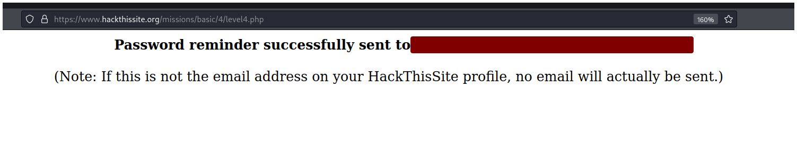
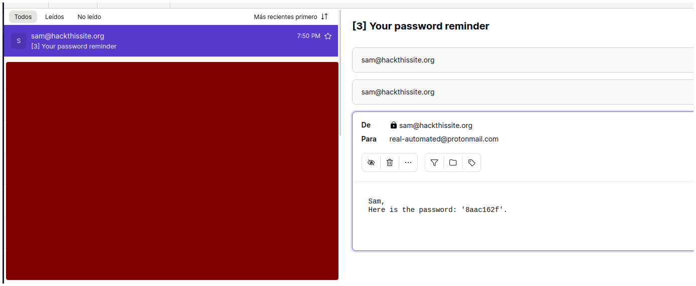
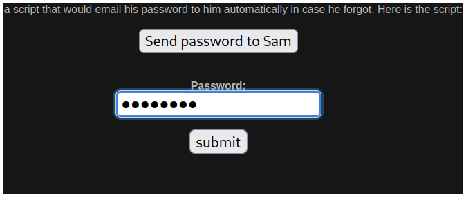
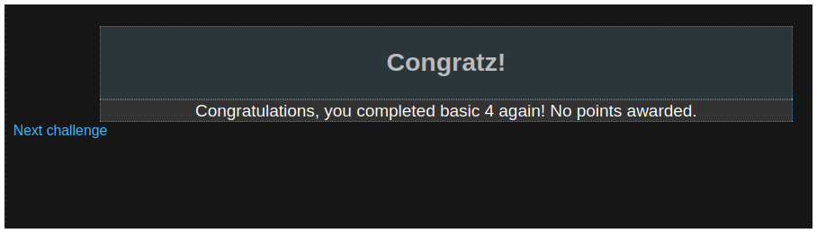

# Hack This Site - Level 4

## Descripción

This time Sam hardcoded the password into the script. However, the password is long and complex, and Sam is often forgetful. So he wrote a script that would email his password to him automatically in case he forgot. Here is the script:

## Solución

Primero abrimos las herramientos de desarrollador.

Luego hacemos click en el ícono de la esquina.

Y seleccionamos el botón de **Send password to Sam**.

Veremos un input que tiene de valor el correo de sam. Debes reemplazar el correo de sam por el correo con el que creaste tu cuenta de HackThisSite.

Por ejemplo, si creaste tu cuenta con el correo **hola@gmail.com** debes escribir eso en el campo de **value**.

Luego haces click en el botón **Send password to Sam**.

Si hiciste todo correcto entonces la página enviará la contraseña a tu correo.

La contraseña es `8aac162f`.

Copiamos la contraseña que nos llego por correo y la pegamos..

Y resolvemos el reto.

