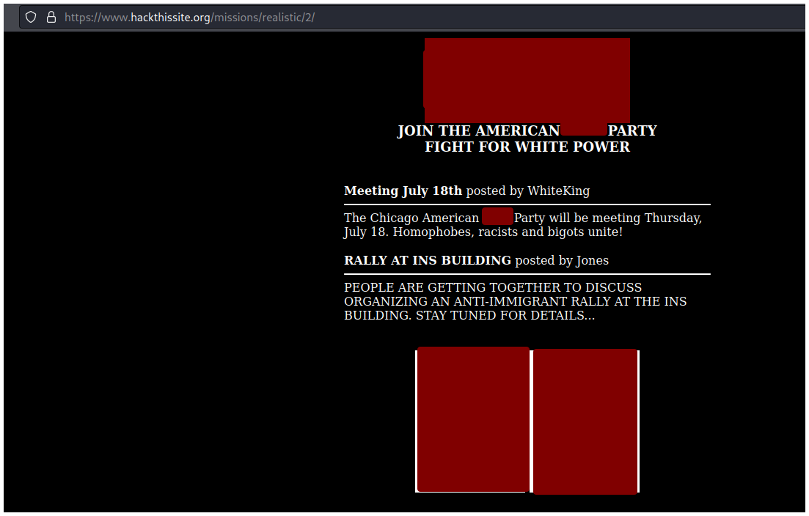
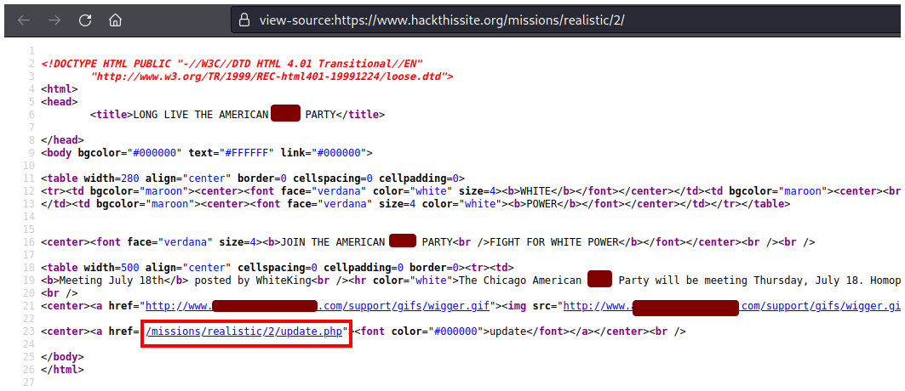
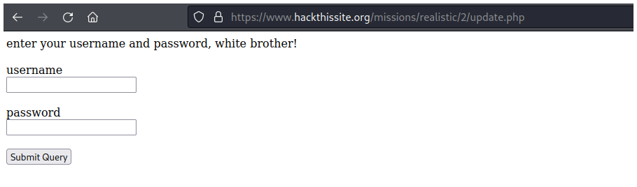
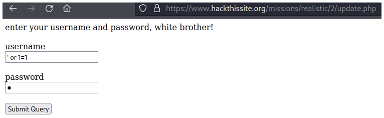

# Hack This Site - Chicago American \*\*\*\* Party


## Descripción

Message: I have been informed that you have quite admirable hacking skills. Well, this racist hate group is using [their website](https://www.hackthissite.org/missions/realistic/2) to organize a mass gathering of ignorant racist bastards. We cannot allow such bigoted aggression to happen. If you can gain access to their administrator page and post messages to their main page, we would be eternally grateful.


## Solución

En la página principal no se observa nada importante más que un montón de imágenes y palabras que tuve que censurar jajajaj.



Vemos el código fuente presionando `CTRL + u` y observamos un archivo `update.php` al final de la página, nuevamente tuve que censurar muchas palabras.



Si navegamos a ese archivo observamos un panel de inicio de sesión.



Ingresamos una inyección SQL en el campo de username, luego hacemos click en el botón **Submit Query** y resolvemos el reto.

```sql
' or 1=1 -- -
```



