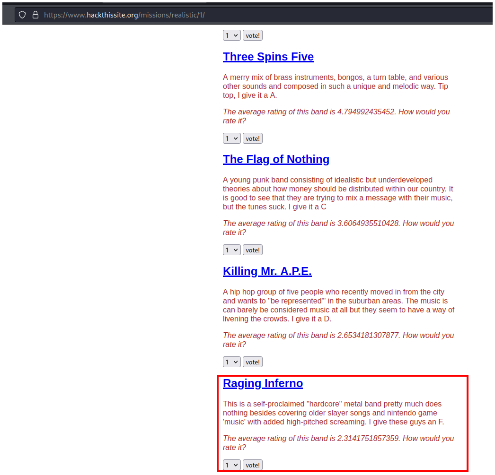
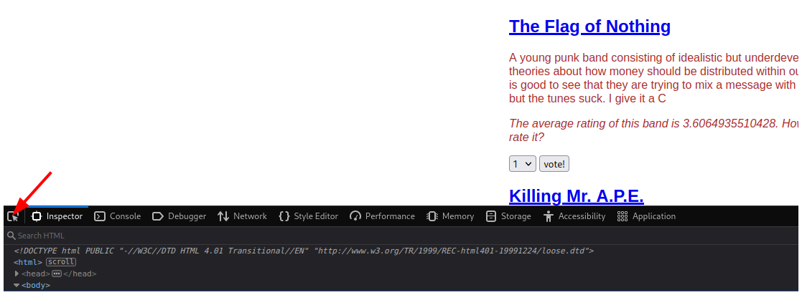
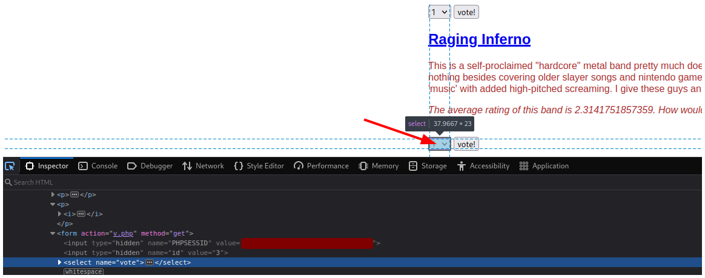
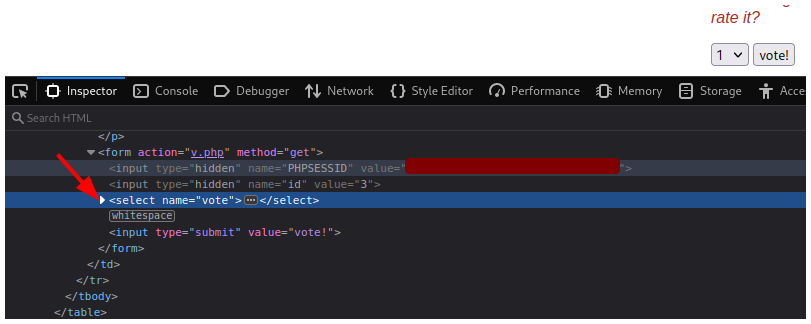
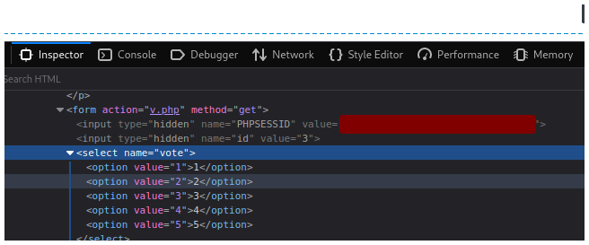
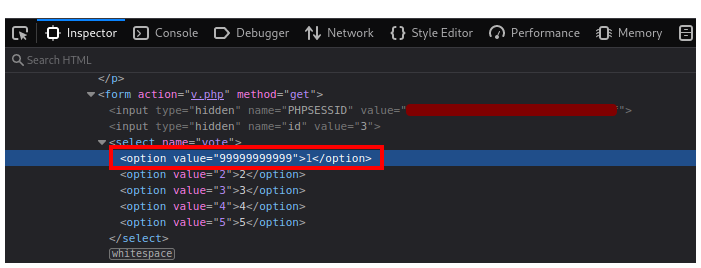
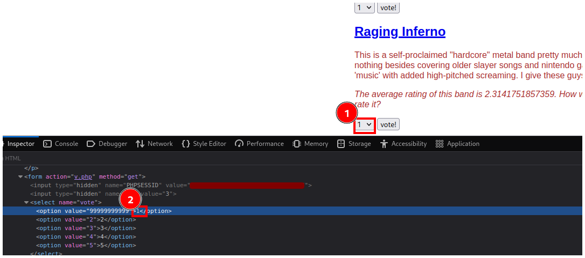
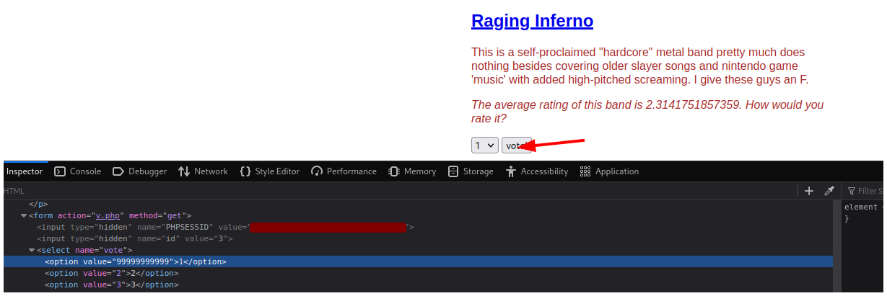

# Hack This Site - Uncle Arnold's Local Band Review

## Descripción

Message: Hey man, I need a big favour from you. Remember that website I showed you once before? [Uncle Arnold's Band Review Page](https://www.hackthissite.org/missions/realistic/1/)? Well, a long time ago I made a $500 bet with a friend that my band would be at the top of the list by the end of the year. Well, as you already know, two of my band members have died in a horrendous car accident... but this ass hole still insists that the bet is on!  
I know you're good with computers and stuff, so I was wondering, is there any way for you to hack this website and make my band on the top of the list? My band is Raging Inferno. Thanks a lot, man!

## Solución

El objetivo es agregar muchos votos a la banda Raging Inferno con el objetivo de que sea la banda más votada de la página y puedan ganar una apuesta. 

Al final de la página vemos las opciones para votar a la banda.

Abrimos las herramientas de desarrollador y hacemos click en el botón de la esquina izquierda.

Luego seleccionamos el campo para indicar la cantidad de votos.

Vemos en el **Inspector** que seleccionamos un campo select y le hacemos click.

Se despliengan las distintas opciones de voto que tenemos, podemos dar desde 1 voto hasta 5 votos.

Según la página el máximo son 5 votos, pero nosotros cambiaremos el valor a un número gigante.

Debemos tener en cuenta que si editamos el valor de la primera opción, debemos seleccionar la primera opción en la página antes de enviar nuestros votos.

Hacemos click en el botón **vote!** y resolvemos el reto.

