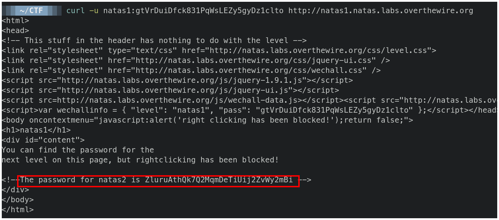

# OverTheWire - Natas 0 -> 1


# Información

```
Username: natas1
Password: gtVrDuiDfck831PqWsLEZy5gyDz1clto
URL:      http://natas1.natas.labs.overthewire.org
```


## Solución

Usamos el comnda curl y el parámetro `-u` para ingresar el usuario y contraseña que obtuvimos en el reto anterior.

```bash
curl -u natas1:gtVrDuiDfck831PqWsLEZy5gyDz1clto http://natas1.natas.labs.overthewire.org
```

El comando nos responde con el código fuente de la página, y vemos al final que en un comentario se encuentra la centraseña para el siguiente reto.




# Contraseña

`ZluruAthQk7Q2MqmDeTiUij2ZvWy2mBi`