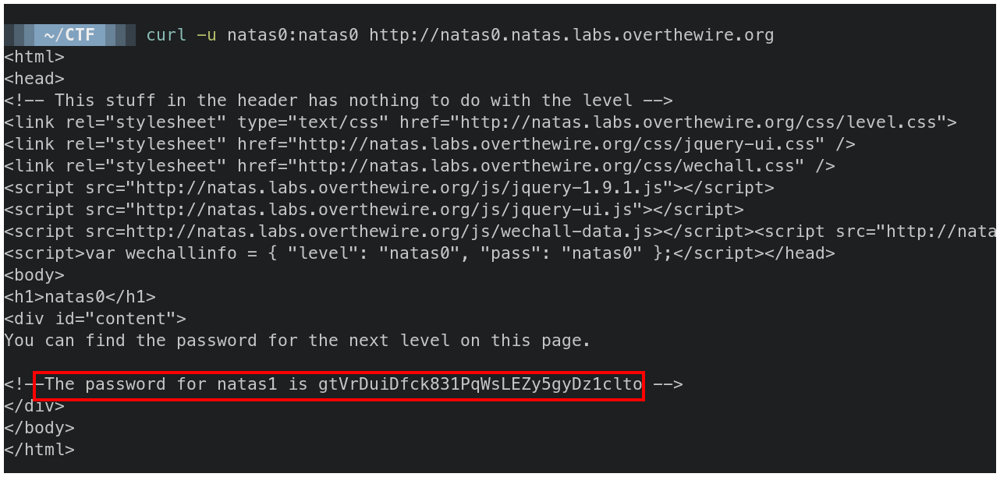

# OverTheWire - Natas 0


## Solución

Ejecutamos curl con el parámetro `-u` para ingresar el nombre de usuario y contraseña y la url al final.

```bash
curl -u natas0:natas0 http://natas0.natas.labs.overthewire.org
```

El comando nos responde con el código fuente de la página y la contraseña se encuentra comentada al final.




## Contraseña 

`gtVrDuiDfck831PqWsLEZy5gyDz1clto`