# PortSwigger - Auth Vulnerabilities

## Lab: Username enumeration via different responses

## Solución

Primera hacemos click en el botón **My account**.

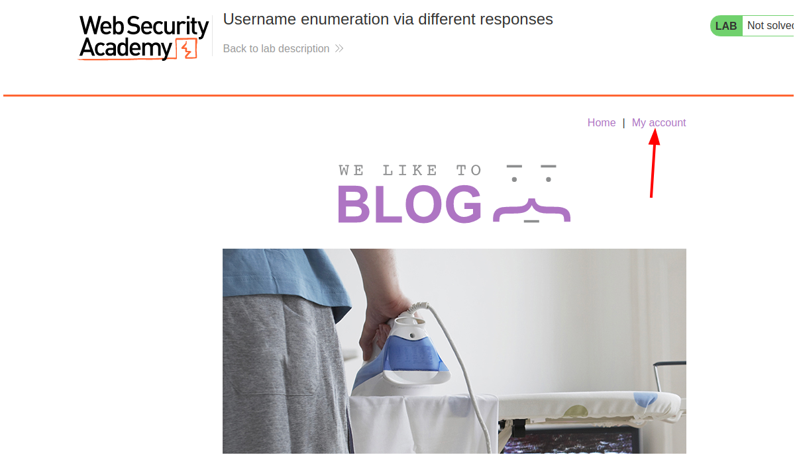

Ingresamos cualquier cosa en el panel de login.

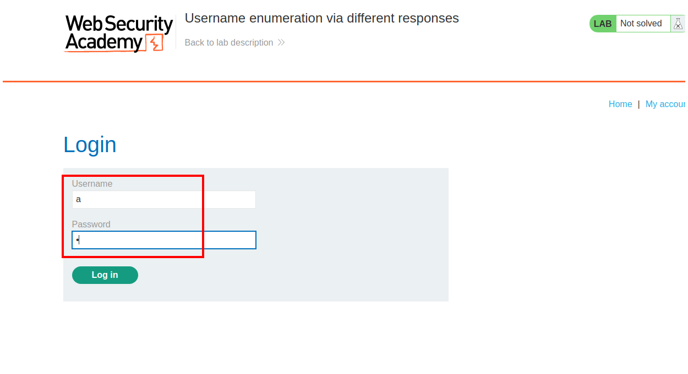

Luego en Burpsuite hacemos click en **Intercept is off** para que quede en **Intercept is on**.

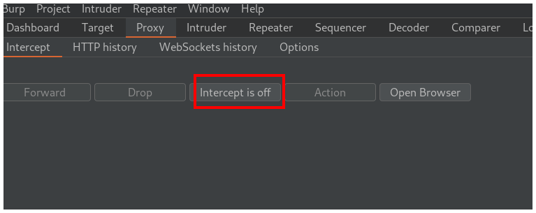

Debería quedar así

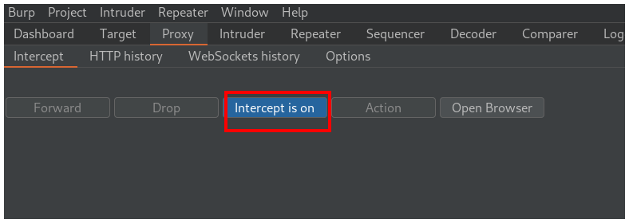

Después en la página web hacemos click en **Log in**.

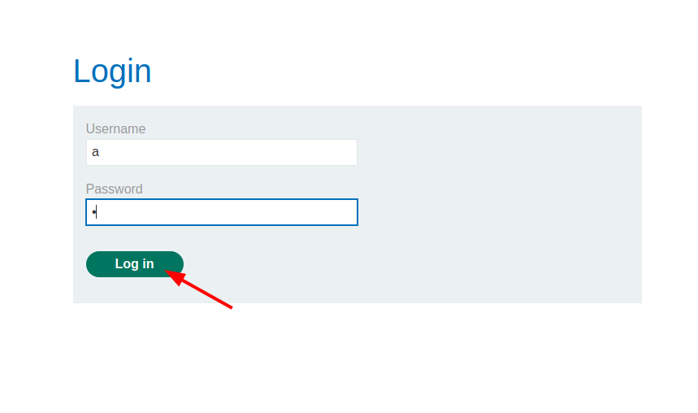

Vemos que interceptamos la petición correctamente.

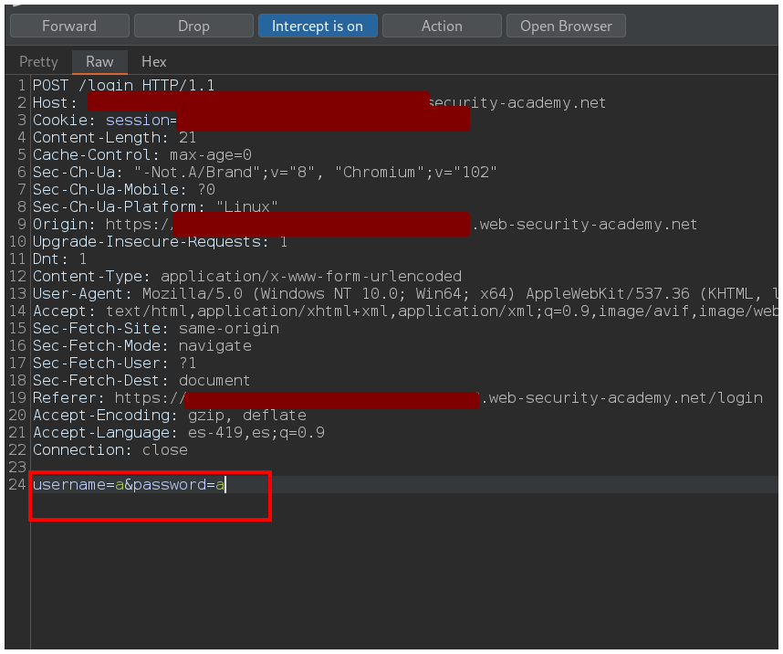

Enviamos la petición a la pestaña **Intruder** y hacemos click en el botón **Clear*.

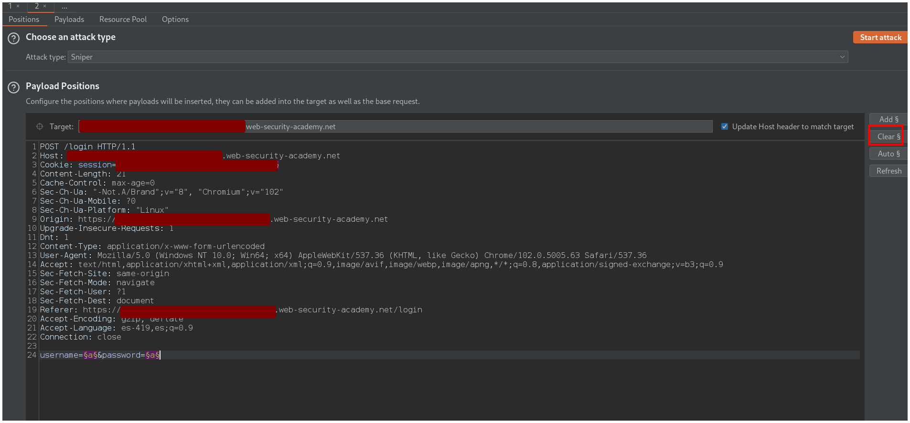

Luego remarcamos la que pusimos en **username** y hacemos click en el botón **Add**.

Debería verse así:

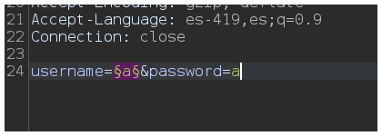

Primero debemos copiar la [lista de usuarios](https://portswigger.net/web-security/authentication/auth-lab-usernames), luego vamos a la pestaña **Payloads** y hacemos click en el botón **Paste**.

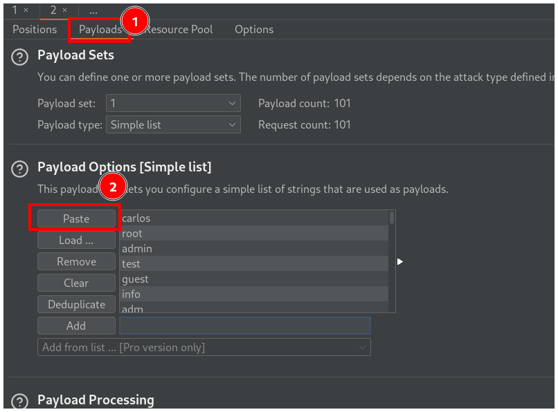

Después hacemos click en el botón **Start attack**.

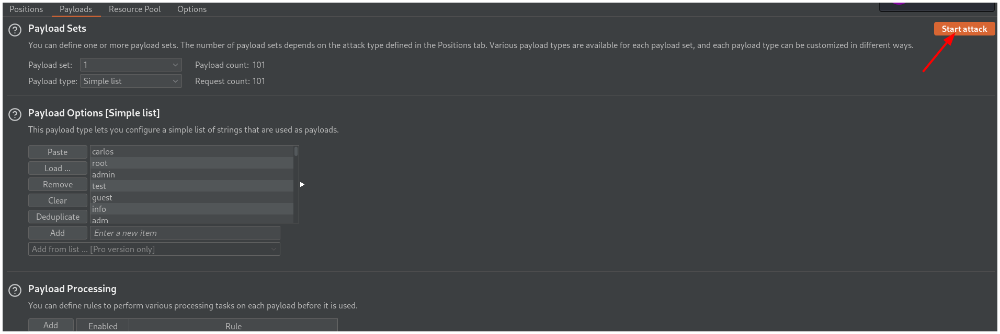

Esperamos un poco y vemos una petición que tiene un largo distinto al resto. Si inspeccionamos haciendo click vemos que el usuario está correcto pero la contraseña es incorrecta.

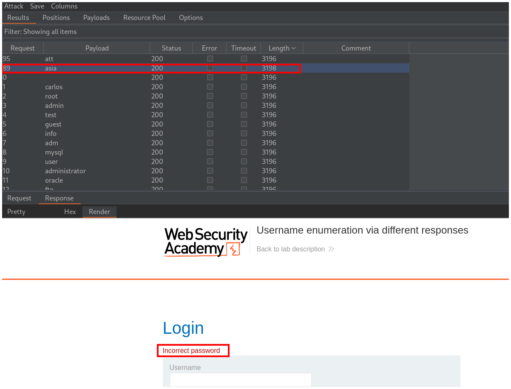

Volvemos a la pestaña **Positions** y hacemos click en el botón **Clear**.

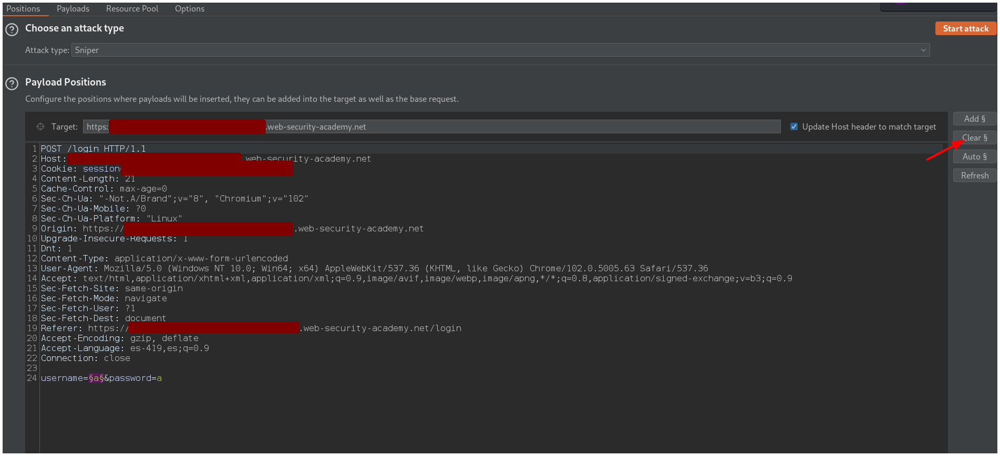

Similar a lo anterior pero ahora seleccionamos el campo de **password** y luego en el botón **Add**.

Debemos cambiar el campo de usuario por el usuario que encontramos anteriormente y la petición debería verse así:

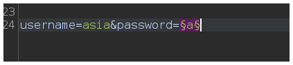

Volvemos a la pestaña **Payloads** y hacemos click en **Clear**.

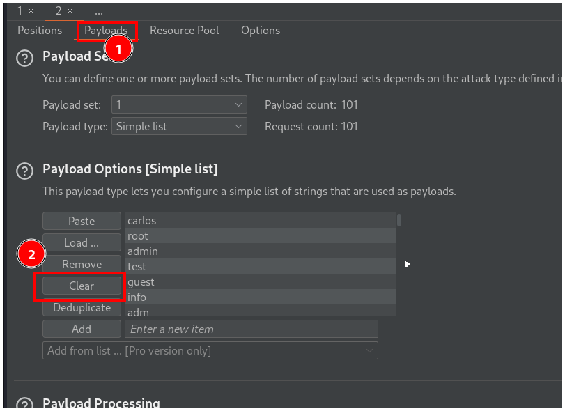

Ahora copiamos el [listado de contraseñas](https://portswigger.net/web-security/authentication/auth-lab-passwords) que nos indica el laboratorio, hacemos click en **Paste** y finalmente hacemos click en **Start attack**.

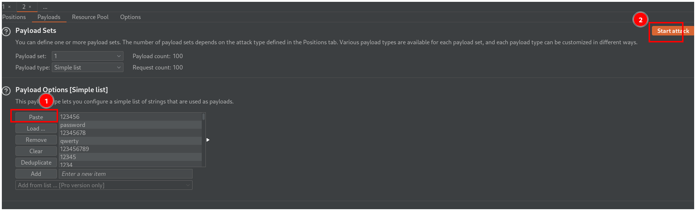

Esperamos unos minutos y vemos una petición distinta a las otras, esta es la contraseña.

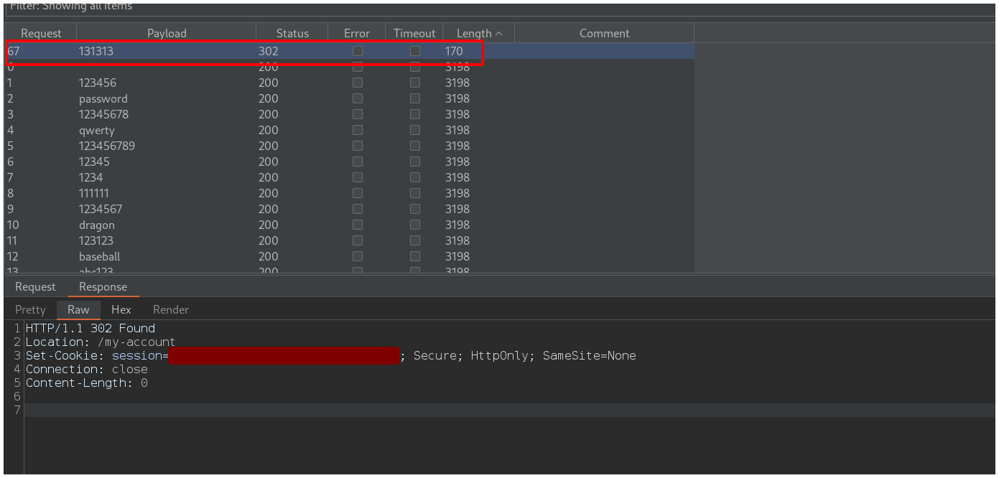

Recuerda dejar de interceptar las peticiones haciendo click en **Intercept is on**.

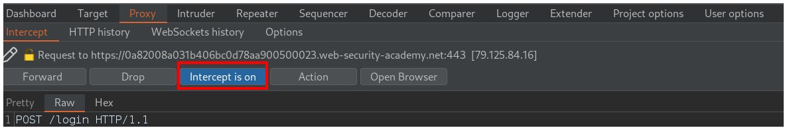

Debería quedar así.

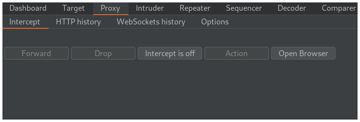

Ingresa tus credenciales en el panel de login.

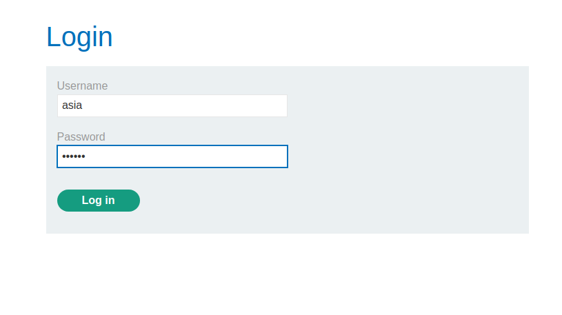

Y resolvemos el laboratorio.

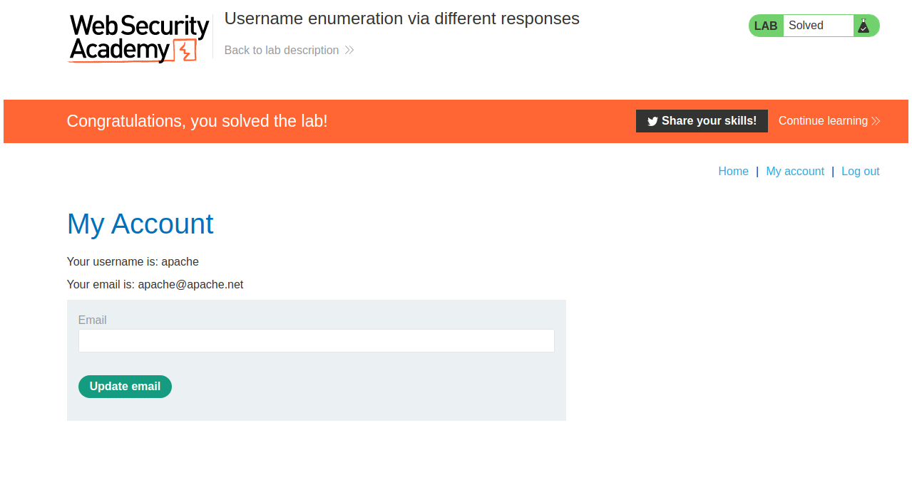