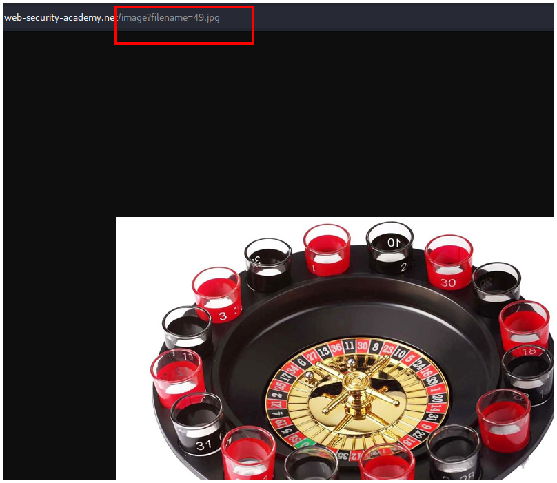
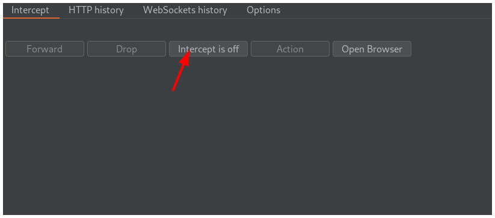
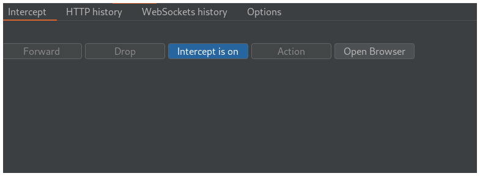
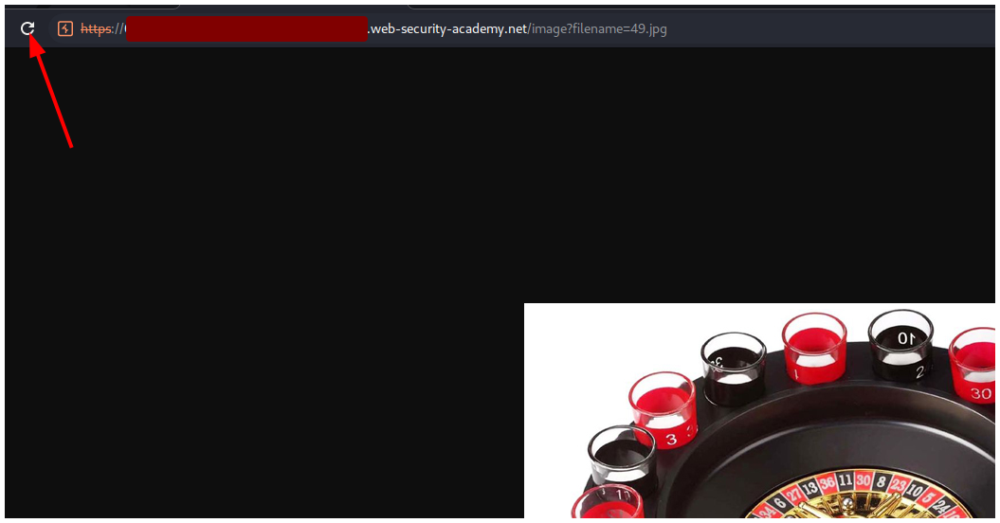
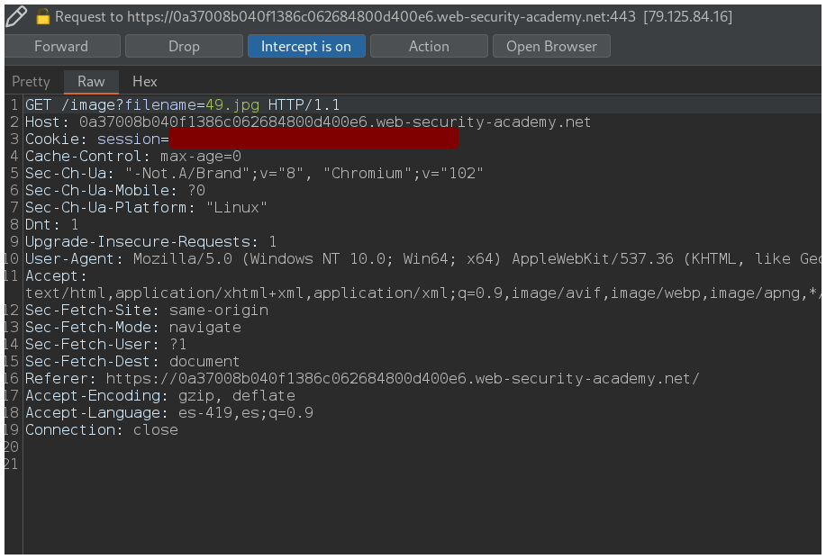
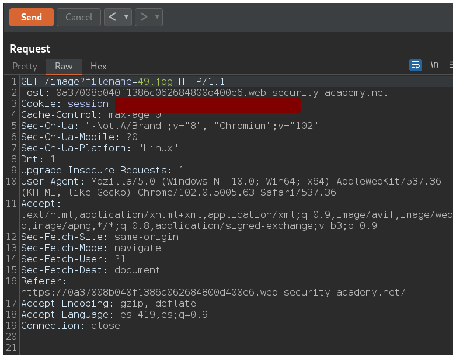
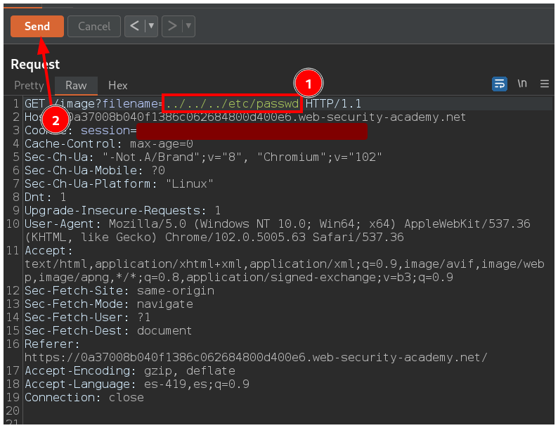
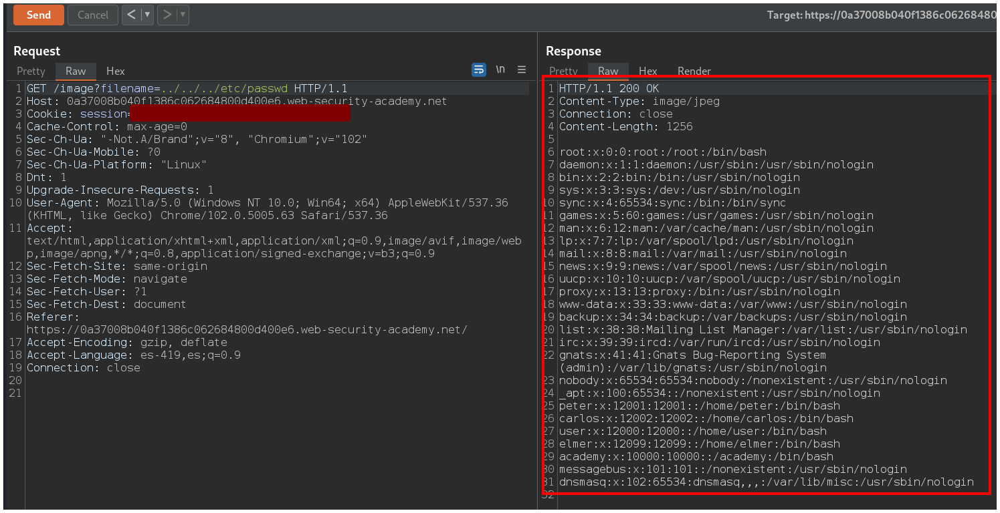
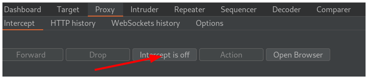
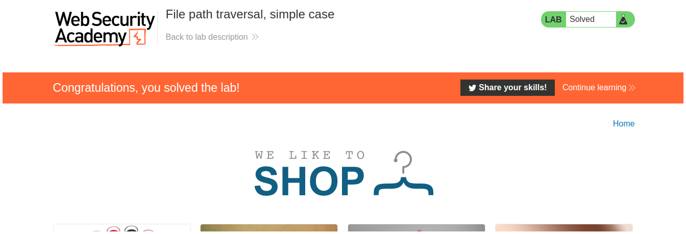

# PortSwigger - Directory traversal

## Lab:  File path traversal, simple case

## Solución

Primero hacemos click derecho y abrimos la imagen en una nueva pestaña.

Notamos en la url que se muestra un parametro que necesito un nombre de archivo.

Si vamos a Burpsuite e interceptamos la petición.

Y recargamos la página.

Vemos la peticón y la enviamos a la pestaña **Repeater** presionando `CTRL + R`.

Cuando estemos en la pestaña **Repeater** modificamos el valor del parámetro `filename` por `../../../etc/passwd` y hacemos click en el botón**Send**.

Observamos en la pestaña **Response** el archivo **/etc/passwd**.

Vamos de nuevo a la pestaña **Proxy** y hacemos click en **Intercept is on** para que quede en **Intercept is off** y así dejemos de interceptar la petición.

Volvemos a la página y resolvemos el laboratorio.

