# PortSwigger - Directory traversal

## Lab: File path traversal, traversal sequences blocked with absolute path bypass

## Solución

Primero haces click derecho sobre una imágen y luego la abres en una pestaña nueva.

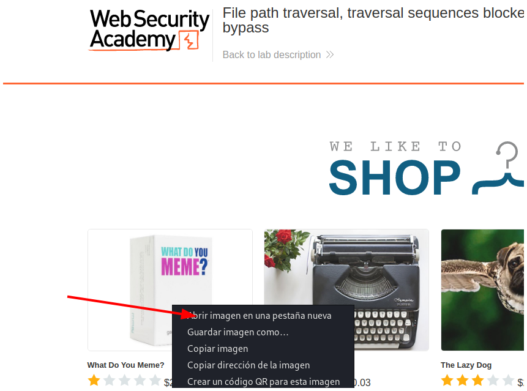

Puedes notar un parámetro que necesita como valor el nombre de un archivo.

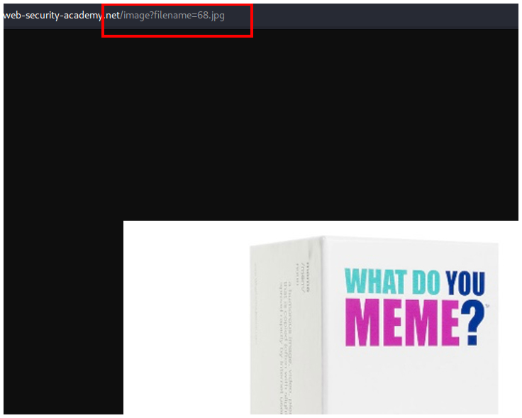

Te vas a Burpsuite y haces click en **Intercept is off** para empezar a interceptar la petición.

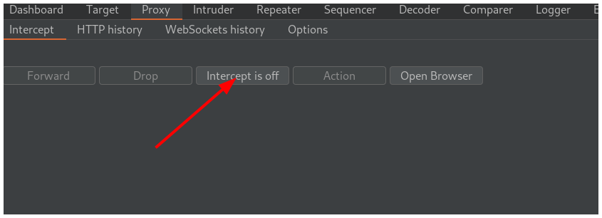

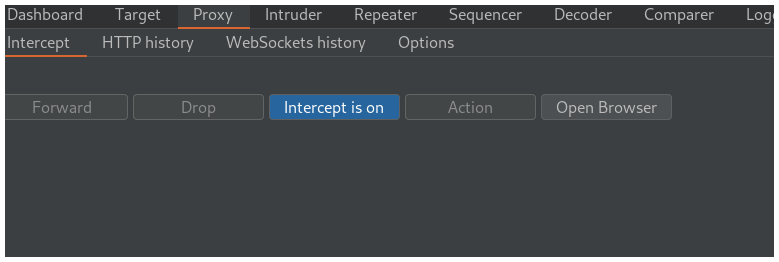

Luego te vas al navegador y recargas la página.

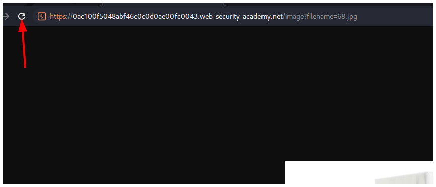

Interceptas la petción y la envías a la pestaña **Repeater** presionando las teclas `CTRL + R`.

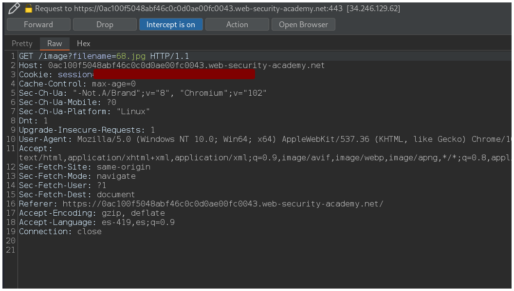

En la pestaña **Repeater** modificas el valor del parámetro por `/etc/passwd` y apretas el botón **Send**.

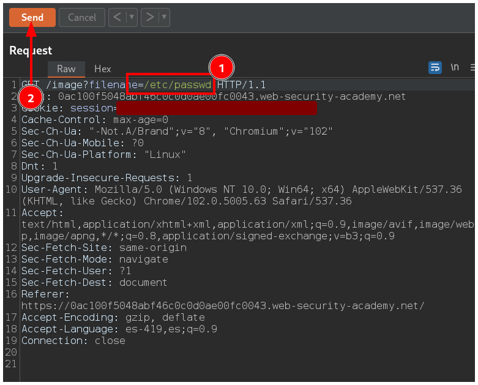

Y puedes ver la respuesta de la petción a la derecha que muestra el contenido del `/etc/passwd`.

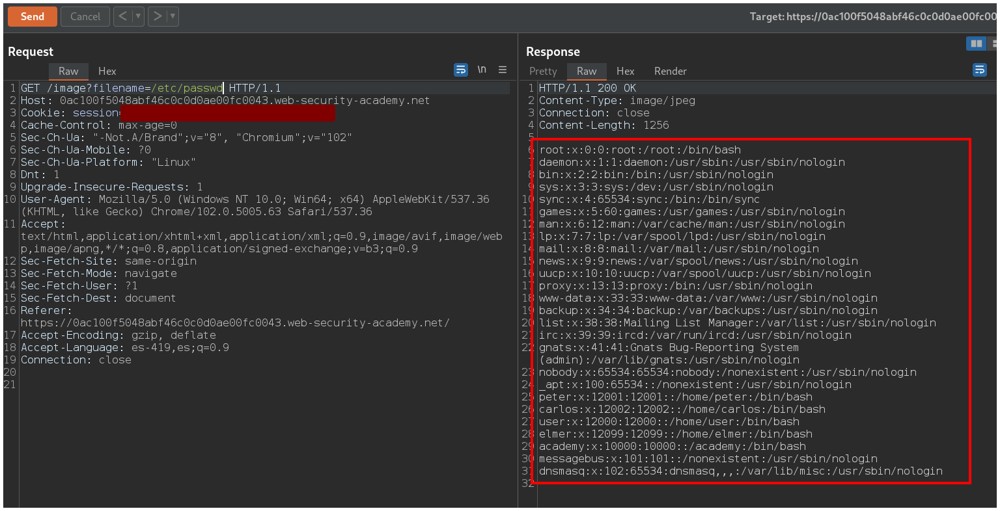

Dejas de interceptar la petición en la pestaña **Proxy** haciendo click en el botón **Intercept is on**.

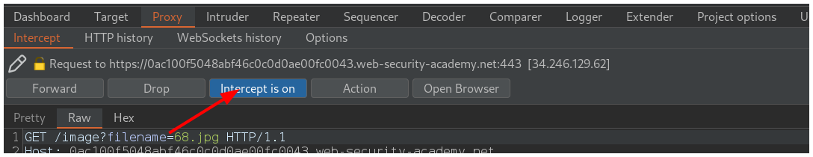

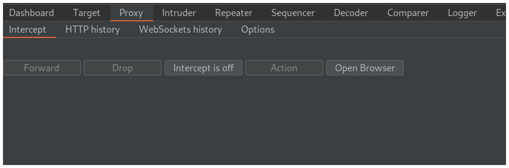

Vuelves al navegador y terminas el laboratorio.

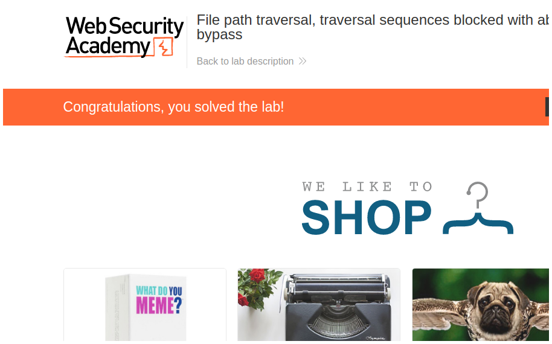

