# PortSwigger - Directory traversal

## Lab: File path traversal, traversal sequences stripped non-recursively

## Solución

Primera hacemos click derecho sobre una imágen y la abrimos en una pestaña nueva.

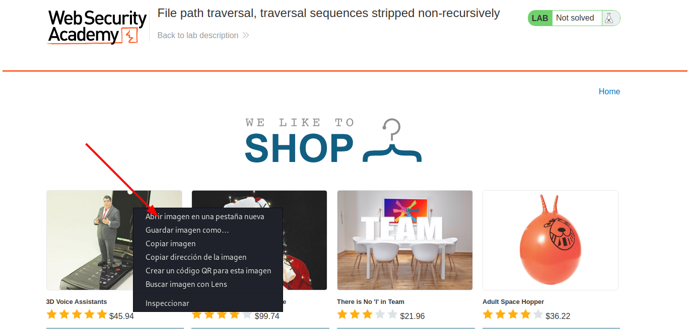

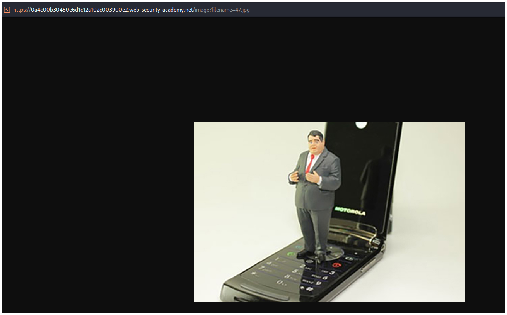

En Burpsuite vamos a la pestaña **Proxy** e interceptamos las peticiones haccienndo click en el botón **Intercept is off**, si se pone de color azul estará interceptando.

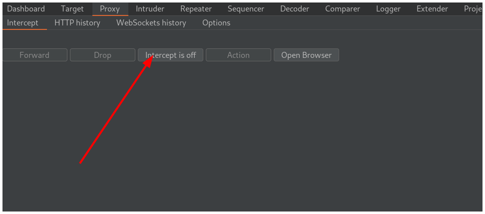

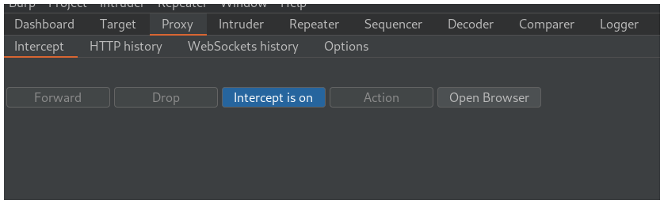

Vamos a la imagen y recargamos la página.

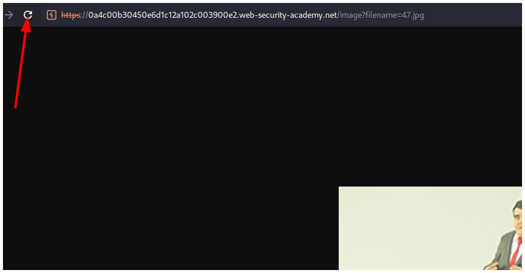

Vemos que interceptamos la petición y la enviamos a la pestaaña **Repeater** presionando los botones `CTRL + R`.

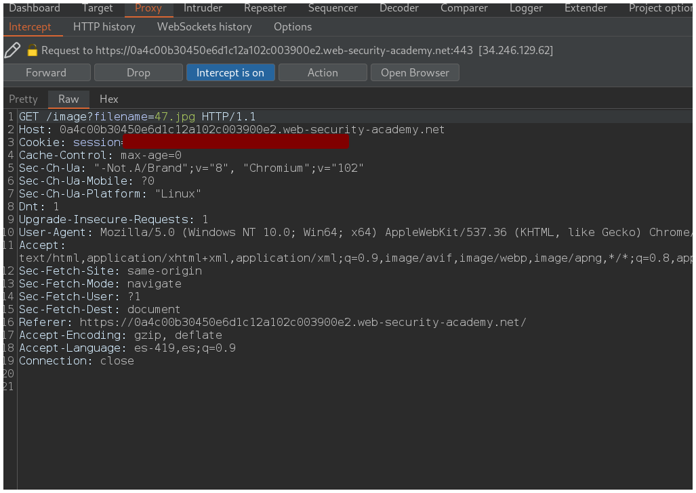

Vamos a la pestaña **Repeater** y reemplazamos el nombre de la imágen.

El filtro de la página solo borra dos puntos y una barra. Entonces, si escribimos `....//` la página borrará dos puntos y una barra dejando el payload así:`../`.

Nuestro payload final es: `....//....//....//etc/passwd`.

Lo pegamos y hacemos click en el botón **Send**.

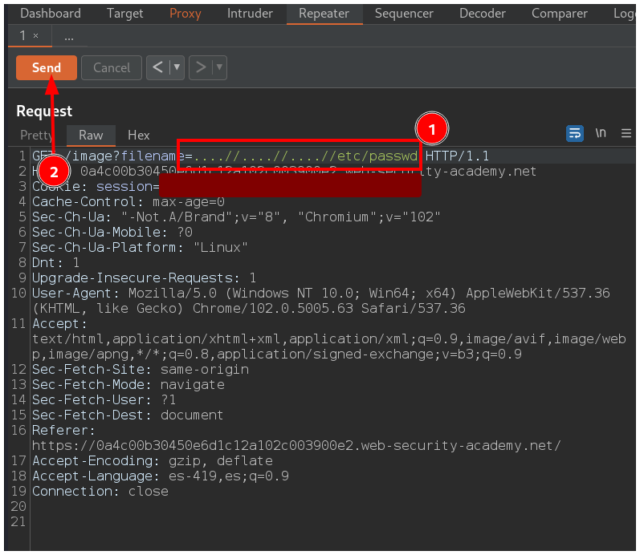

Vemos que en la respuesta está el `/etc/passwd`.

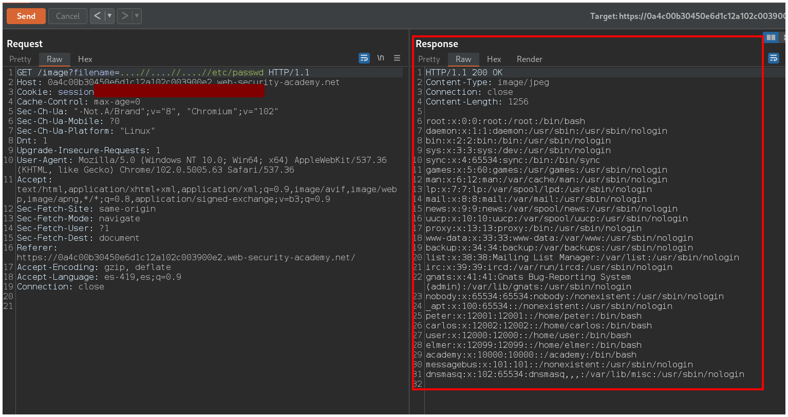

Volvemos a la pestaña **Proxy**  y para dejar de interceptar el tráfico hacemos click en **Intercept is on**.

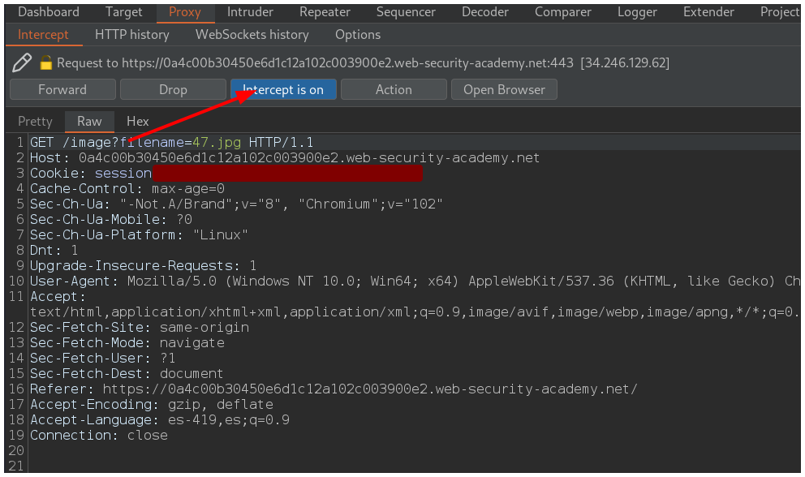

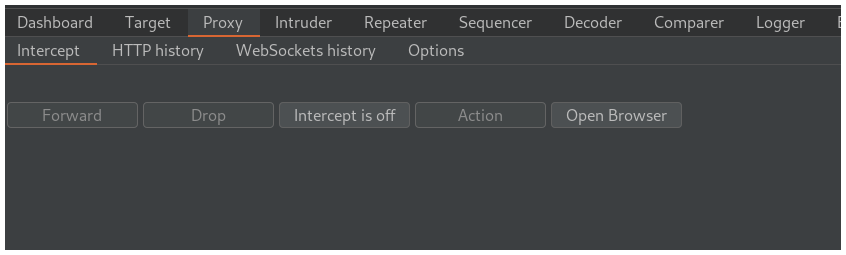

Volvemos a la página y resolvemos el laboratorio.

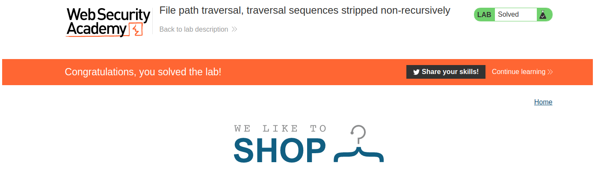

