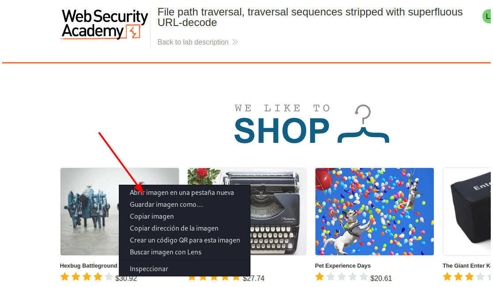
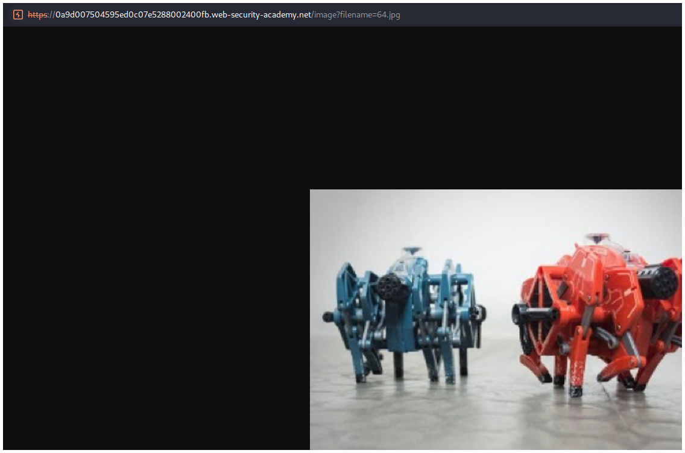
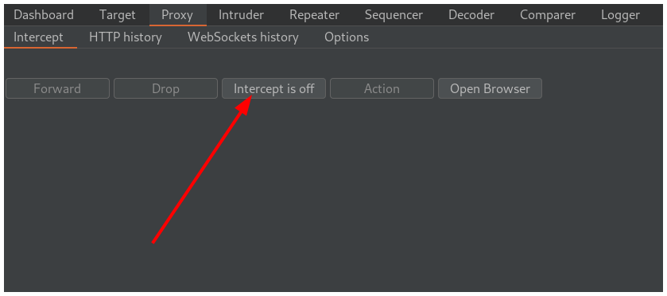
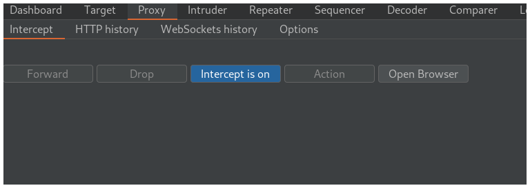
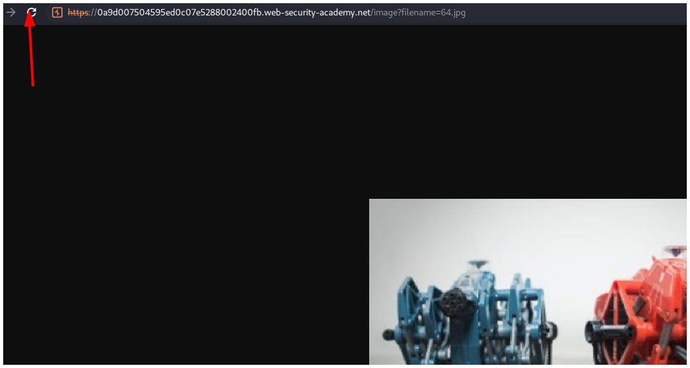
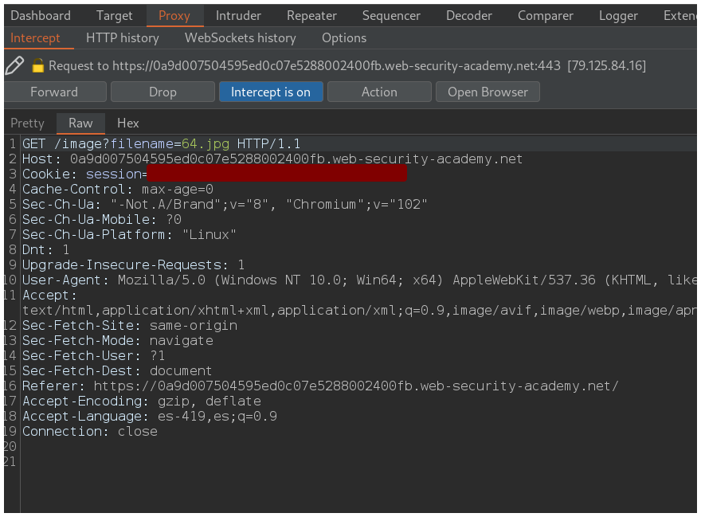
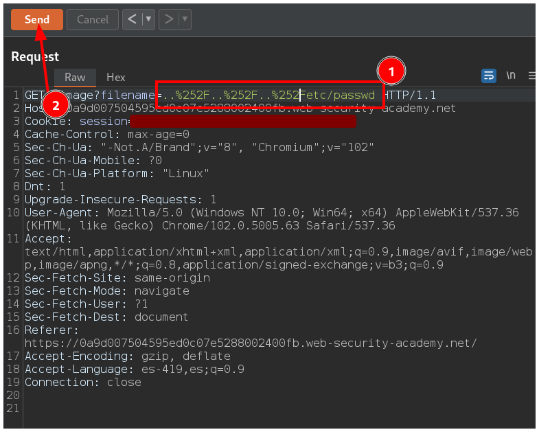
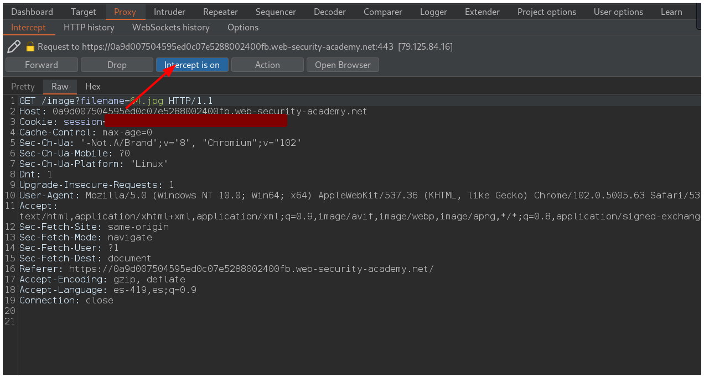
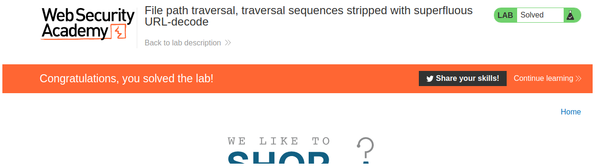

# PortSwigger - Directory traversal

## Lab: File path traversal, traversal sequences stripped with superfluous URL-decode

## Solución

Primero hacemos click derecho sobre una imágen y la abrimos en una pestaña nueva.

Luego interceptamos las peticiones en Burpsuite haciendo click en el botón **Intercept is off** para que cambie a color azul.

Luego vamos a la pestaña del navegador donde está la imágen y recargamos la página.

Vemos que interceptamos la petición y la enviamos a la pestaña **Repeater** presionando los botones `CTRL + r`.

Cambiamos el nombre de la imágen por nuestro payload `..%252F..%252F..%252Fetc/passwd` y enviamos la petición.  

Vemos el archivo en pestaña **Response**.

Volvemos a la pestaña **Proxy** en Burpsuite y hacemos click en el botón **Intercept is on** para dejar de interceptar las peticiones.

Volvemos al navegador y resolvemos el laboratorio.

