# PortSwigger - Directory traversal

## Lab: File path traversal, validation of file extension with null byte bypass

## Solución

Hacemos click derecho sobre una imagen y la abrimos en una pestaña nueva.

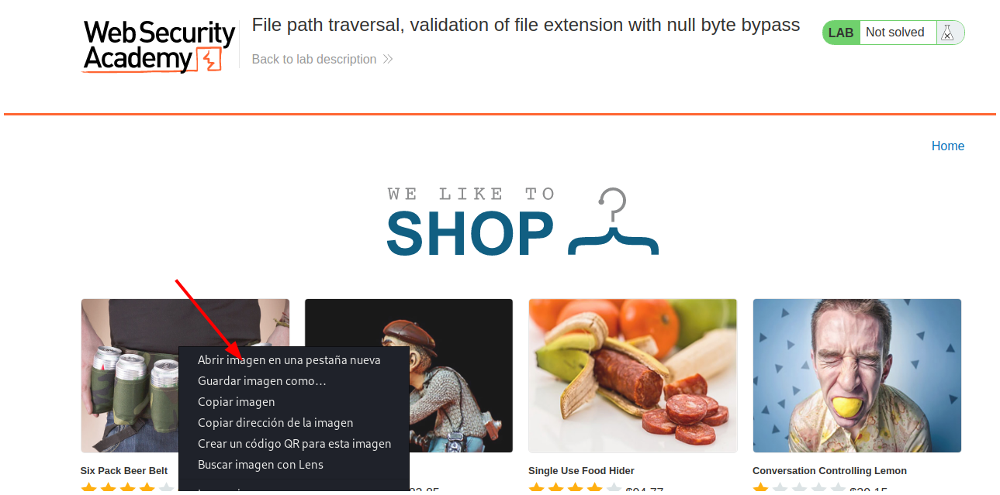

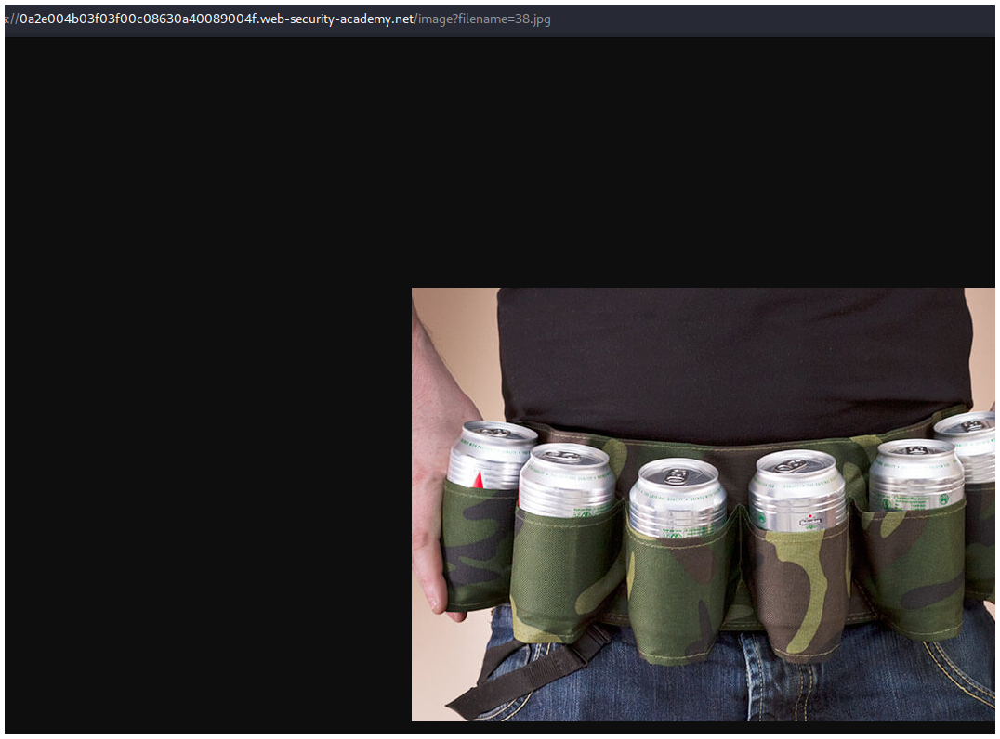

Luego vamos a Burpsuite e interceptamos las peticiones haciendo click en el botón **Intercept is off** para que se ponga de color azul.

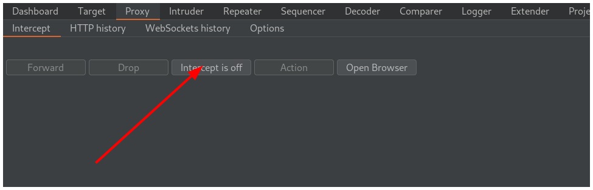

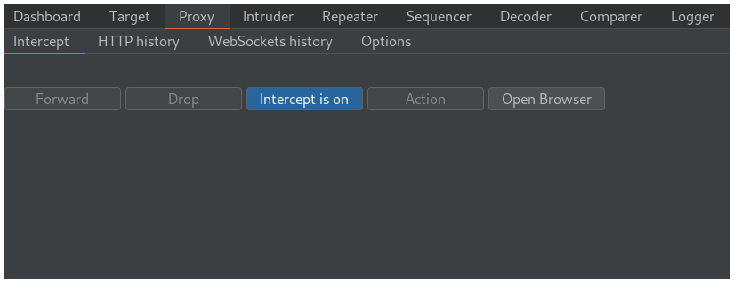

Ahora vamos a la pestaña en el navegador donde está la foto y recargamos.

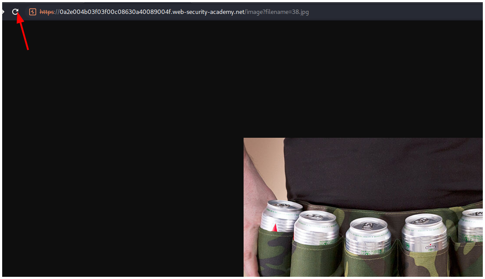

Vemos que interceptamos la petición y la enviamos a la pestaña **Repeater** haciendo click derecho y **Send to repeater** o presionando los botones `CTRL + r`.

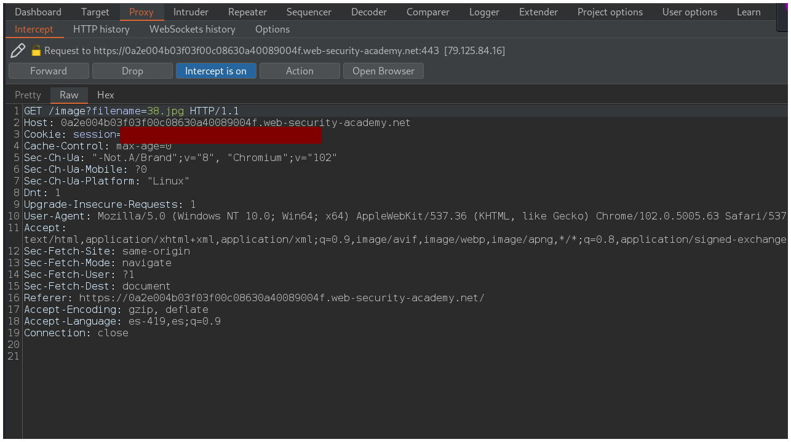

Vamos a la pestaña **Repeater** y modificamos el valor de `filename` por `../../../etc/passwd%00.png`.

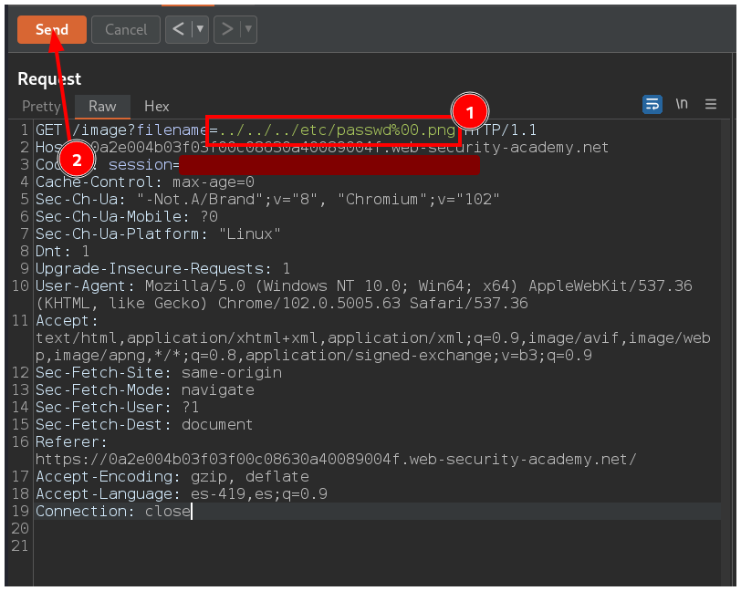

Vemos el contenido del archivo en la pestaña **Response**.

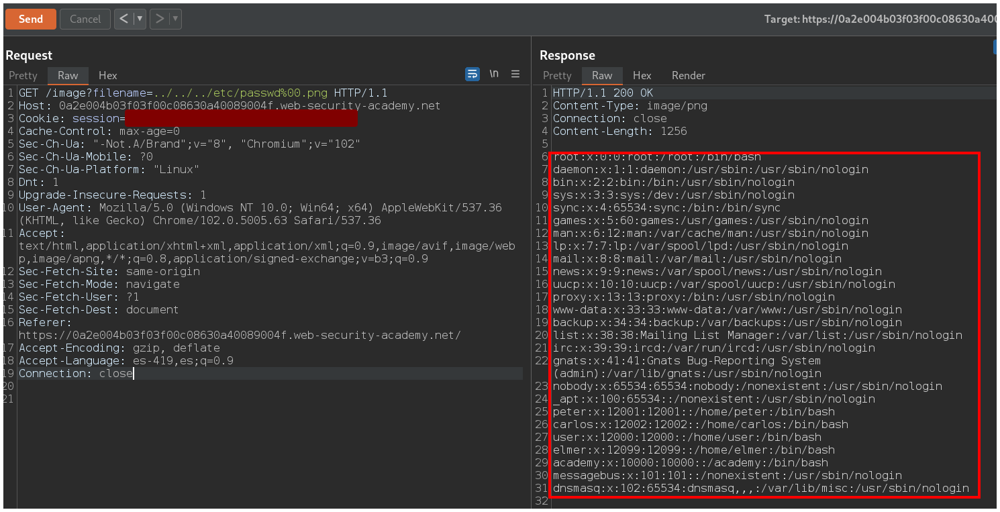

Volvemos a la pestaña **Proxy** y hacemos click en el botón **Intercept is on** para dejar de interceptar las peticiones.

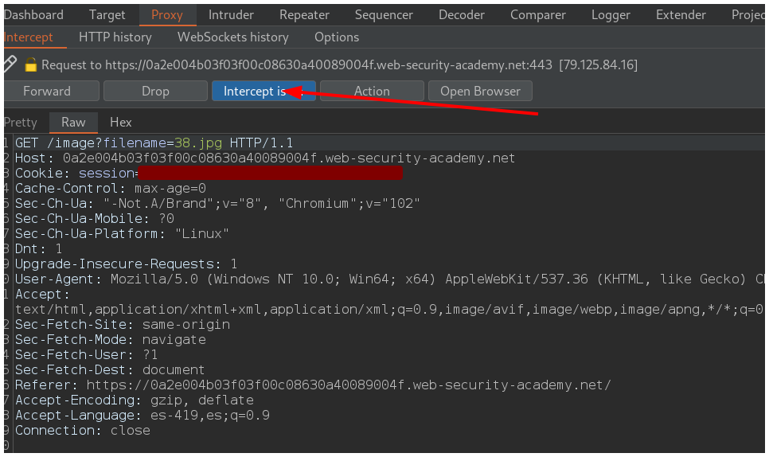

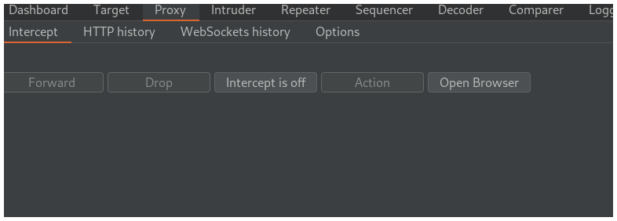

Volvemos al navegador y resolvemos el laboratorio.

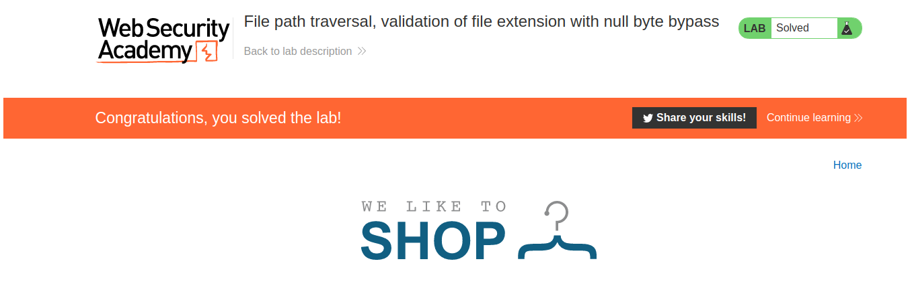

