# PortSwigger - Directory traversal

## Lab: File path traversal, validation of start of path

## Solución

Primero hacemos click derecho sobre una imagen y la abrimos en una pestaña nueva.

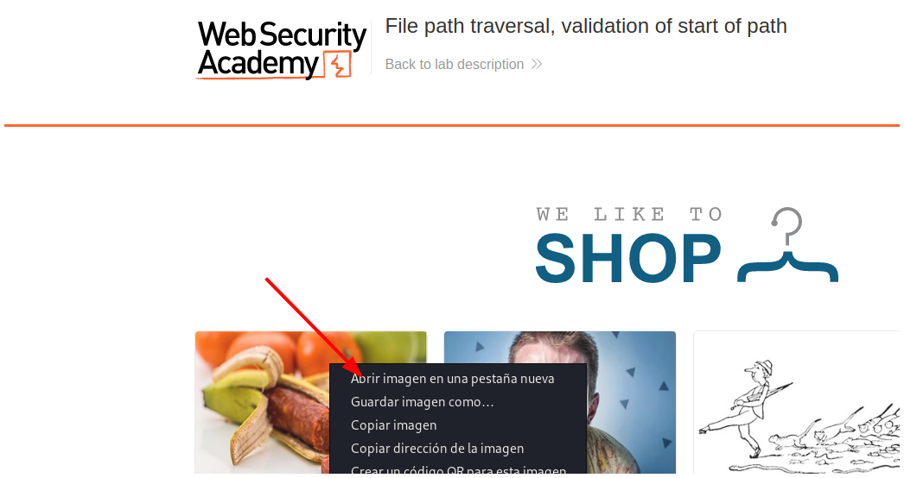

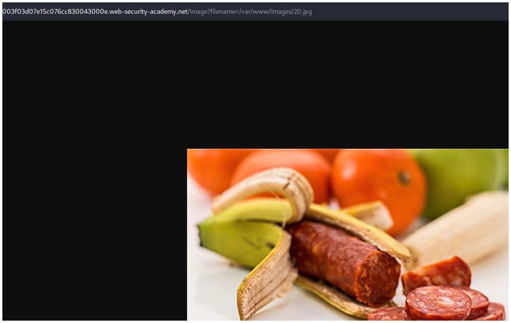

Luego vamos a Burpsuite y hacemos clikc en el botón **Intercept is off** para interceptar las peticiones.

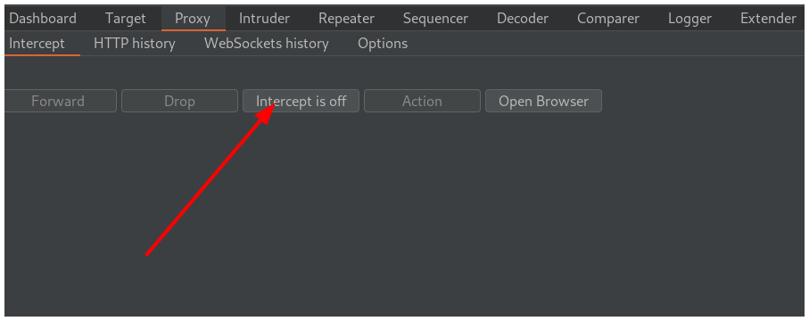

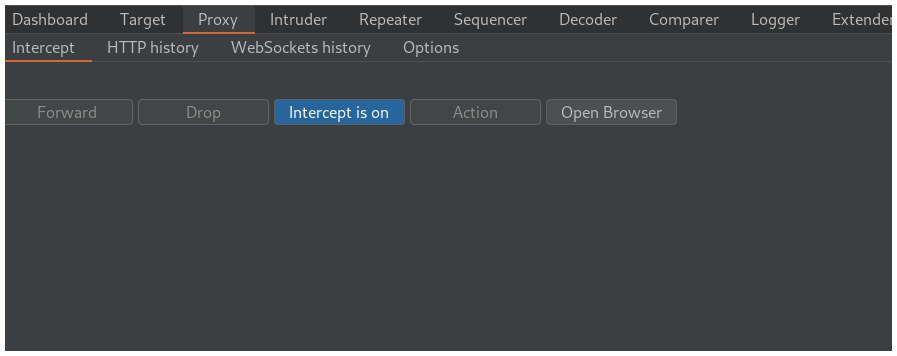

Vamos a la página donde está la foto y recargamos.

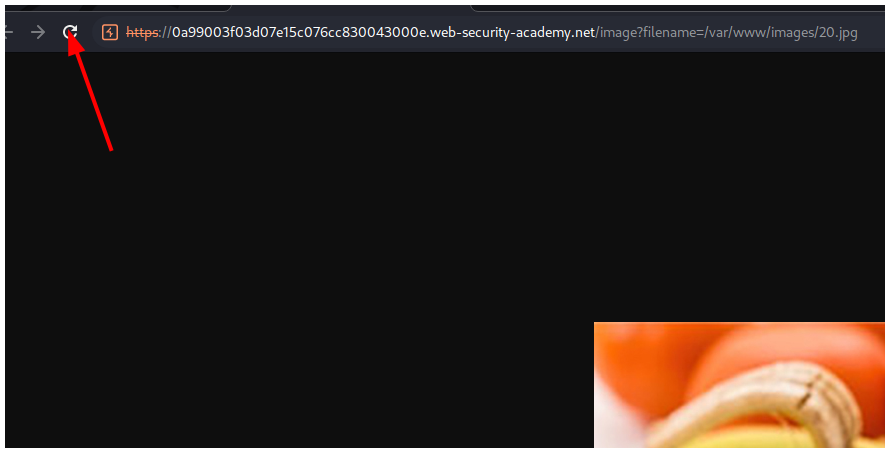

Interceptamos la petición y la enviamos a la pestaña **Repeater** presionando las teclas `CTRL + r`.

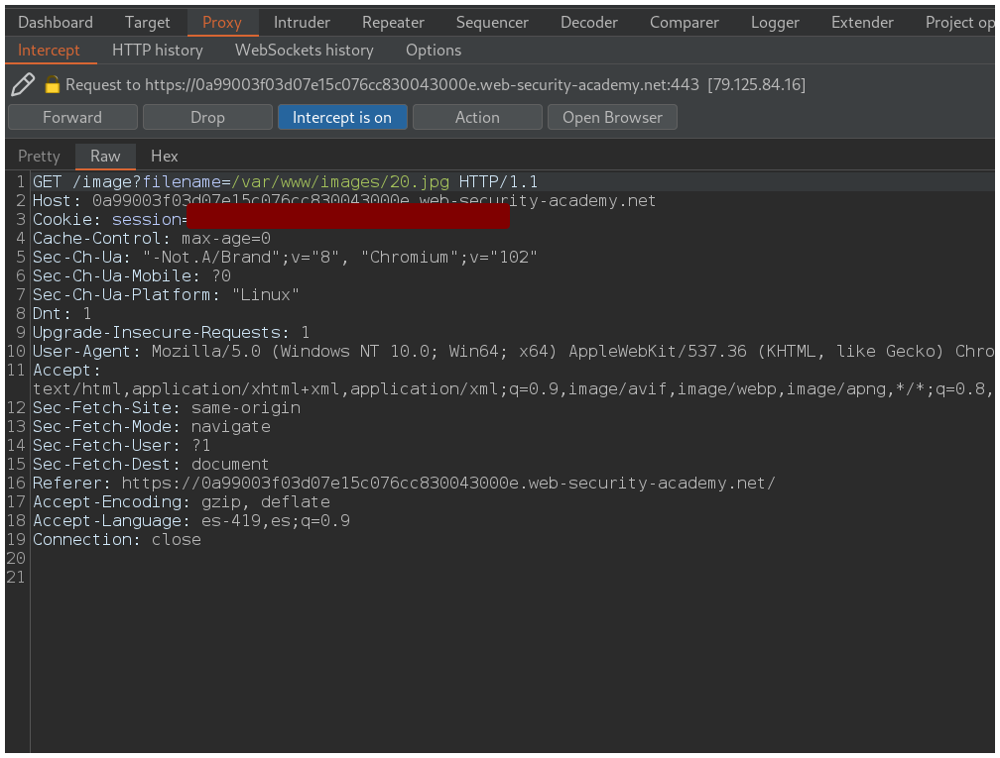

En la pestaña repeater cambiamos la ruta de la imagen por `/var/www/images/../../../etc/passwd` y hacemos click en el botón **Send**.

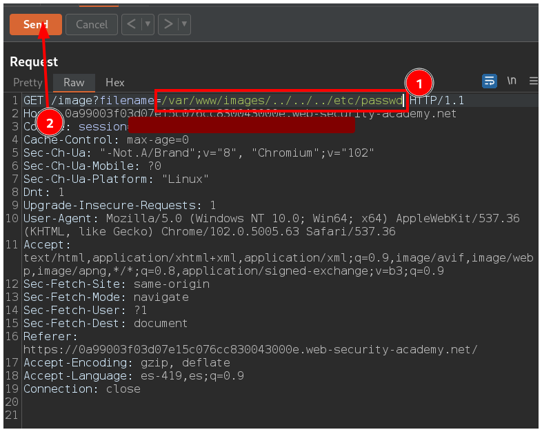

Vemos en la pestaña **Response** el contendio del archivo `/etc/passwd`.

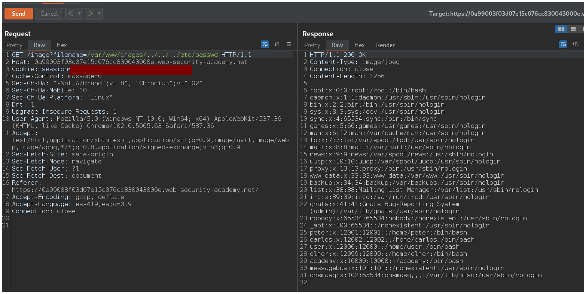

Volvemos a la pestaña **Proxy** y hacemos click en el botón **Intercept is on** para dejar de interceptar las peticiones.

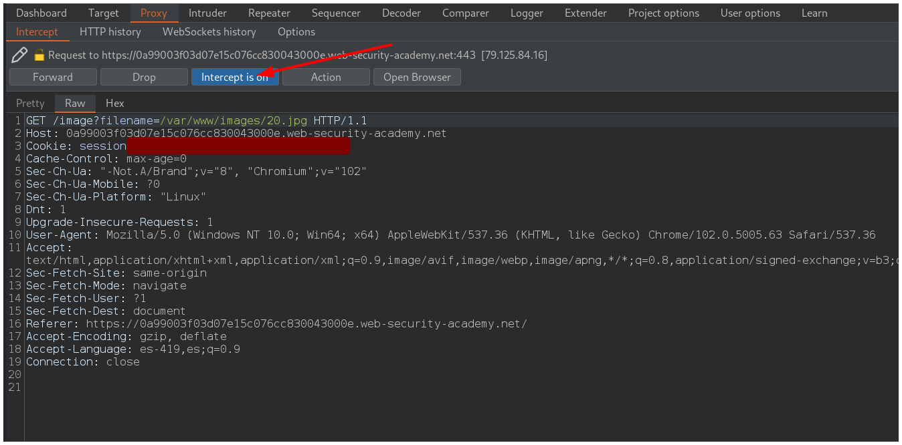

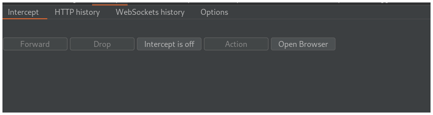

Volvemos al navegador y resolvemos el laboratorio.

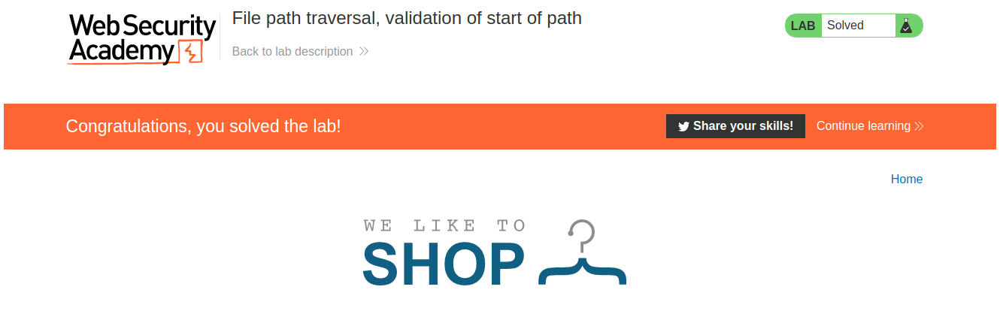
