# PortSwigger - Information disclosure

## Lab: Authentication bypass via information disclosure

## Solución

Navegador: **Firefox**

Primero hacemos click en el botón **My account**.

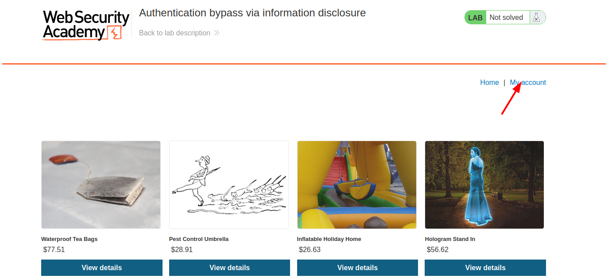

Iniciamos sesión con las credenciales que nos indica la descripción del laboratorio.

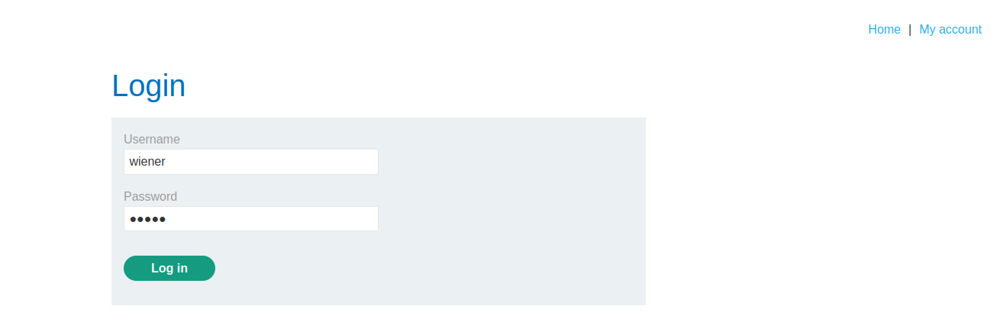

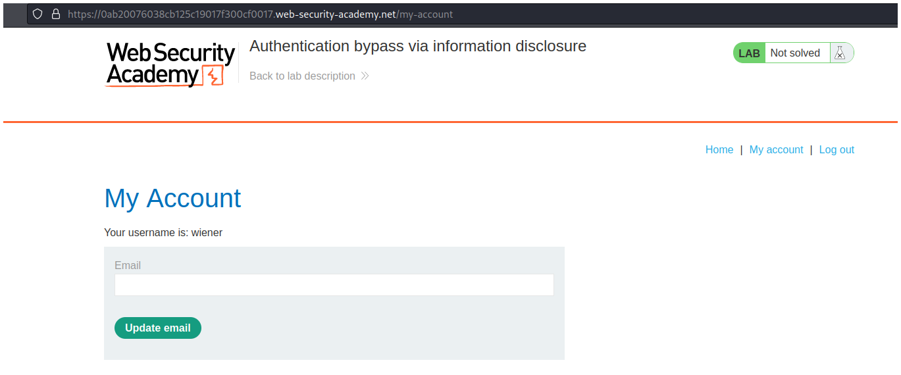

Cuando iniciemos sesión iremos a la ruta `/admin`. Una vez que estemos ahí la página nos indica que solo los usuarios locales tienen permiso de usar las funciones de admin.

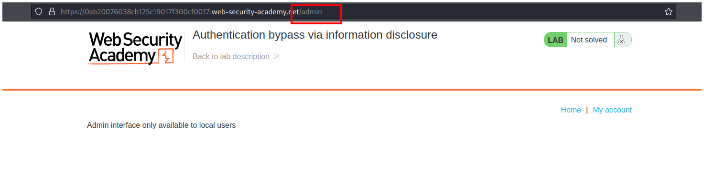

Abrimos las herramientas de desarrollador.

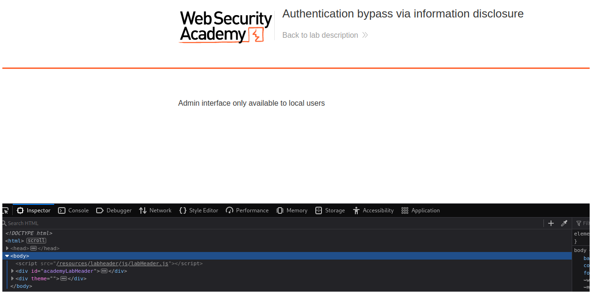

Y nos vamos a la pestaña **Network**.

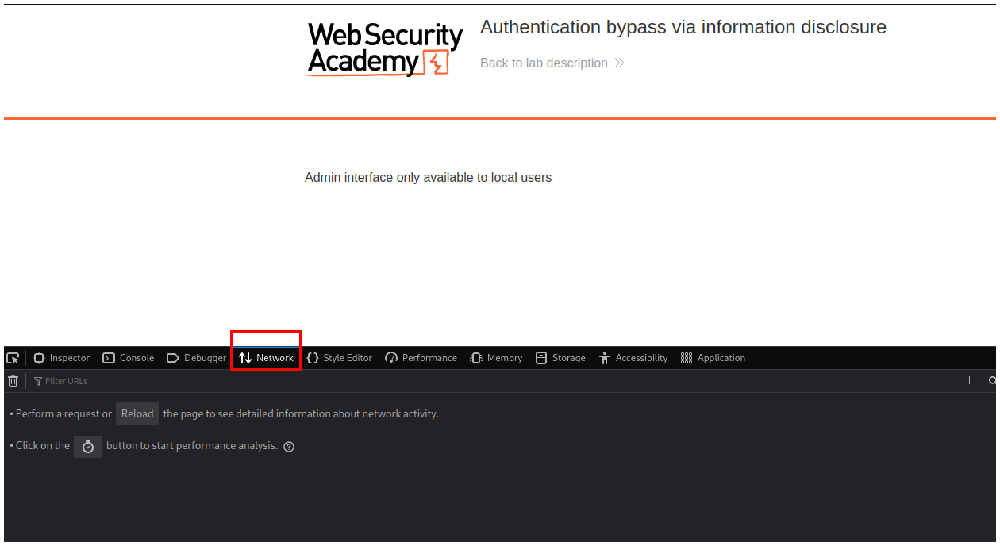

Recargando la página vemos una petición GET con el número de estado 401.

Si le hacemos click derecho y luego seleccionamos la opción **Edit and Resend** nos aparecerá una pestaña a la derecha.

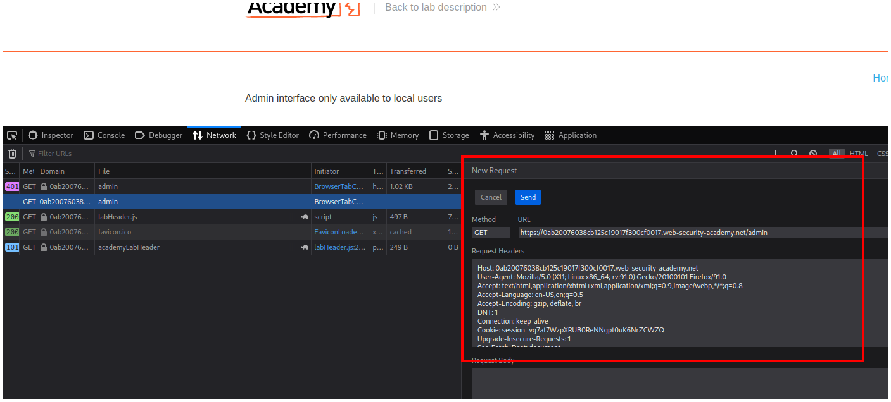

Cambiamos el método de la petición por el **TRACE**.

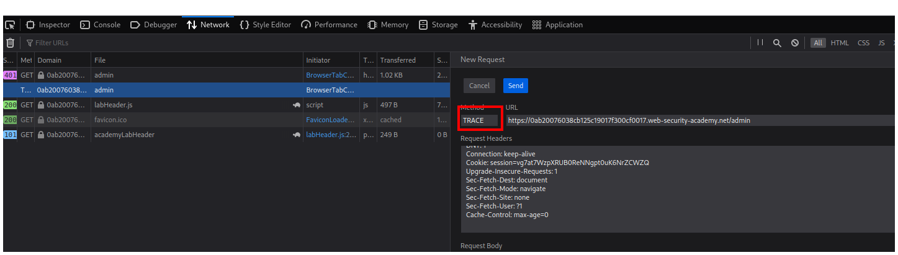

Y enviamos la petición haciendo click en el botón **Send**.

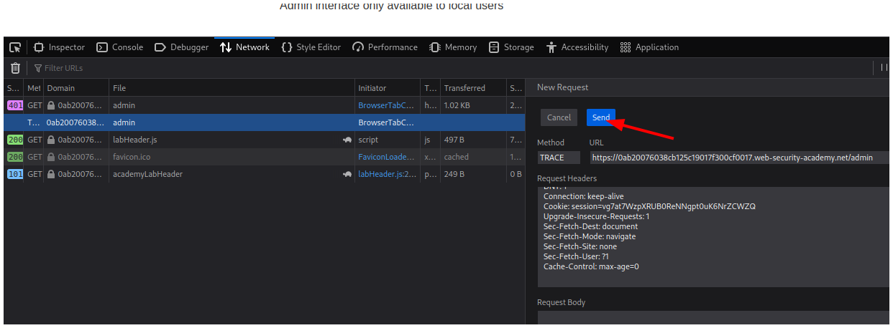

Vemos que nuestra nueva petición tiene de esta el número 200.

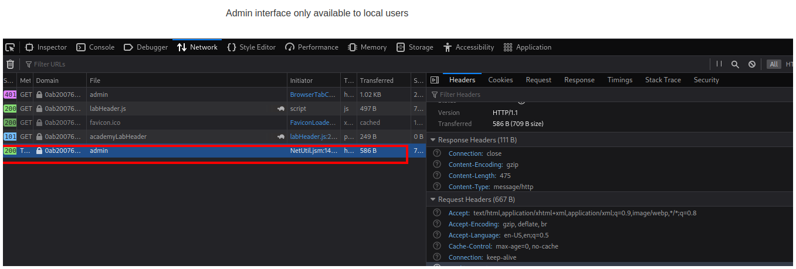

Le hacemos click a nuestra petición y nos vamos a la pestaña **Response**.

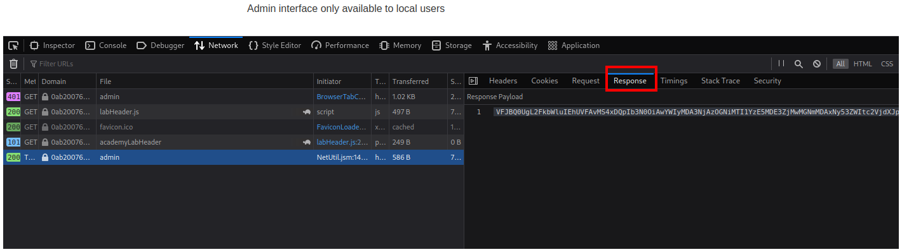

Copiamos la cadena en base64 y la pegamos en cualquier decodificador de base64 en internet, yo utilizé Cyberchef.

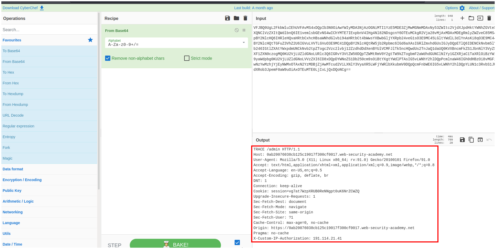

Notamos que se agrega una cabecera nueva a nuestra petición con nuestra dirección IP.

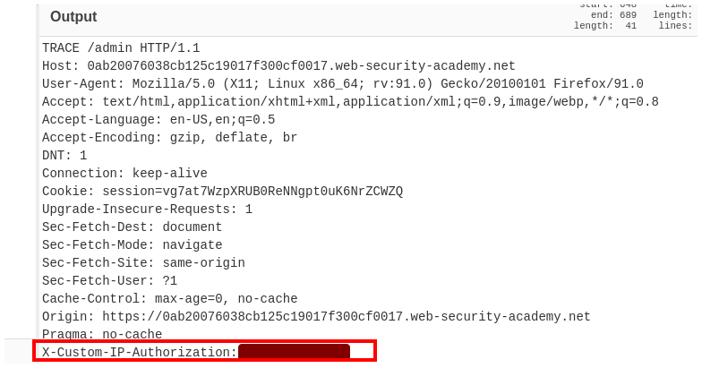

Hacemos click derecho sobre nuestra petición anterior y luego seleccionamos la opción **Edit and Resend** nuevamente.

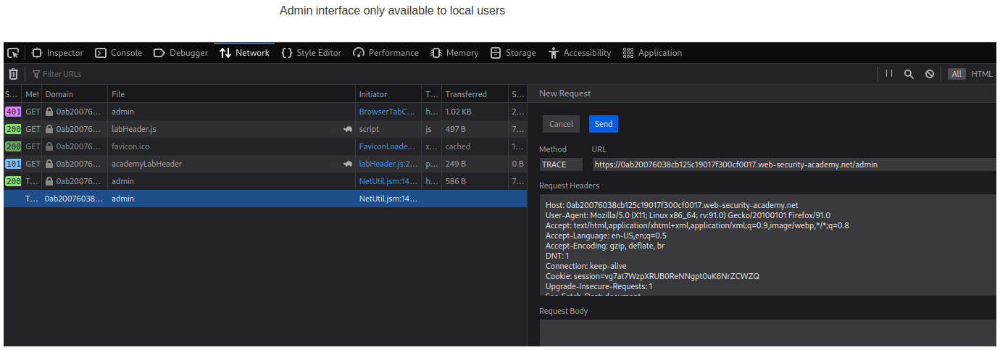

En el campo **Request Headers** agregamos la cabecera que vimos anteriormente.

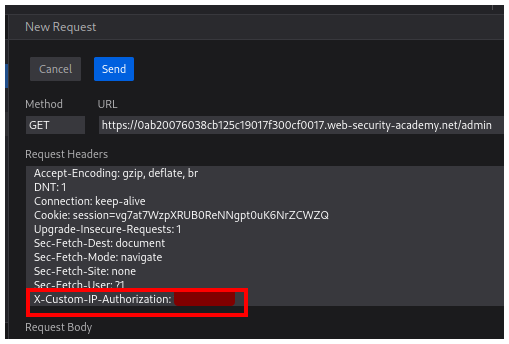

Cambiamos nuestra IP por 127.0.0.1 para indicar que nuestra dirección IP es local.

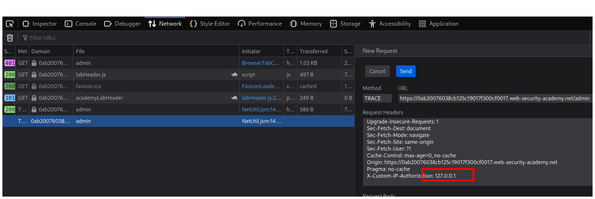

Cambiamos el método a GET.

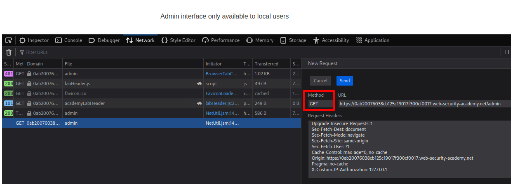

Y hacemos click en el botón **Send**.

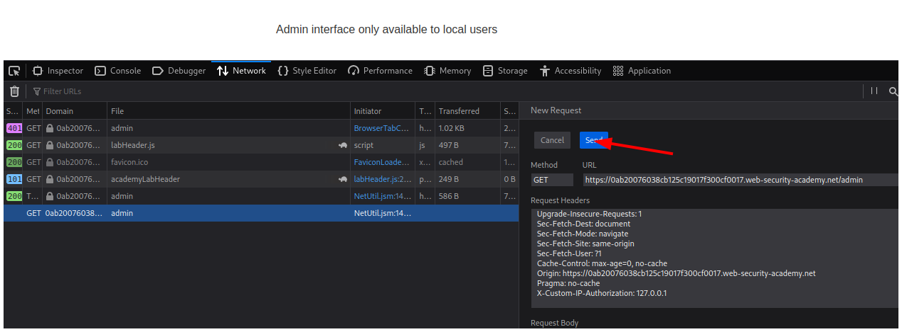

Nuestra petición tiene como estado el número 200.

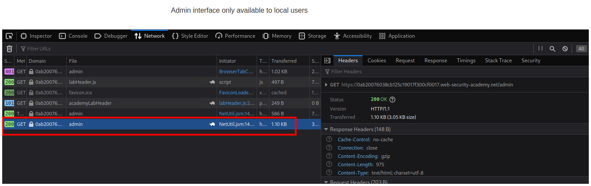

La seleccionamos y vamos a la pestaña **Response**.

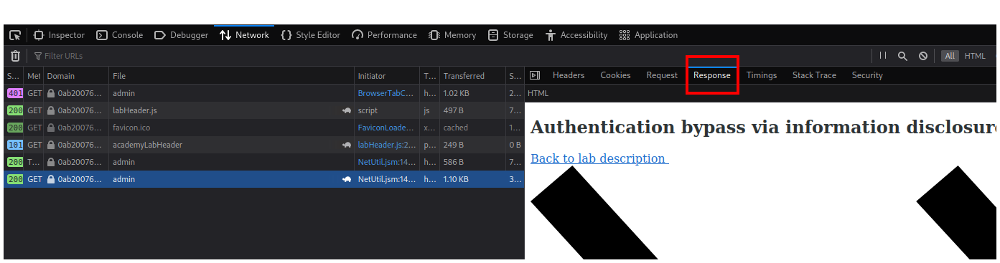

Bajamos y al final vemos 2 opcione, eliminar el usuario carlos y el usuario wiener.

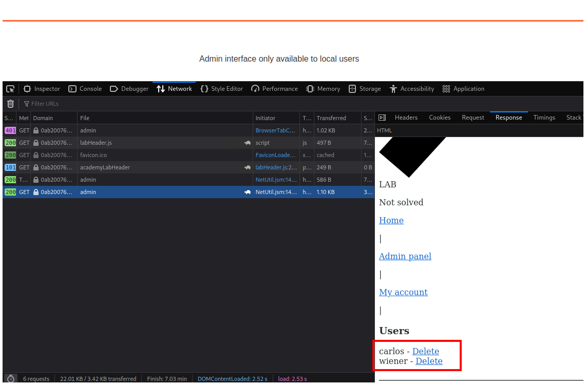

Si pasamos el cursor sobre la palabra **Delete** marcada en azul podemos ver un enlace `/admin/delete?username=carlos`.

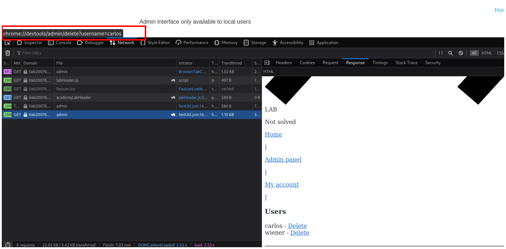

Agregamos esto a la URL y vemos que la página nuevamente nos pide la cabecera para indicar que somos usuarios locales.

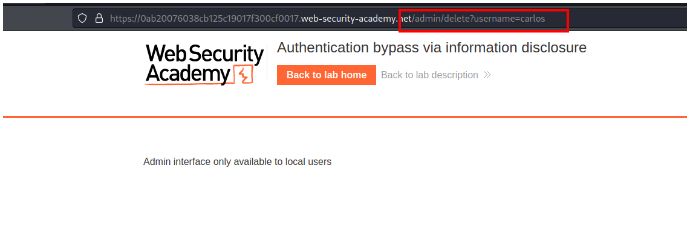

En las herramientas de desarrollador vemos la petición con número de estado 401.

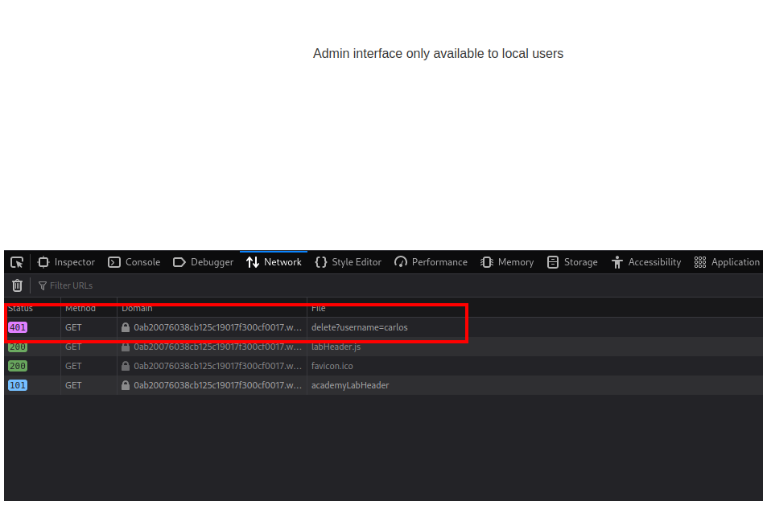

Le hacemos click derecho y seleccionamos la opción **Edit and Resend**.

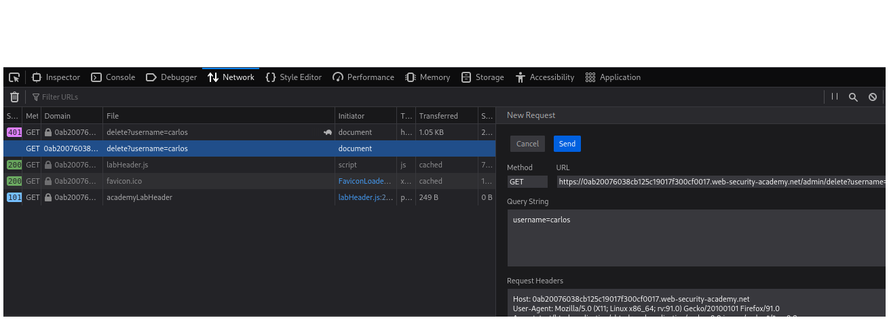

Agregamos la cabecera anterior.

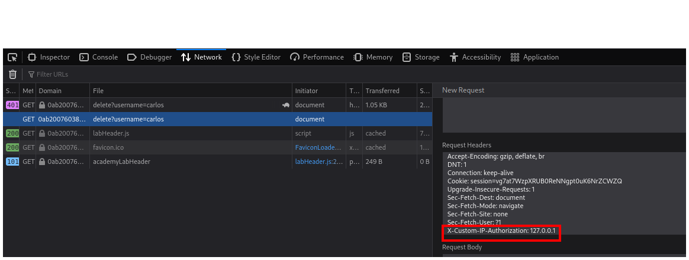

Seleccionamos el botón **Send**.

Y resolvemos el laboratorio.

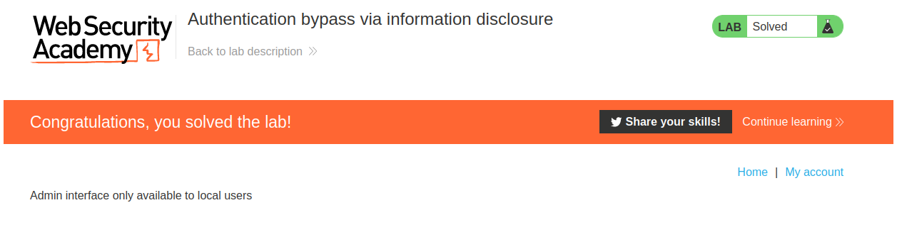

