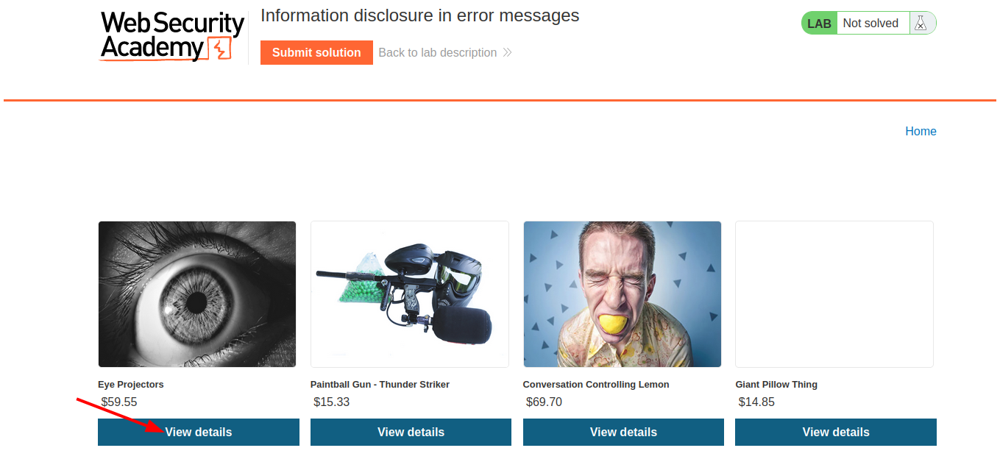
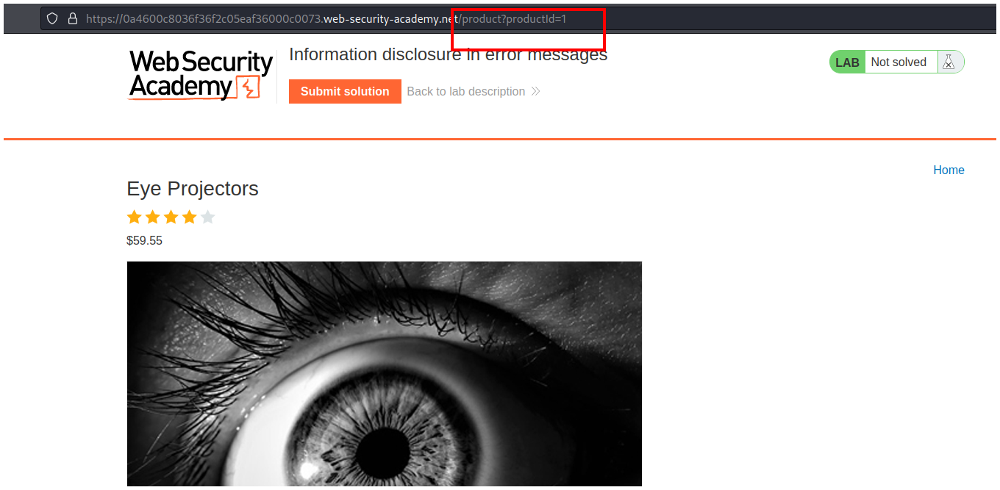
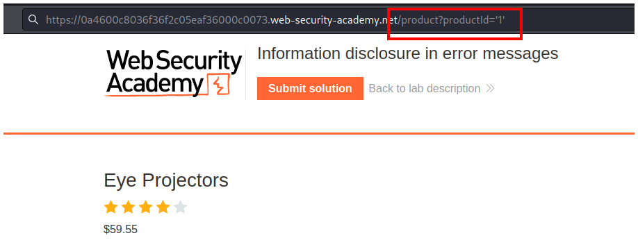
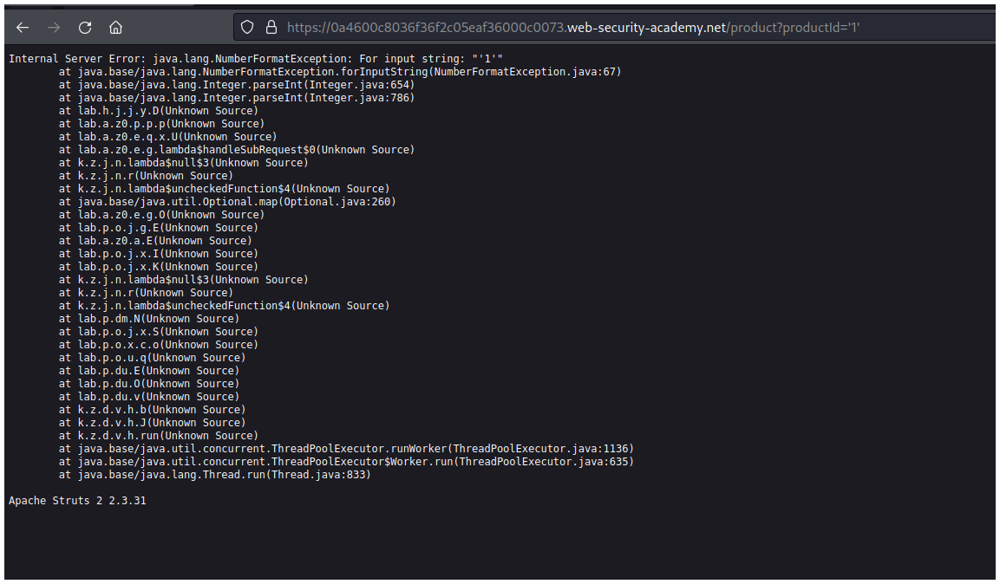
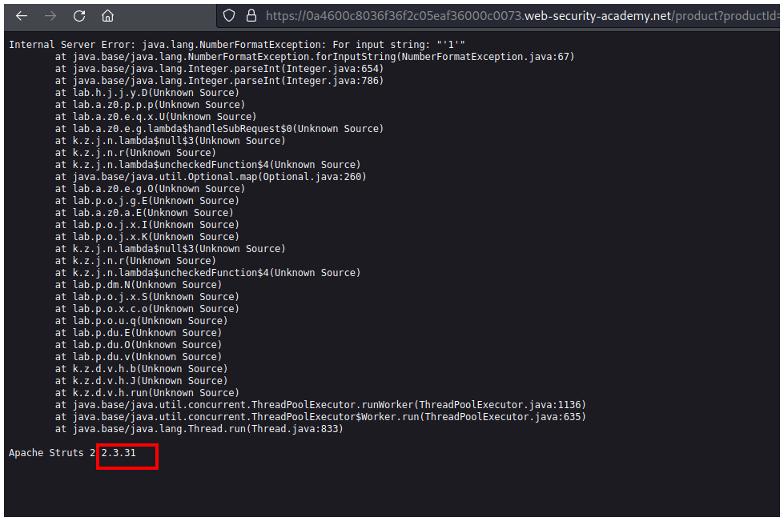
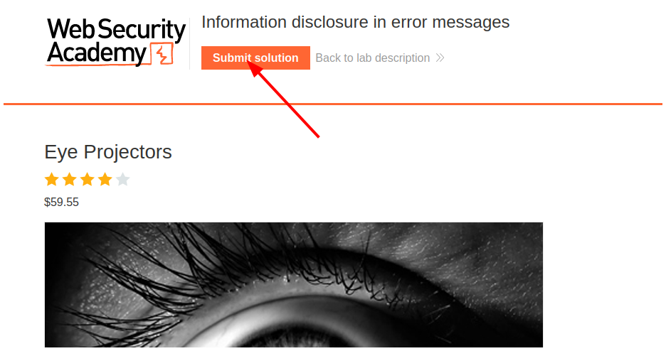
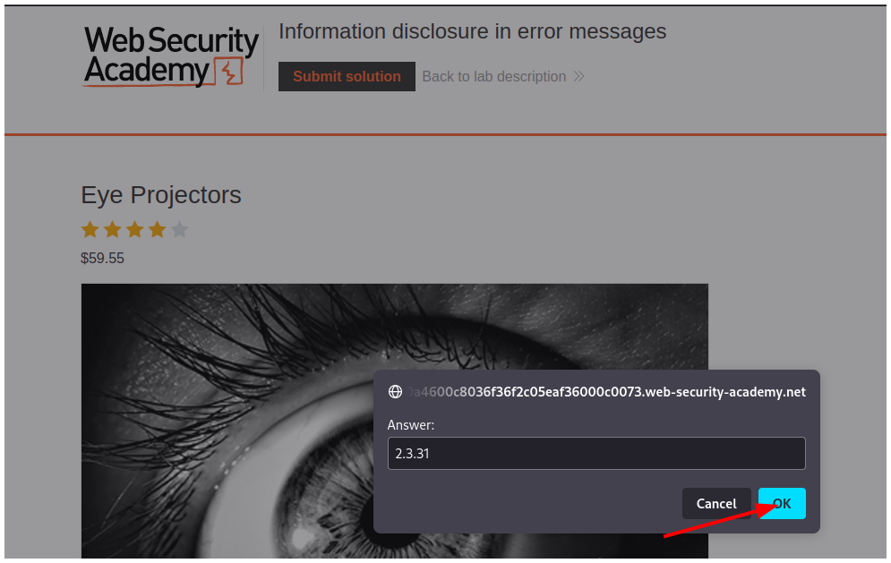
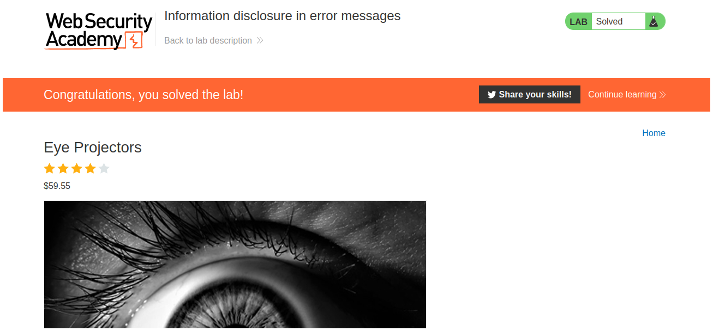

# PortSwigger - Information disclosure

## Lab: Information disclosure in error messages

## Solución

Primero hacemos click en **View details**.

Vemos que el id en la url es un número.

Lo ponemos entre comillas esperando que el servidor lo interprete como una string y falle.

Lo enviamos y efectivamente el servidor lo interpreta como string y falla.

Vemos al final la versión de Apache que necesitamos para terminar el laboratorio.

Volvemos a la página principal del laboratorio y hacemos click en **Submit solution**.

Ingresamos nuestra respuesta y hacemos click en **OK**.

Y resolvemos el laboratorio.

