# PortSwigger - Information disclosure


## Lab: Information disclosure in version control history


## Solución

Primero vamos a la console y ejecutamos el siguiente comando para copiar toda la carpeta `.git` a nuestro escritorio.

```bash
wget -r linkdellaboratorio
```

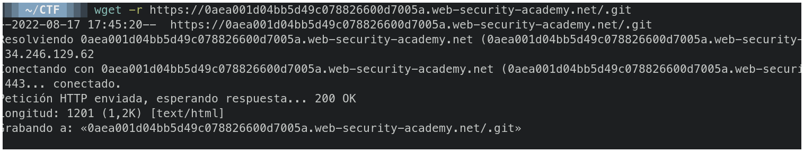

Cuando termine de descargar entramos a la carpeta.

```bash
cd nombredelacarpeta
```

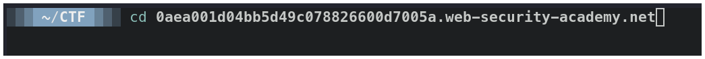

Entramos a la carpeta `.git`.

```bash
cd .git
```


Ejecutamos el siguiente comando  para ver los commits.

```bash
git log
```

Podemos notar que en el mensaje del commit nos indica que se ha eliminado la contraseña de admin en un archivo config.

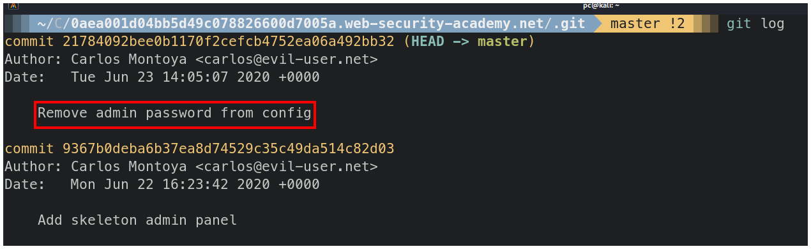

Ejecutamos el siguiente comando para visualizar los cambios que se realizar en el último commit.

```bash
git show hashdelcommit
```

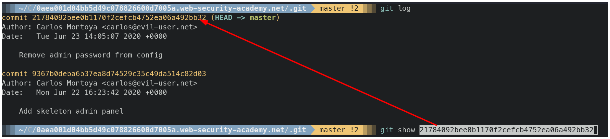

Observamos que se eliminó la contraseña de admin y se reemplazó por **env('ADMIN_PASSWORD')**.

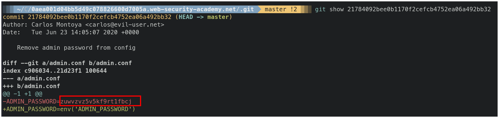

Vamos a la página web del reto y hacemos click en el botón **My account**.

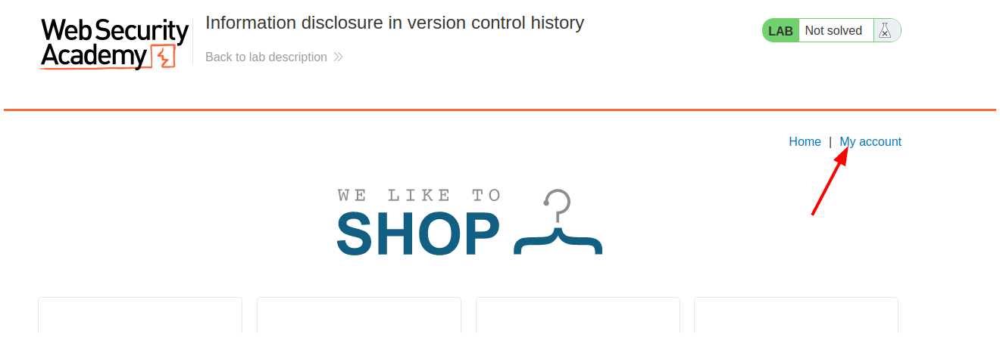

Ingresamos el usuario administrador y la contraseña que obtuvimos en el commit.

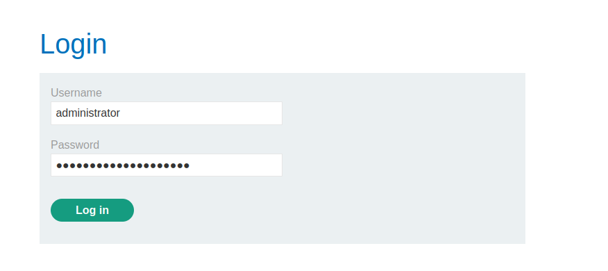

Si todo salió correctamente inicamos sesión como administrador.

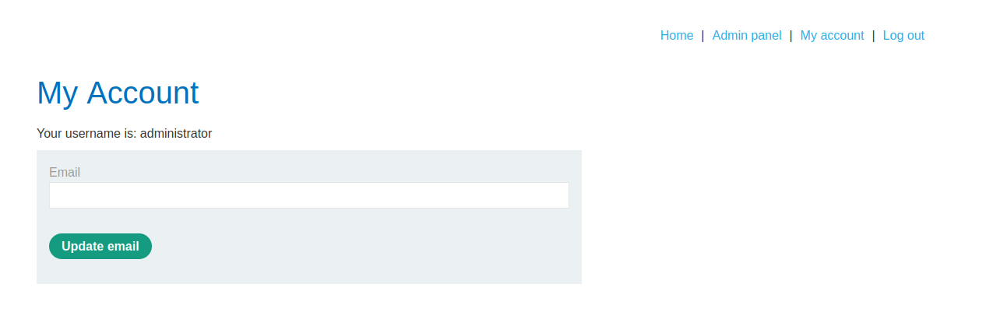

Hacemos click en el botón **Admin panel**.

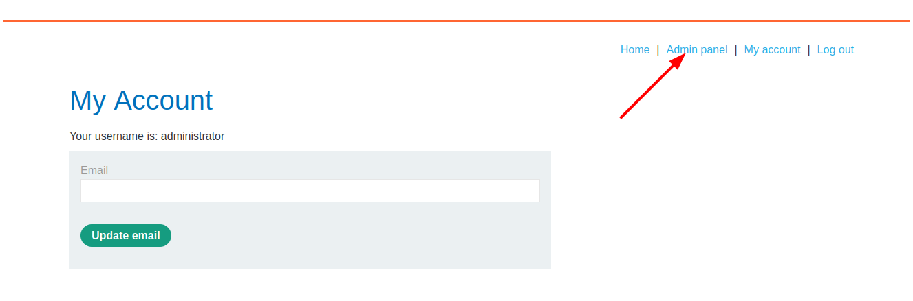

Eliminamos al usuario carlos.

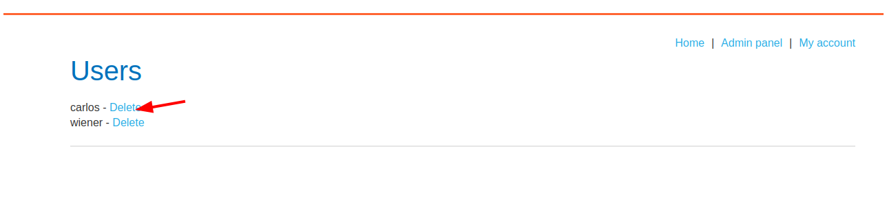

Y terminamos el laboratorio.

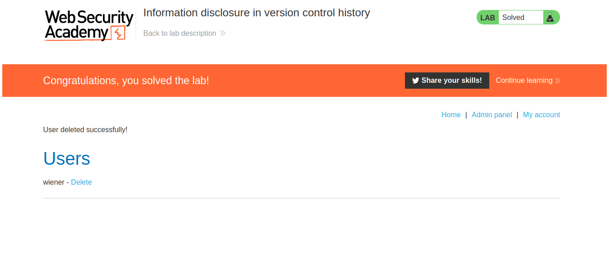

