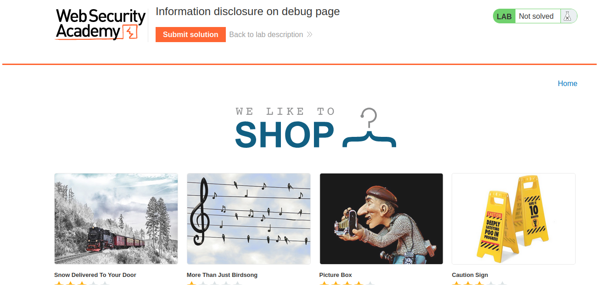
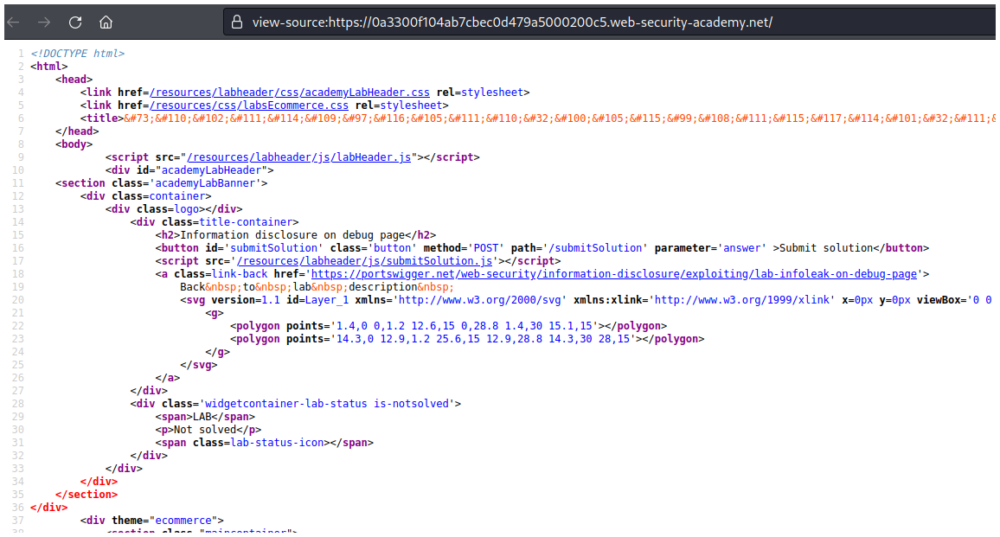
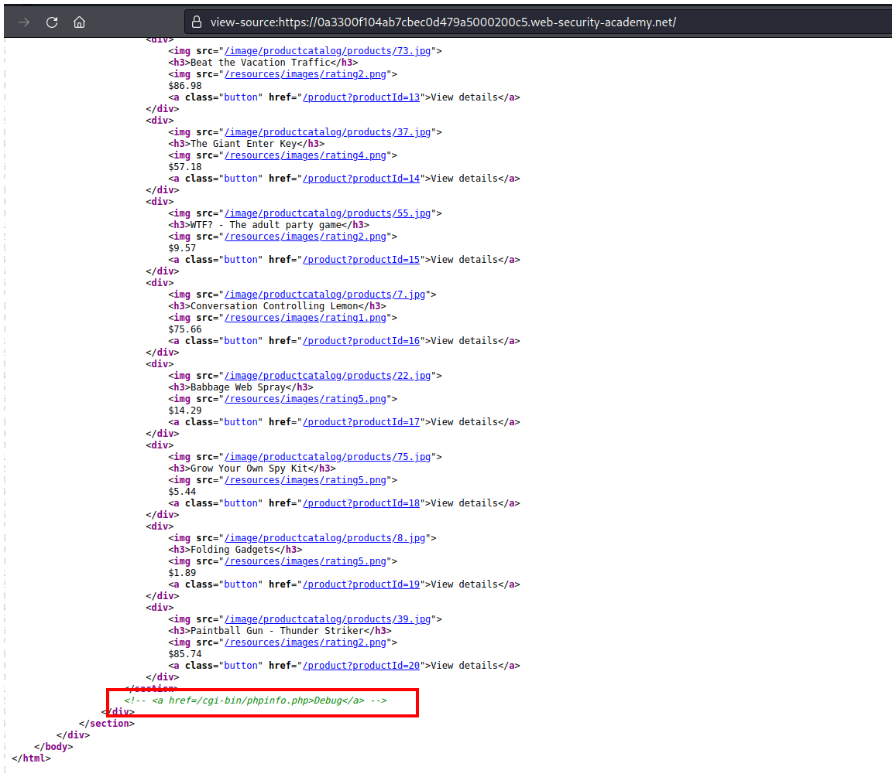
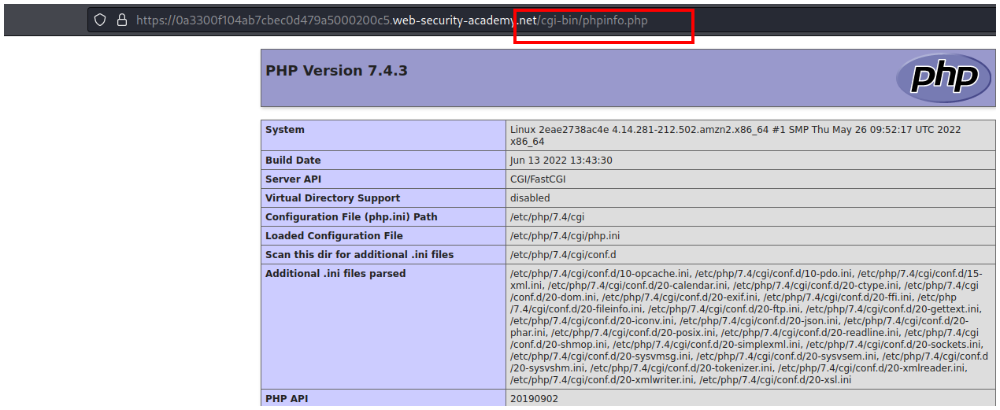
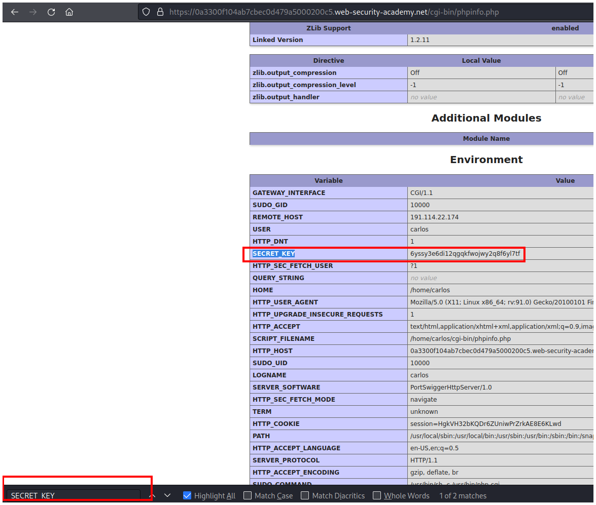
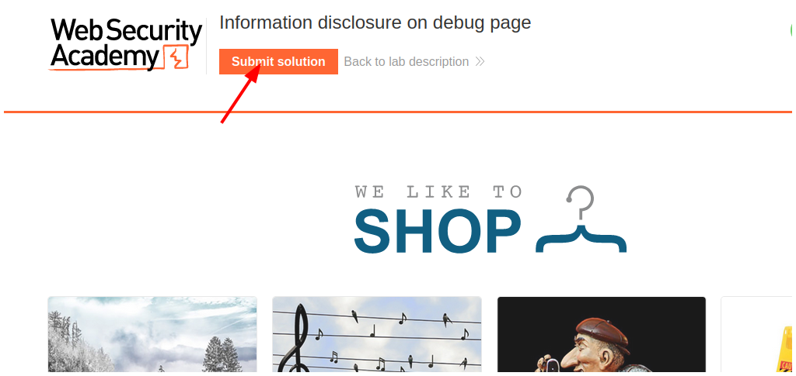
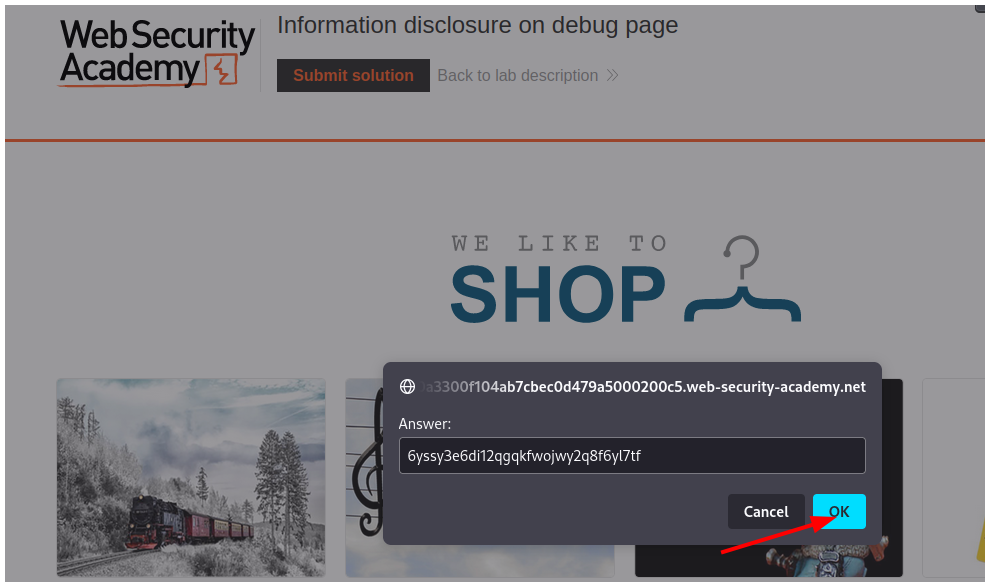

# PortSwigger - Information disclosure

## Lab: Information disclosure on debug page

## Solución

Primero abrimos el código fuente de la página en otra pestaña presionando `CTRL + u`.

Vemos el código fuente y buscamos algo raro.

Al final de la página vemos un comentario con la dirección de un archivo php.

Pegamos la dirección en la url y vamos al archivo.

Como el archivo es muy largo presionamos `CTRL + f` y escribimos `SECRET_KEY` porque es lo que necesitamos para resolver el laboratorio.

Volvemos a la página principal y hacemos click en el botón **Submit solution**.

Pegamos el valor del **SECRET_KEY** y hacemos click en el botón **OK**.

Y resolvemos el laboratorio.

