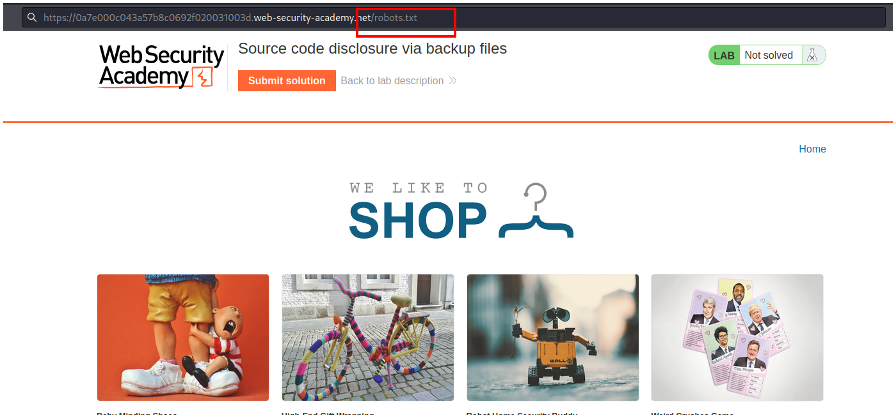
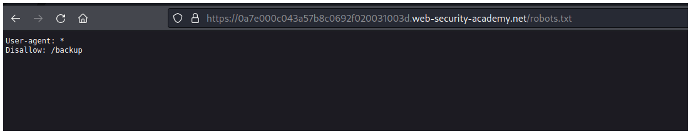
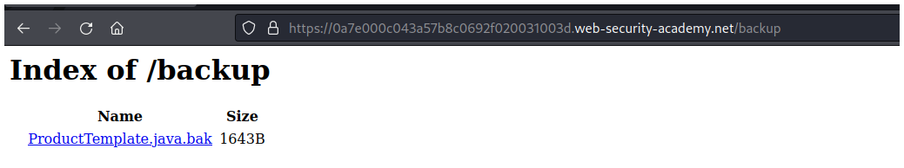
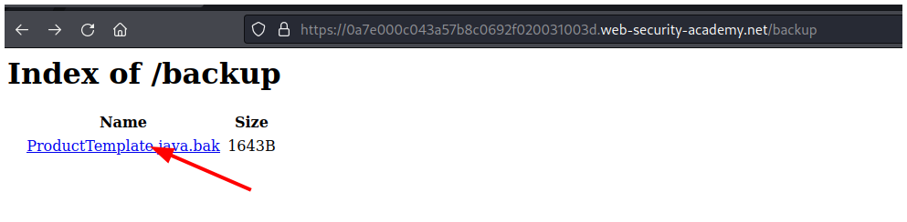
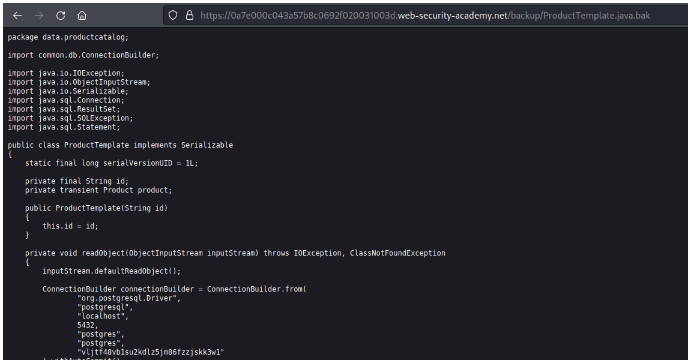
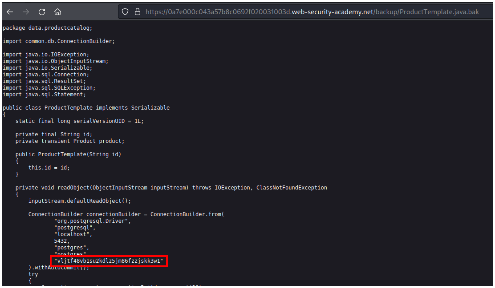
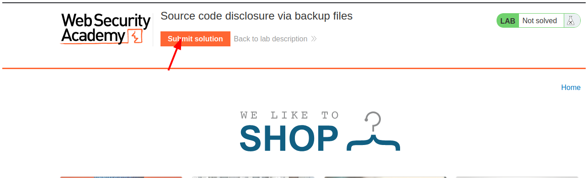
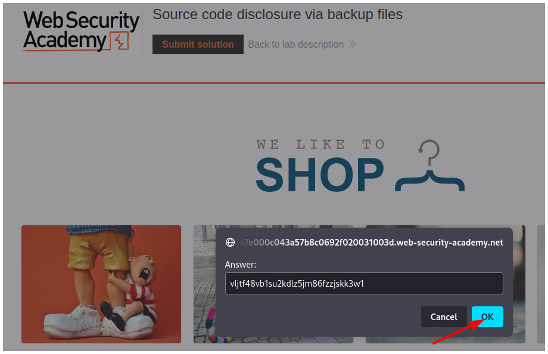
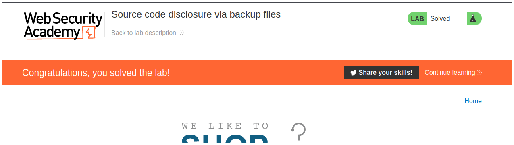

# PortSwigger - Information disclosure

## Lab: Source code disclosure via backup files

## Solución

Primero vamos al archivo `robots.txt` agregandolo en la url.

Cuando accedemos vemos un archivo `/backup` al que podemos acceder.

Cuando vamos al archivo **backup** observamos un archivo `.bak`.

La hacemos click.

Vemos el contenido de un archivo.

Si revisamos bien vemos que se realiza una conexión hacia una base de datos postgresql y se observa la contraseña.

Volvemos al inicio y hacemos click en el botón **Submit solution**.

Ingresamos la contraseña.

Y resolvemos el laboratorio.

