# PortSwigger - OS command injection

## Lab: Blind OS command injection with output redirection

## Solución

Navegador: **Firefox**

Primero hacemos click en el botón **Submit feedback**.

Abrimos las herramientas de desarrollador y vamos a la pestaña **Network**.

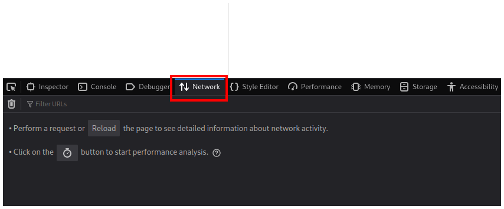

Rellenamos el formulario y hacemos click en **Submit feedback**.

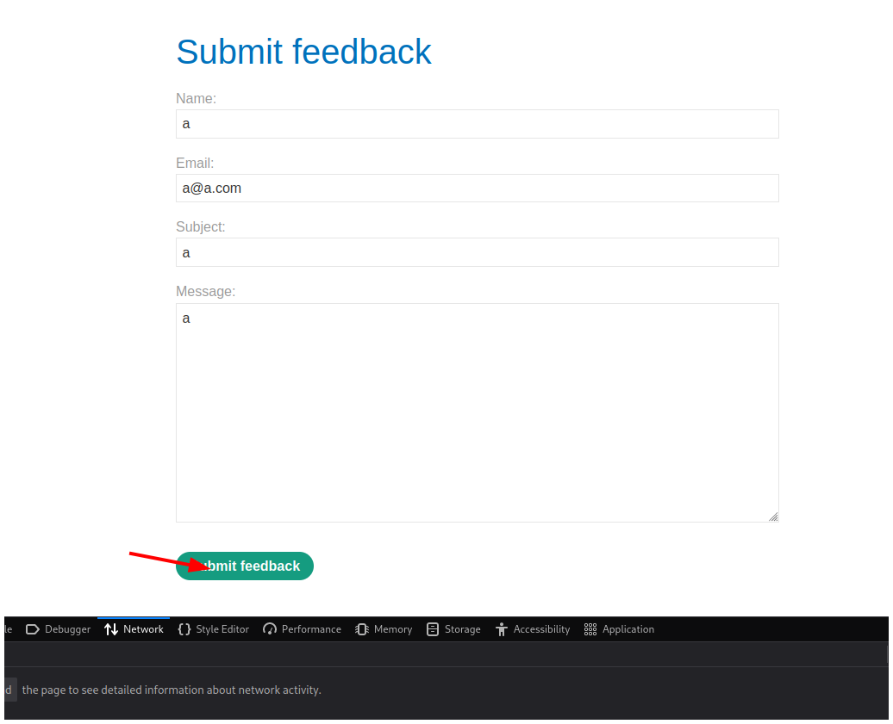

Vemos que se realiza una petición con el método POST que podemos editar haciendo click derecho y en **Edit and Resend**.

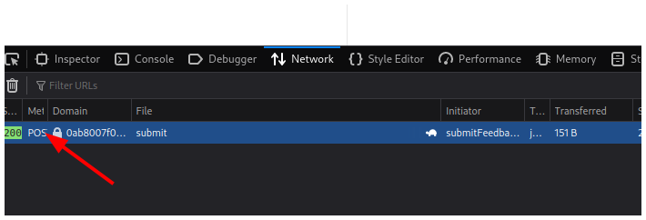

Observamos una nueva pestaña a la derecha llamada **New Request**.

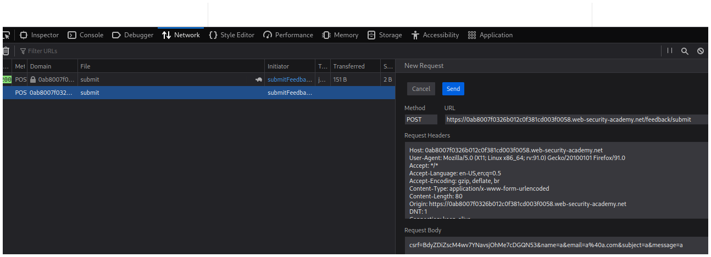

Inyectamos nuestro payload al final de nuestro correo electrónico `||whoami > hola.txt||`. Este payload ejecuta el comando **whoami** y redirige el output a un archivo que llamaremos **hola.txt**.

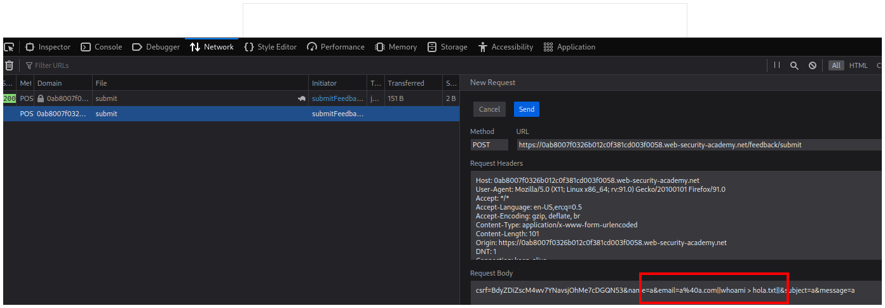

Hacemos click en el botón **Send**.

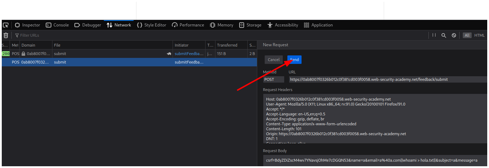

Vemos que nuestra petición tiene de estado el número 200, por lo tanto todo se realizó correctamente.

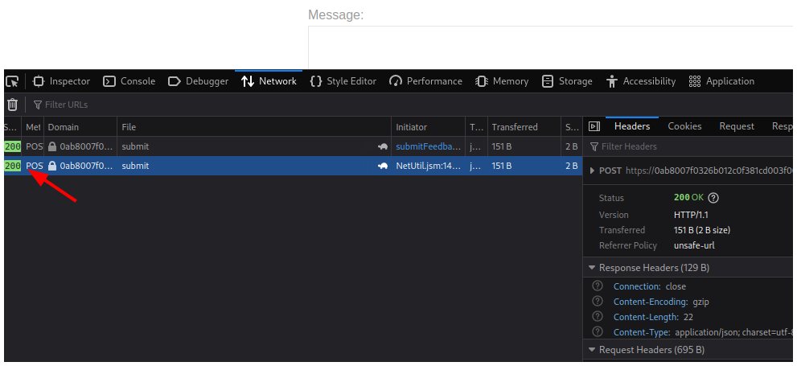

Volvemos a la página principal del reto y abrimos una imagen en una pestaña nueva.

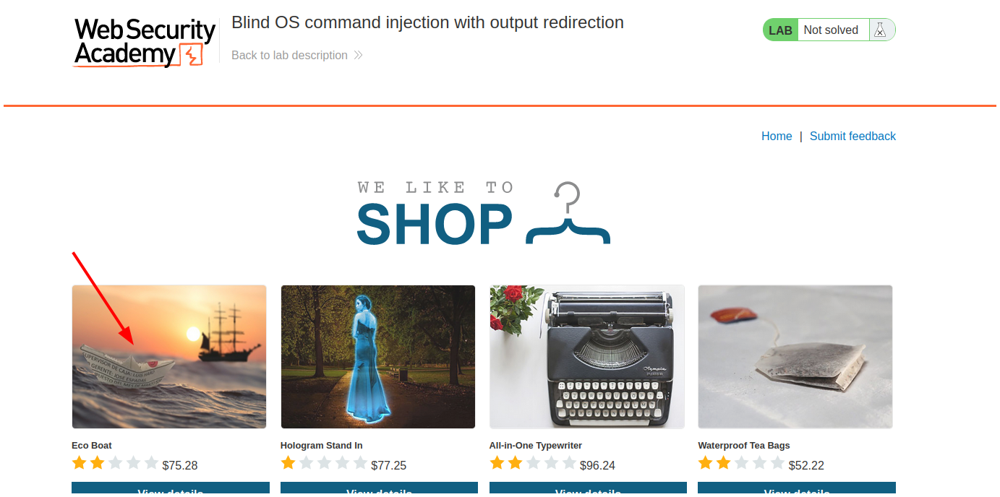

Nos fijamos que en la url se está entregando el nombre de un archivo, así que, en lugar de **65.jpg** escribiremos el nombre del archivo en el que escribimos el output del comando.

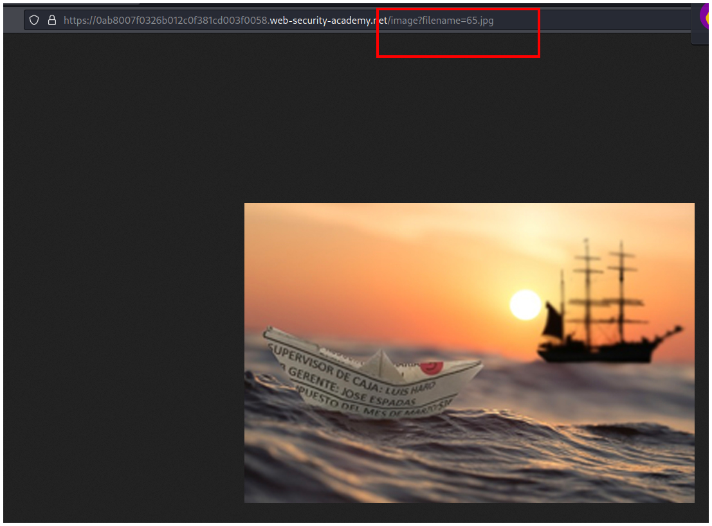
Yo le puse **hola.txt** al archivo, por lo tanto escribiré hola.txt y vemos el resultado del comando **whoami**.

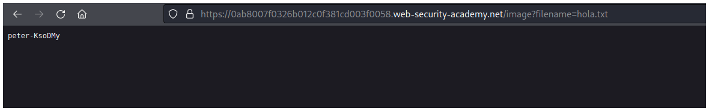

Y resolvemos el laboratorio sin necesidad de Burpsuite.

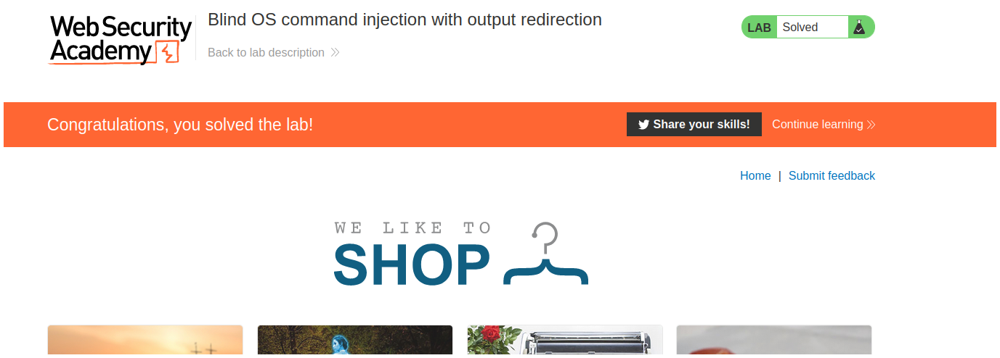

