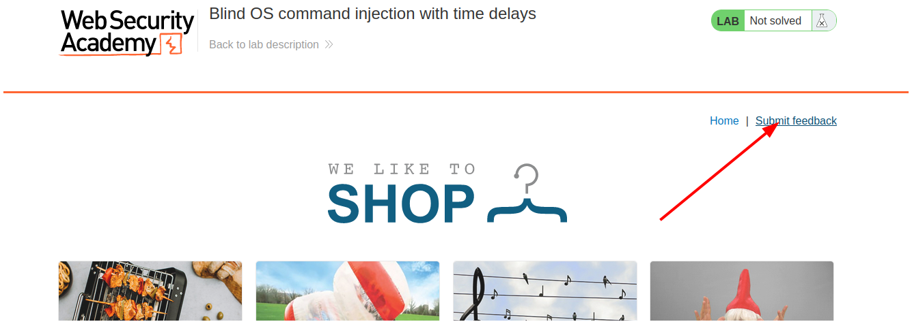
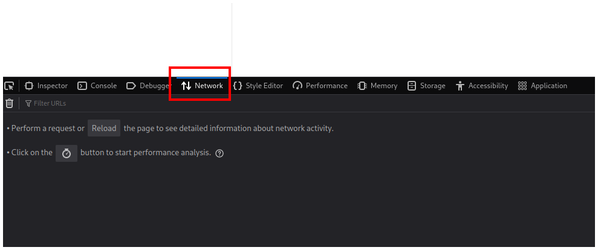
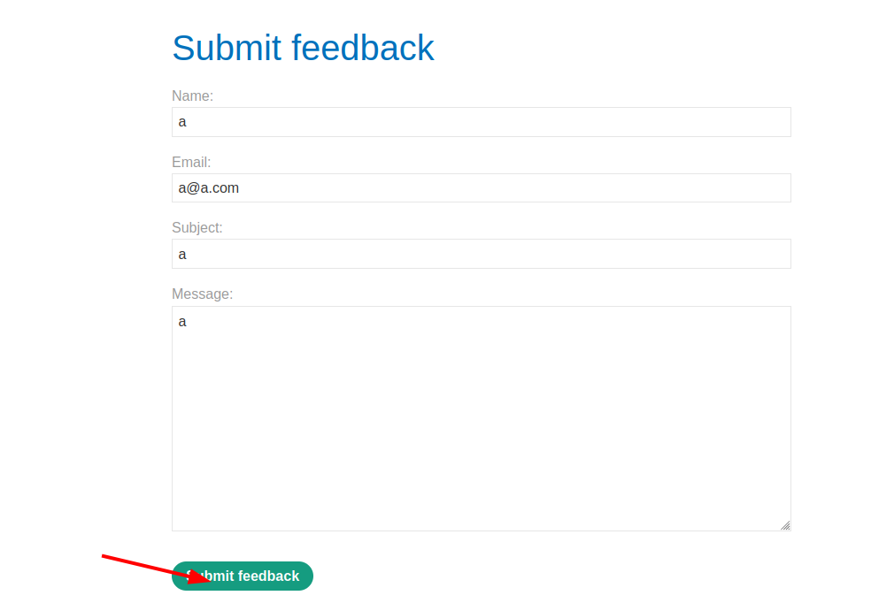
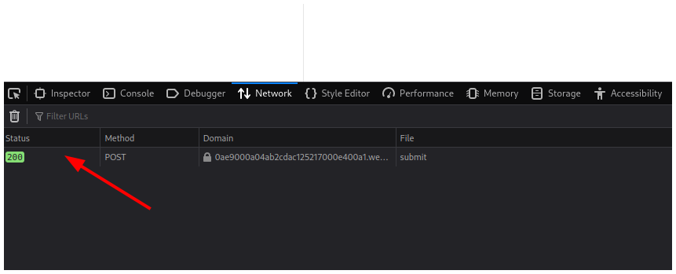
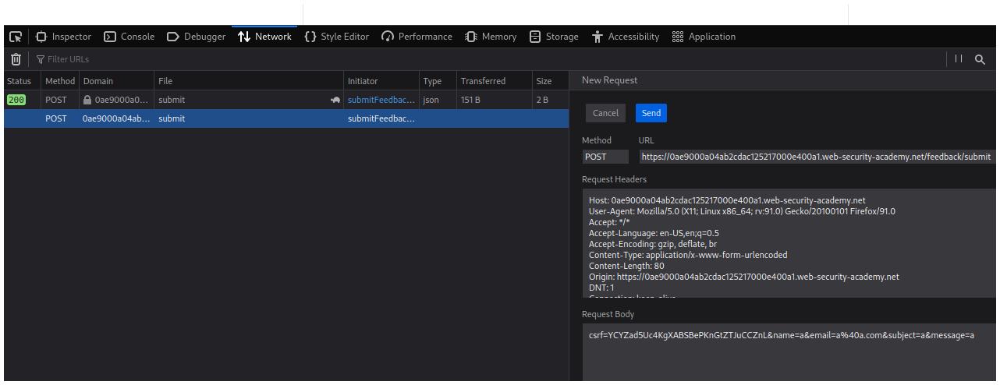
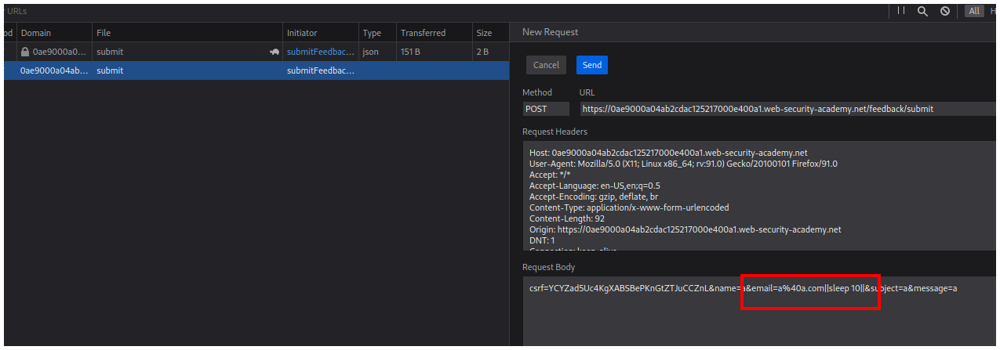
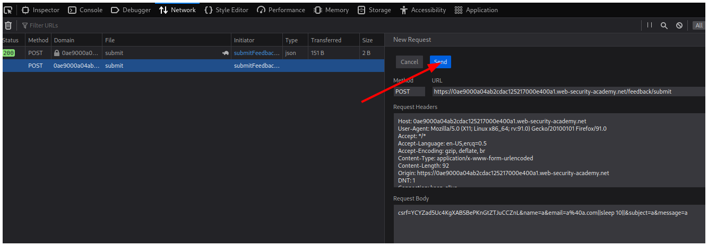
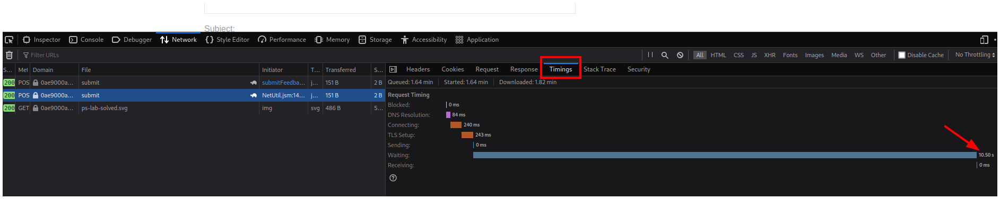

# PortSwigger - OS command injection

## Lab: Blind OS command injection with time delays

## Solución

Navegador: **Firefox**

Primero hacemos click en el botón **Submit feedback**.

Abrimos las herramientas de desarrollador y vamos a la pestaña **Network**.

Rellenamos el formulario y hacemos click en el botón **Submit feedback**.

Vemos que se realiza una petición por el método POST que editaremos haciendo click derecho y en **Edit and Resend**.

Vemos que se abre una ventana la derecha con el nombre **New Request**.

Después de nuestro email inyectamos nuestro comando `||sleep 10||`.

Luego hacemos click en el botón **Send**.

Vemos que nuestra petición se realizó correctamente, podemos comprobarlo haciendole click a la petición y yendo a la pestaña **Timings** vemos que se demoró 10 segundos.

Y resolvemos el laboratorio sin el uso de Burpsuite.

