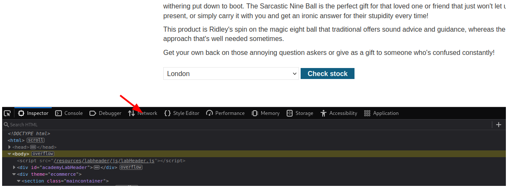
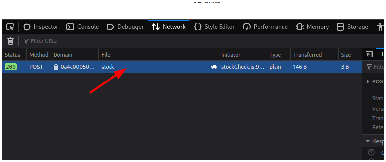
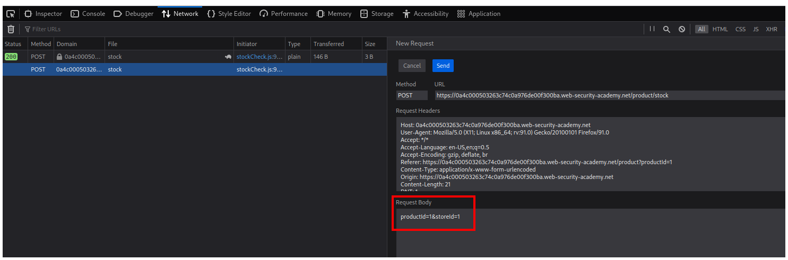
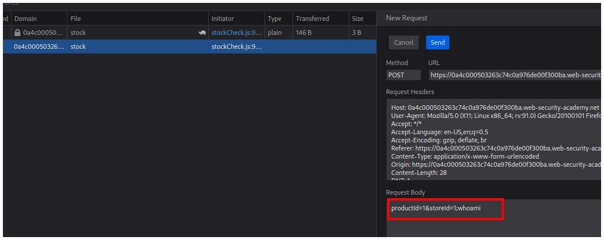
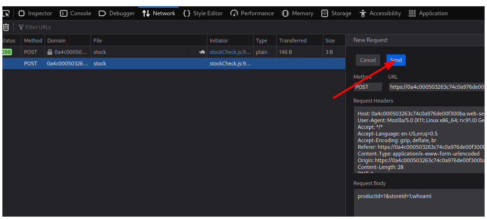
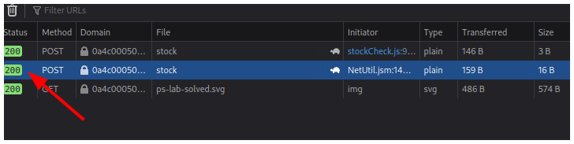
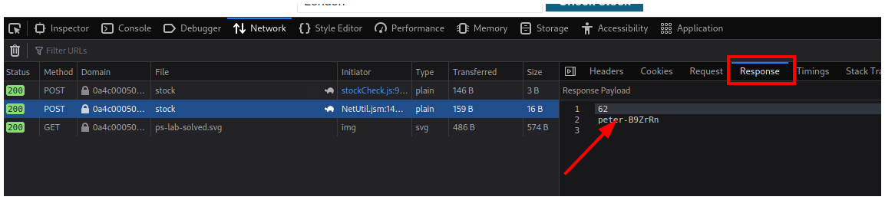
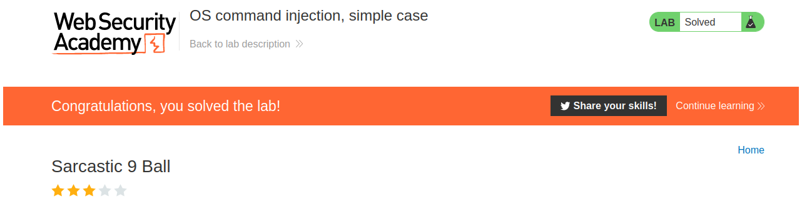

# PortSwigger - OS command injection

## Lab: OS command injection, simple case

## Solución

Navegador: **Firefox**

Primero hacemos click en el botón **View details** de cualquier producto.

Luego abrimos las herramientas de desarrollador y nos vamos a la pestaña **Network**.

Hacemos click en el botón **Check stock**.

Y vemos una petición que se realiza con el método POST que podemos editar si hacemos click derecho y hacemos click en la opción **Edit and resend**.

Se abrirá un nuevo panel para editar la petición.

 Nosotros agregaremos `;whoami` al final del **Request body**.

Y presionaremos el botón **Send**.

Vemos que nuestra nueva petición tiene de estado el número 200 y eso significa que todo se realizó correctamente.

Hacemos click en nuestra petición y vamos a la pestaña **Response** para ver el resultado de nuestro comando inyectado.

Y con esto resolvemos el laboratorio sin el uso de Burpsuite.

