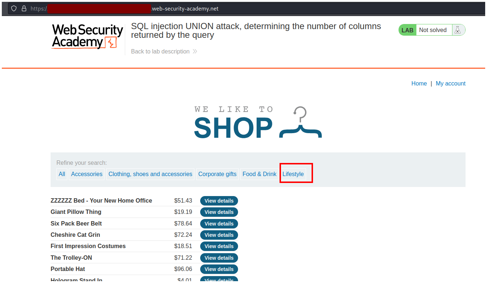
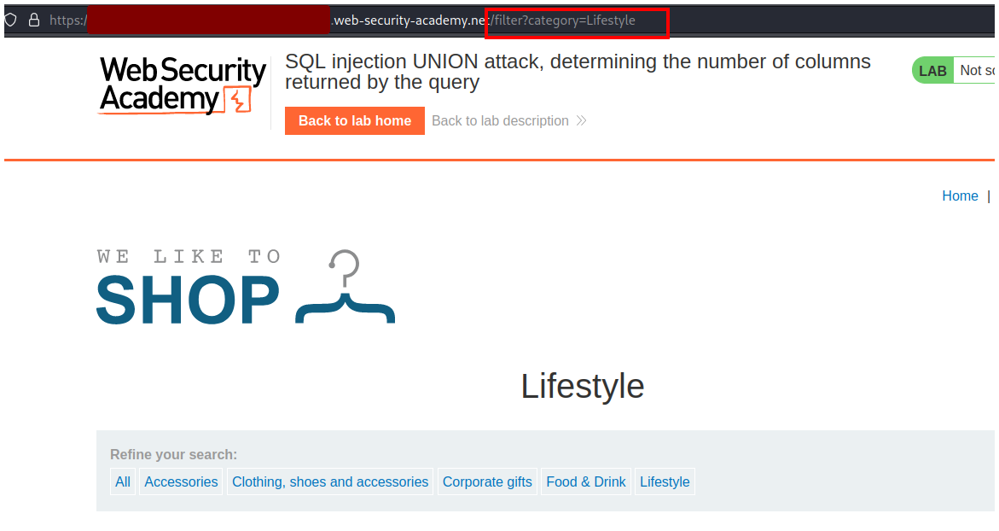
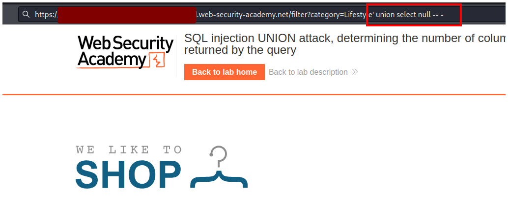
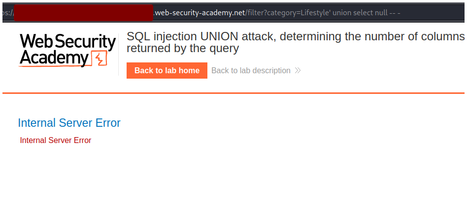
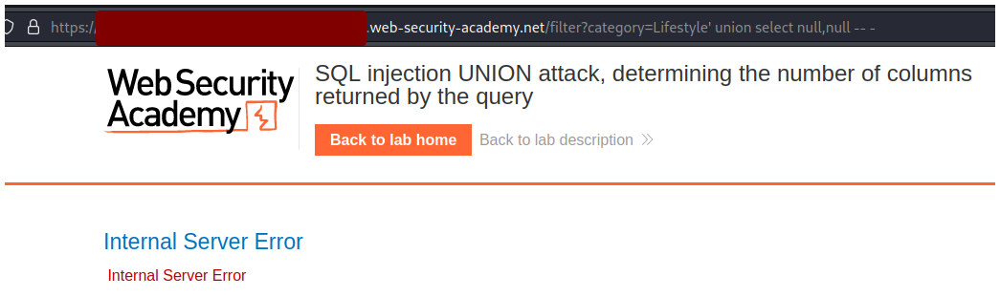
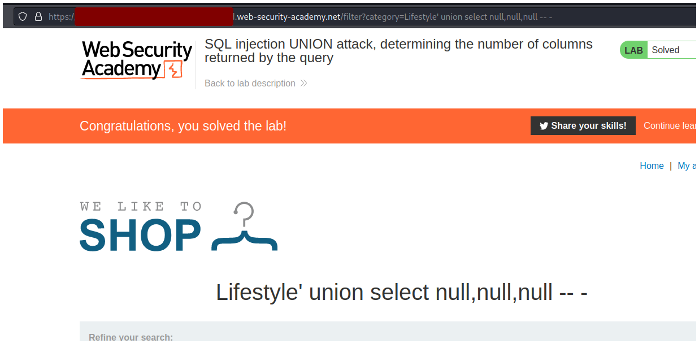

# PortSwigger - SQL injection


## Lab: SQL injection UNION attack, determining the number of columns returned by the query


## Solución

En la página principal hacemos click en alguna opción de búsqueda, yo voy a hacerle click a **Lifestyle**.



Luega se agregará a la url un filtro que busca según lo que escogiste, en este caso como escogimos **Lifestyle** nos muestro `filter?=category=Lifestyle`.



Al final debemos agregar una query SQL para identificar la cantidad de columnas existen. Primero escribimos `' union select null -- -` y si la página nos devuelve un error entonces seguimos agregando la palabra `null` hasta que se arregle.



Con un solo `null` nos devuelve un error, esto significa que existen más de 1 columna.

```sql
' UNION SELECT null -- -
```



Con 2 `null` también nos devuelve un error, entonces debemos agregar más `null`.

```sql
' UNION SELECT null,null -- -
```



Si agregamos 3 `null` el laboratorio se resuelve porque existen 3 columnas.

```sql
' UNION SELECT null,null,null -- -
```

