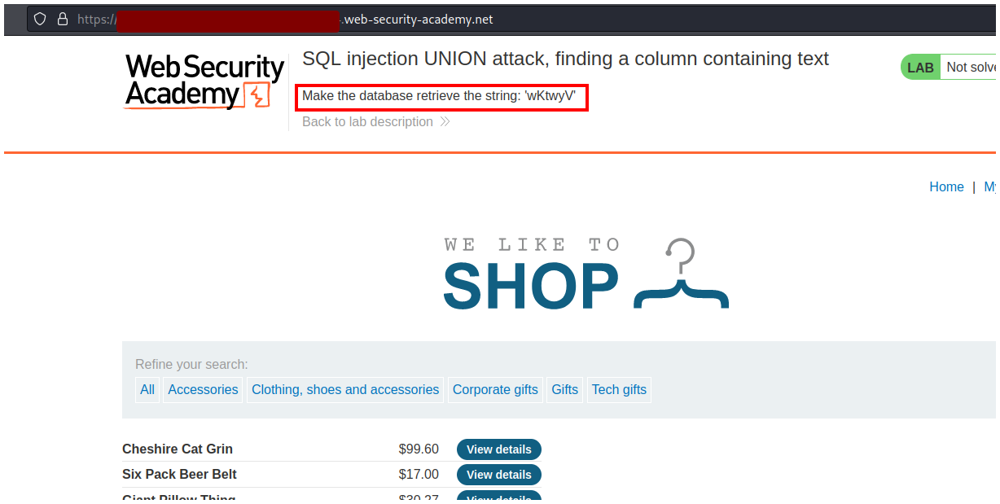
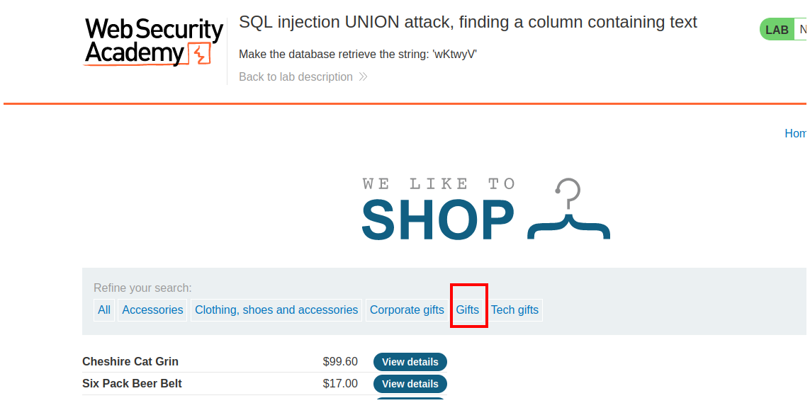
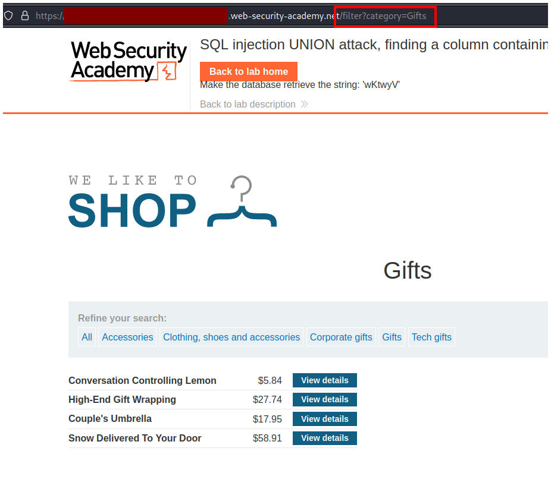
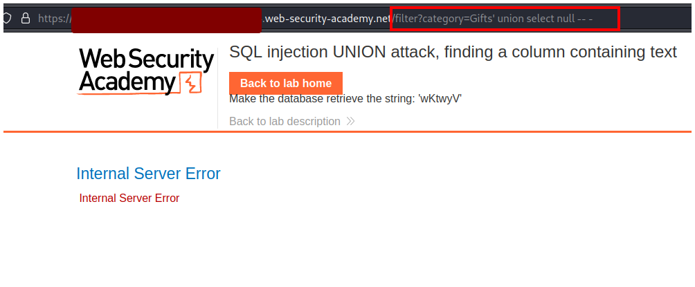
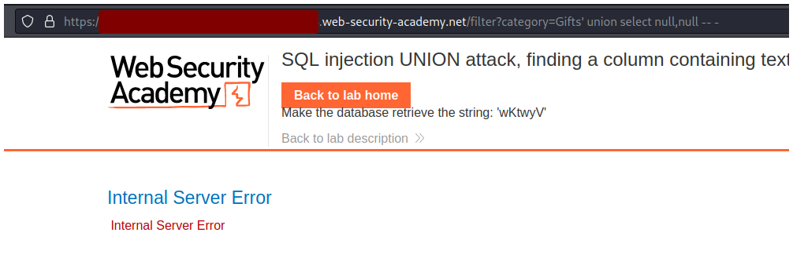
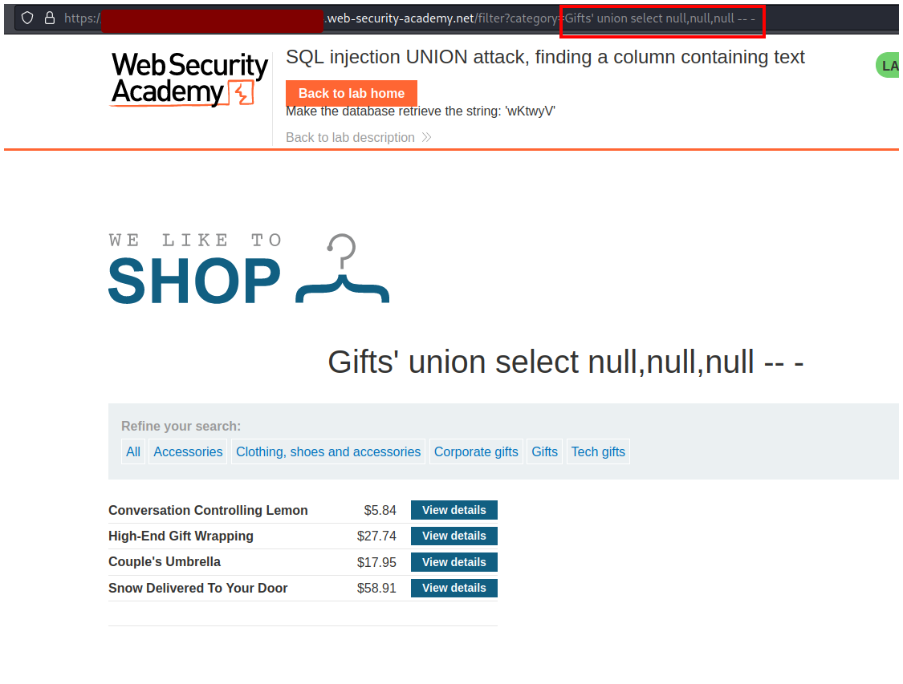
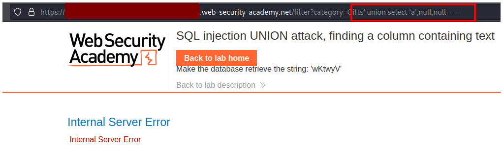
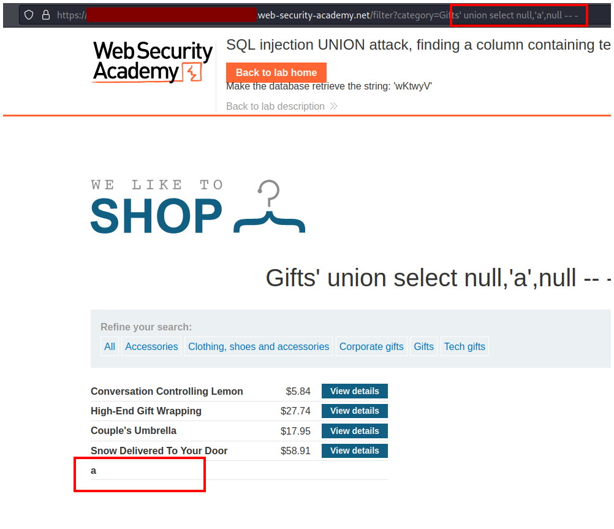
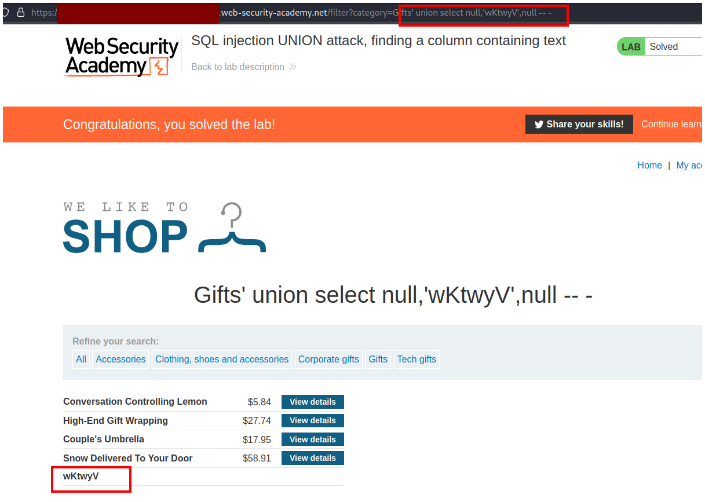

# PortSwigger - SQL injection


## Lab: SQL injection UNION attack, finding a column containing text


## Solución

En la página principal podemos ver un mensaje que nos indica un mensaje, el cual debemos mostrar en la página web a través de la base de datos, o sea, a través de nuestra SQL injection.

El mensaje es `wKtwyV`.



Luego haremos click en un filtro de búsqueda, en mi caso haré click en `Gifts`.



Observamos que en la url se agrega un filtro `filter?category=Gifts`.



Primero debemos enumerar el número de columnas que existen, para eso comenzamos con un `null` y seguimos agregando hasta que la página nos responda correctamente, en este caso con un solo `null` la página se rompe.

```sql
' UNION SELECT null -- -
```



Si agregamos dos `null` también nos devuelve un error.

```sql
' UNION SELECT null,null -- -
```




Si agregamos tres `null` la página nos responde correctamente, esto significa que existen tres columnas.

```sql
' UNION SELECT null,null,null -- -
```



Después de enumerar el númera de columnas hay que enumerar la columna que acepta strings, para eso cambiamos un null por una string entre comillas.

```sql
' UNION SELECT 'a',null,null -- -
```

Podemos ver que la primera columna ha sido cambiada por una string `'a'` pero la página nos devuelve un error, esto significa que la primera columna no acepta strings.



Entonces cambiamos la primera columna devuelta a `null` y modificamos el segundo `null` para que ahora sea una string `'a'`

```sql
' UNION SELECT null,'a',null -- -
```

Esta vez podemos ver que la página nos responde correctamente y que muestra nuestra letra `a` en la página al final.



Finalmente cambiamos la letra `a` por la cadena que nos señalaba la página al principio `# wKtwyV` y resolvemos el lab.

```sql
' UNION SELECT null,'wKtwyV',null -- -
```

