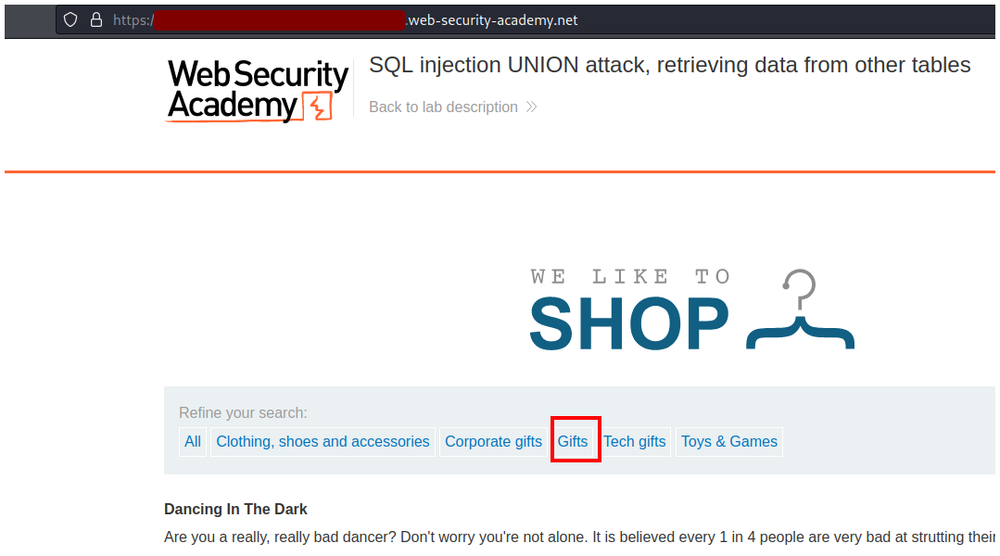
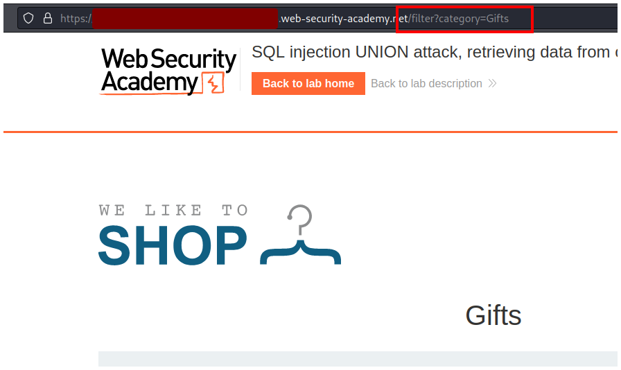
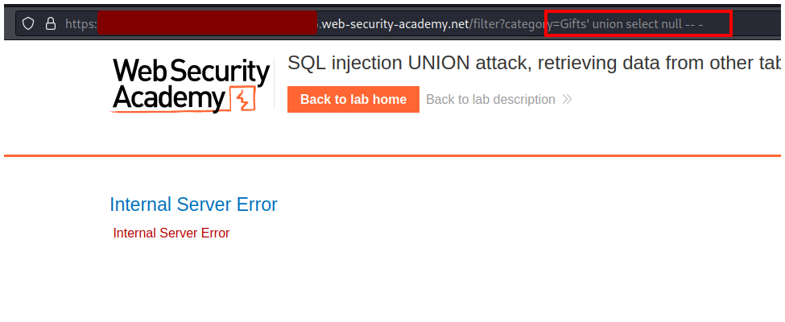
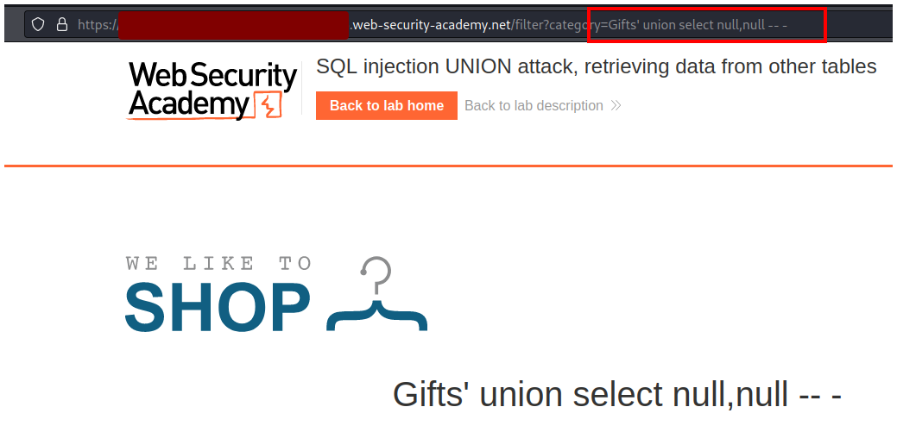
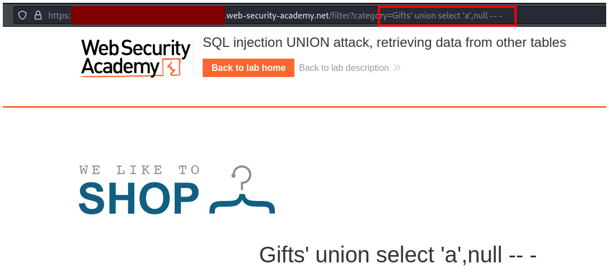
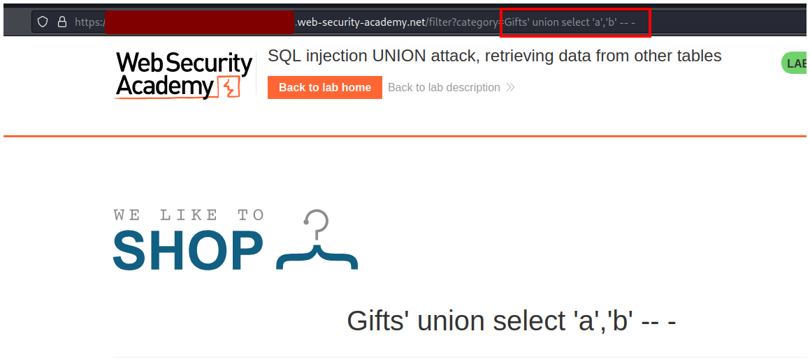
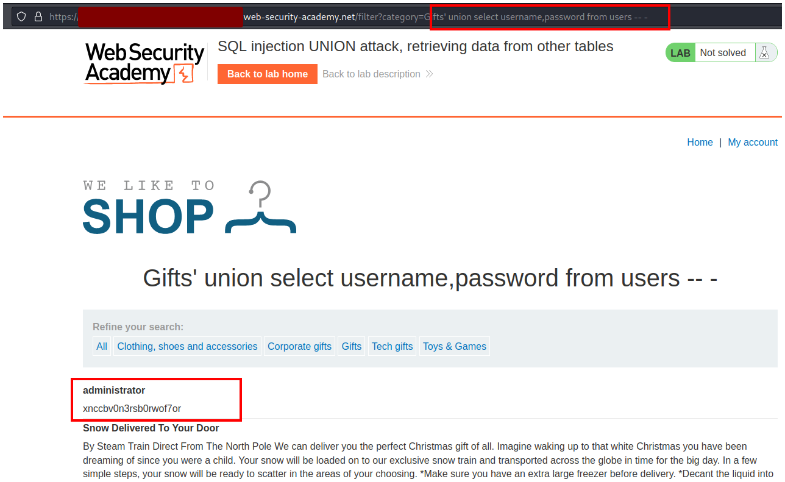
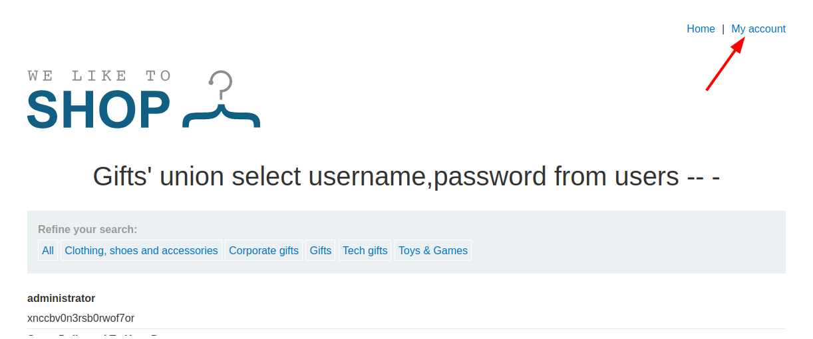
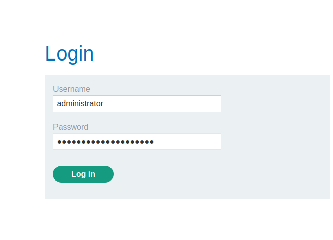
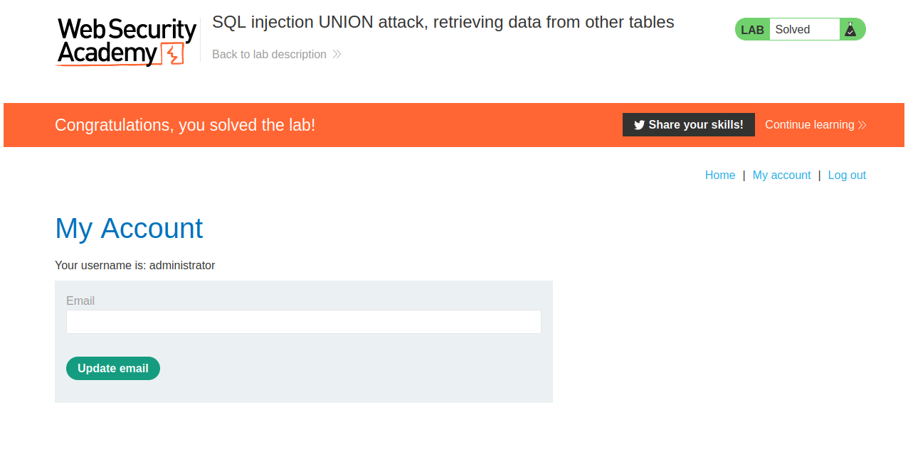

# PortSwigger - SQL injection


## Lab: SQL injection UNION attack, retrieving data from other tables


## Solución

Primero hacemos click en **Gifts** o cualquiera do los filtros de búsqueda.



Y podemos ver que se agrega a la url `filter?category=Gifts`.



Nuestro objetivo es obtener la contraseña de administrador pero antes hay que enumerar. Primero enumeraremos la cantidad de columnas.

```sql
' UNION SELECT null -- -
```



Vemos que con un `null` la página nos devuelve un error, pero con dos `null` la página se arregla, esto significa que hay 2 columnas.



Ahora hay que comprobar que las columnas aceptan strings. Para eso cambiamos el primer null por una string entre comillas.

```sql
' UNION SELECT 'a',null -- -
```



Ahora probamos la segunda columna.

```sql
' UNION SELECT 'a','b' -- -
```

Podemos comprobar que ambas columnas aceptan strings.



Siguiendo la descripción del reto sabemos el nombre de las dos columnas y el nombre de la tabla, entonces reemplazamos y obtenemos la siguiente query:

```sql
' UNION SELECT username,password from users -- -
```

Después de enviar la petición vemos reflejado en la página nuestro resultado y obtenemos la contraseña.



Con esta infomación podemos iniciar sesión, así que nos vamos a **My account**.



Rellenamos los datos con el nombre y contraseña obtenidos anteriormente.



Y completamos el reto.

