# PortSwigger - SQL injection


## Lab: SQL injection attack, listing the database contents on non-Oracle databases


## Solución

Primero hacemos click en el botón **Gifts** o cualquier otro botón.

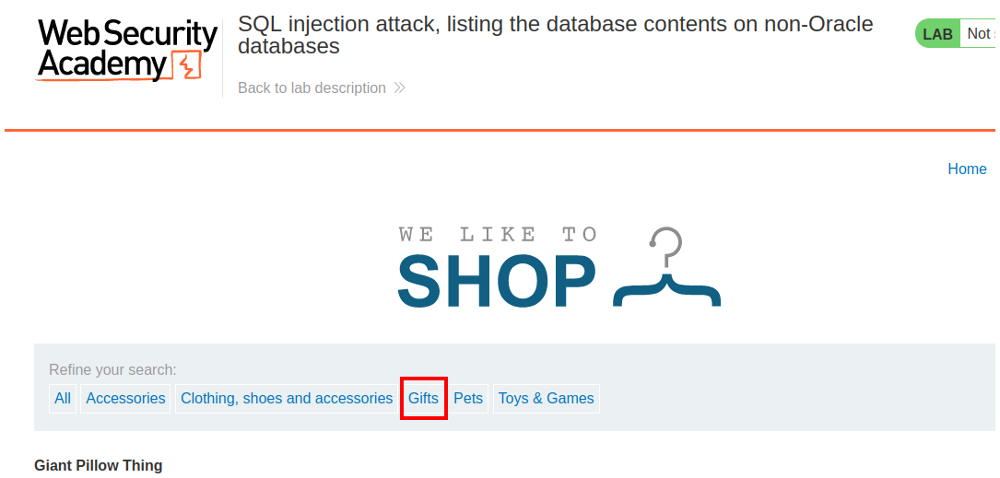

Podemos notar en la url que se agrega un filtro `filter?category=Pets`. Esta parte del laboratorio es vulnerable a SQL injection.

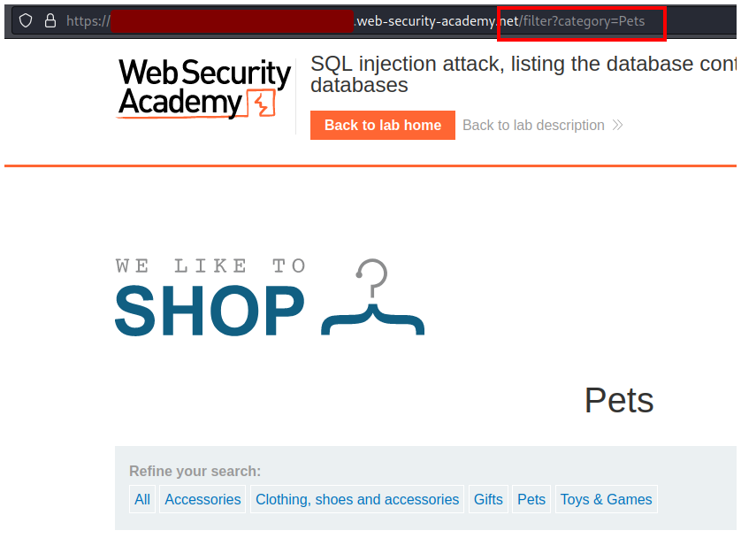

Empezamos enumerando las tablas.

```sql
' ORDER BY 1 -- -
```

Con esta query indicamos que queremos ordenar por la primera columna, así que la página responde correctamente porque siempre habrá una columna como mínimo. Nuestro objetivo es seguir agregando hasta que la página nos responda con un error.

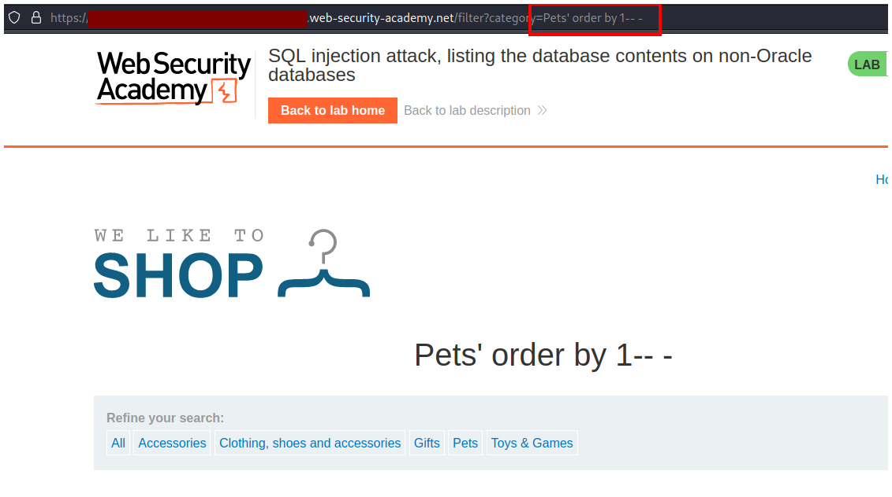

Llegamos hasta 3 y la página nos responde con un error, por lo tanto existen 2 columnas.

```sql
' ORDER BY 1,2,3 -- -
```

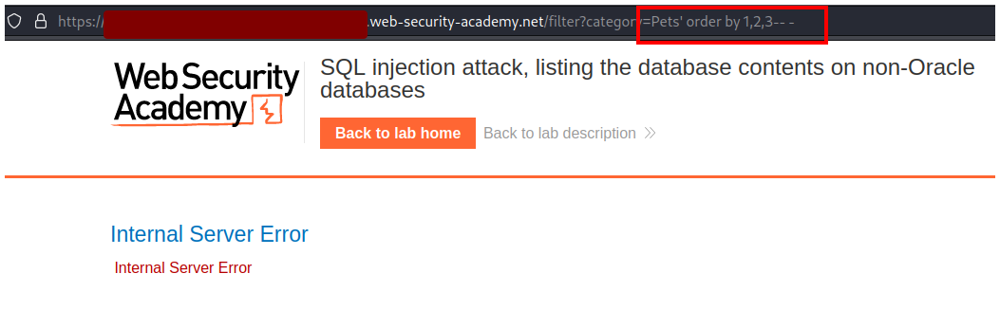

Como existen 2 columnas entonces agregaremos 2 `null` a nuestra query.

```sql
' UNION SELECT null,null -- -
```

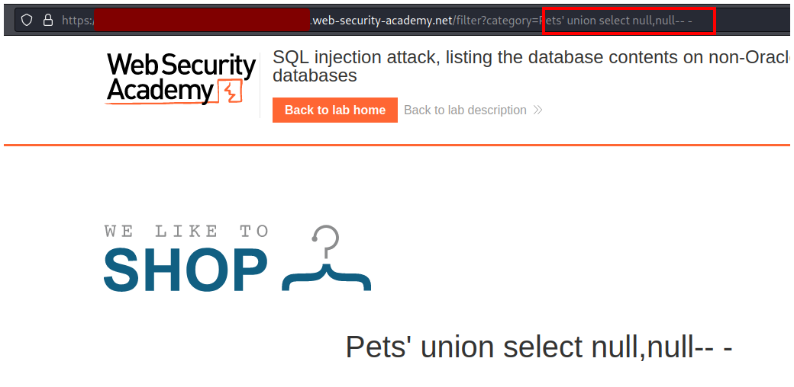

Ahora hay que enumerar los nombres de la tabla y las columnas de donde sacaremos la información que necesitamos.

```sql
' UNION SELECT table_name,null from information_schema.tables -- -
```

Primero cambiamos el primer `null` por `table_name` que es el nombre de la columna que contiene el nombre de todas las tablas que existen en el servidor, y sacaremos la información de `information_schema.tables`. 

`information_schema` es una base de datos predeterminada en varios motores de bases de datos, y contiene información sobre todas las tablas, columnas, etc de todo el servidor. 

`information_schema.tables` es una tabla que contiene toda la información sobre todas las tablas del servidor.

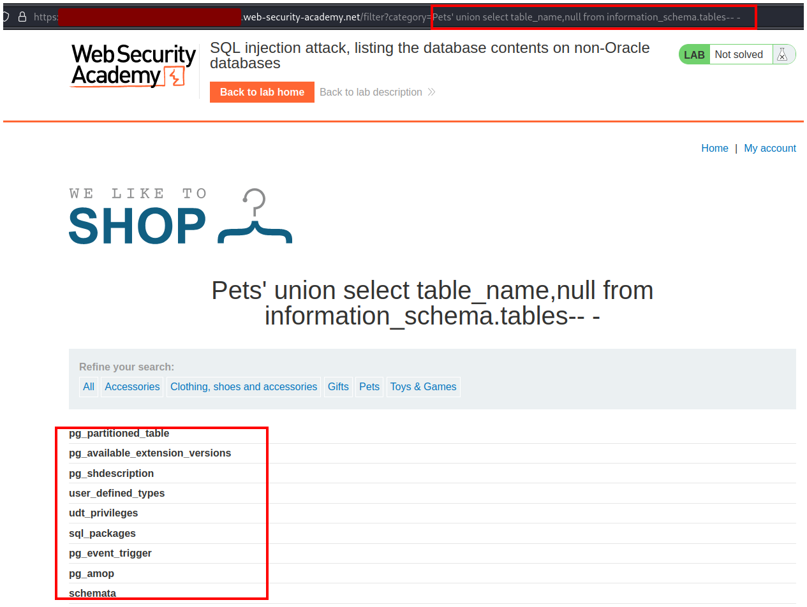

Como vemos están todas las tablas del servidor y al final de la página podemos ver una que nos llama la atención `users_cbkyxg` (esta última string es aleatoria para todos los usuarios).

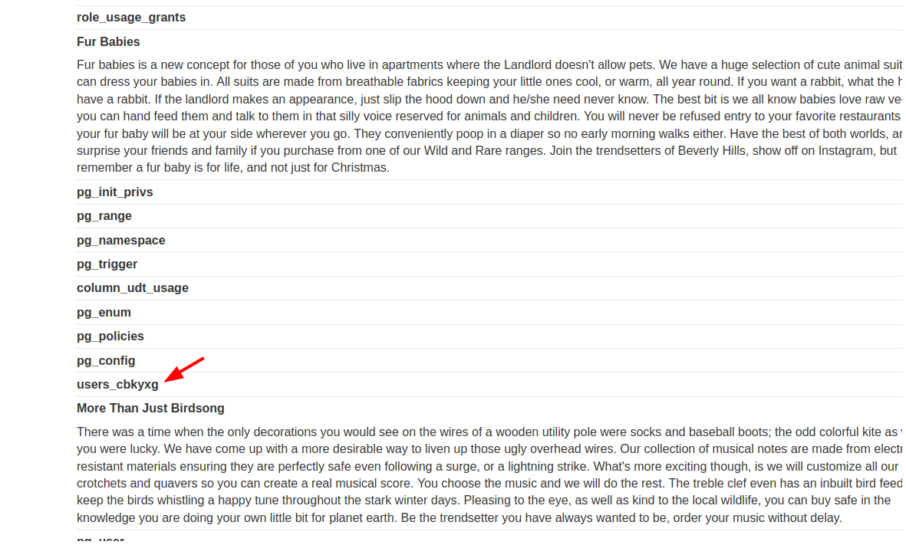

Ahora que sabemos el nombre de la tabla, necesitamos los nombres de las columnas.

```sql
' UNION SELECT column_name,null from information_schema.columns where table_name = 'users_cbkyxg' -- -
```

Como hicimos anteriormente usaremos la base de datos `information_schema` para obtener información, luego cambiaremos el primer `null` por `column_name` para obtener todos los nombres de las columnas de la tabla que vimos antereriormente `users_cbkyxg`.

En vez de `information_schema.tables` ahora usaremos la columna `information_schema.columns` ya que queremos información sobre columnas, no sobre tablas.

Y finalmente indicaremos que queremos información solamente de la columna `users_cbkyxc` con `where table_name = 'users_cbkyxg'`.

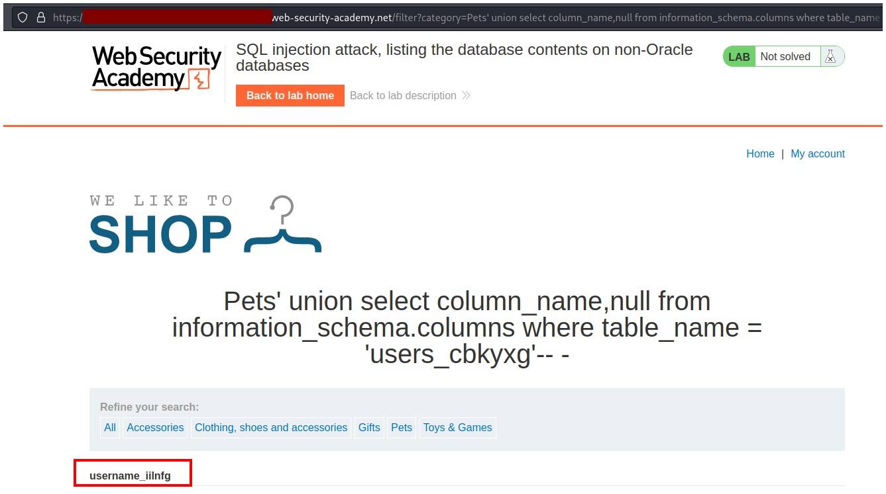

Al principio de la página vemos el nombre de la primera columna y luego vemos el nombre de la segunda columna `usrename_iilnfg` y `password_sutfry`.

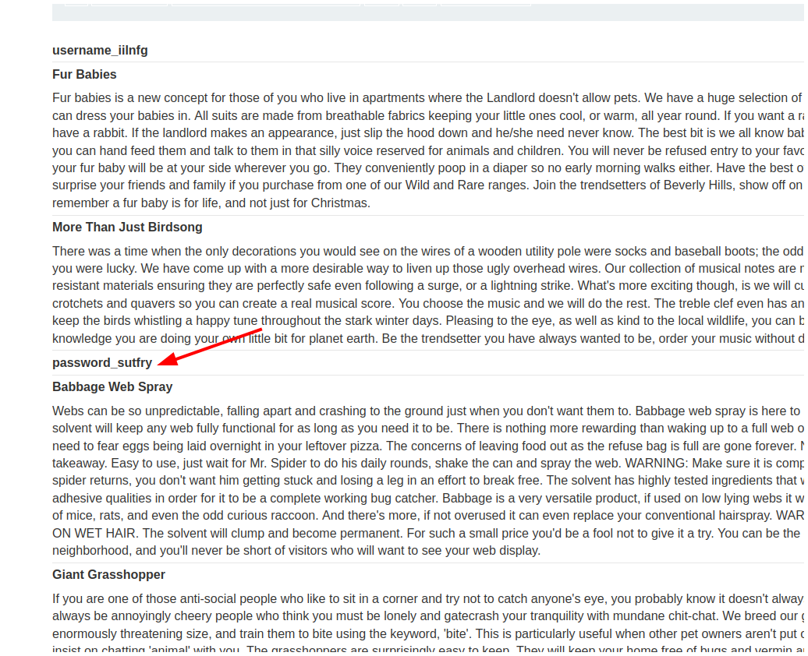

Con toda esta información podemos construir la siguiente query:

```sql
' UNION SELECT username_iilnfg,password_sutfry from users_cbkfxg -- -
```

Reemplazamos los null por los nombres de las columnas que obtuvimos anteriormente y al final le indicamos la tabla que usaremos.

Luego de ejecutar esta query vemos el usuario administrador y su contraseña.

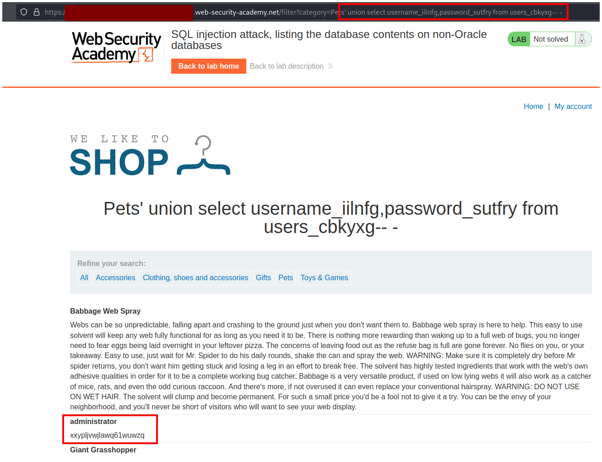

Con estas credenciales nos vamos al botón de **My account**.

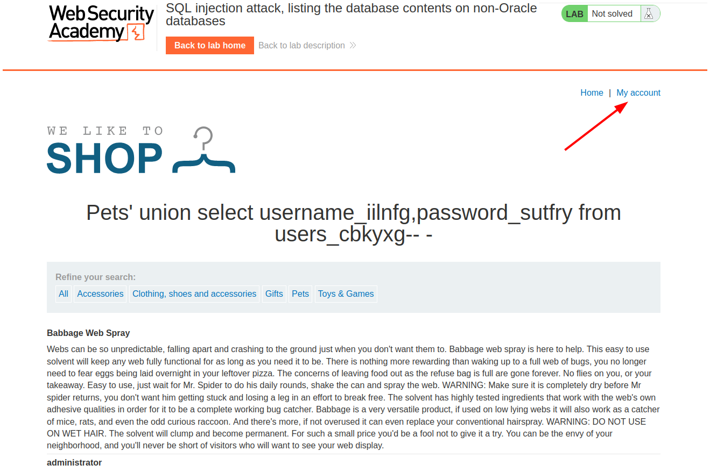

Ingresamos las credenciales.

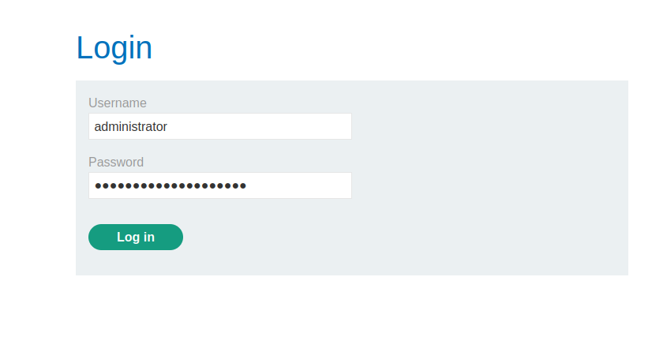

Y resolvemos el laboratorio.

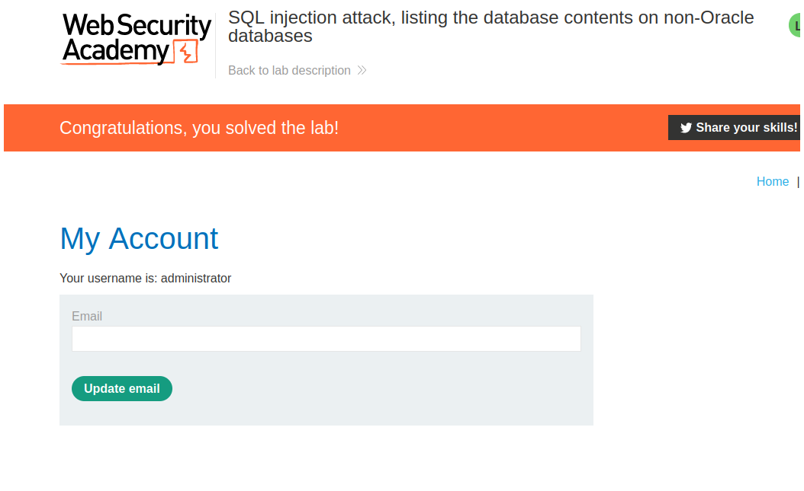