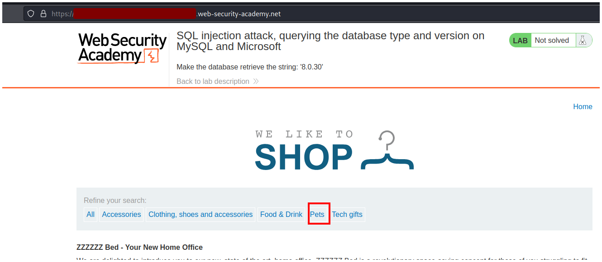
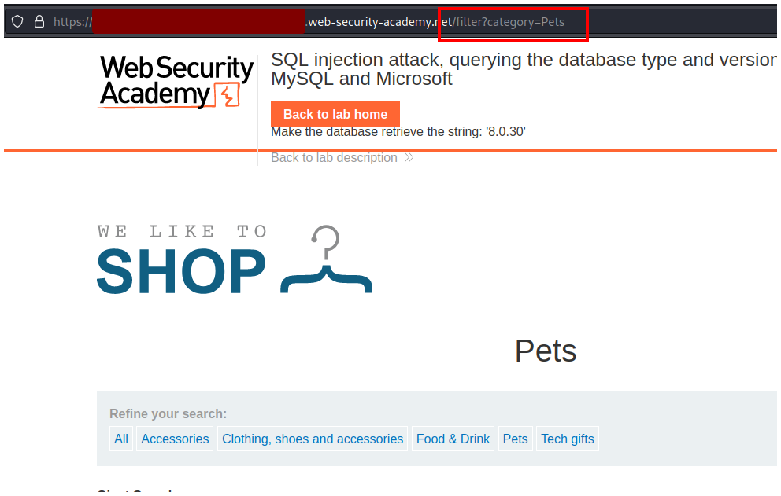
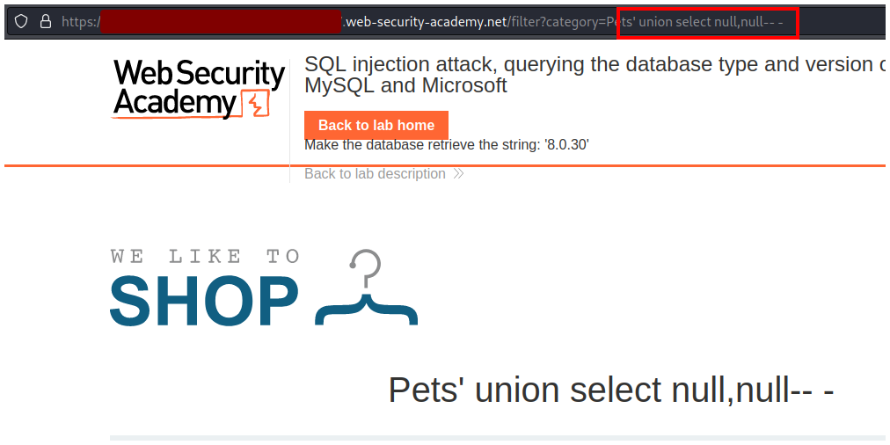
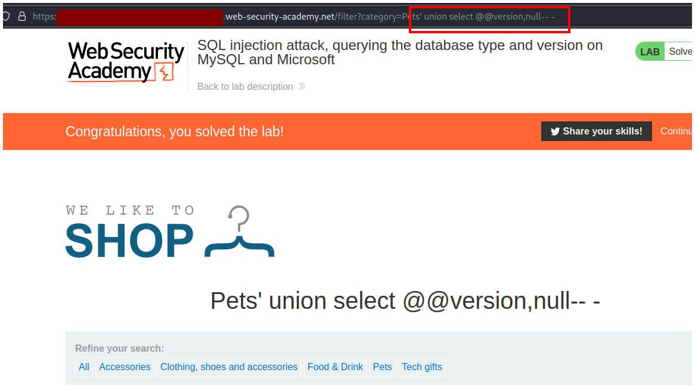
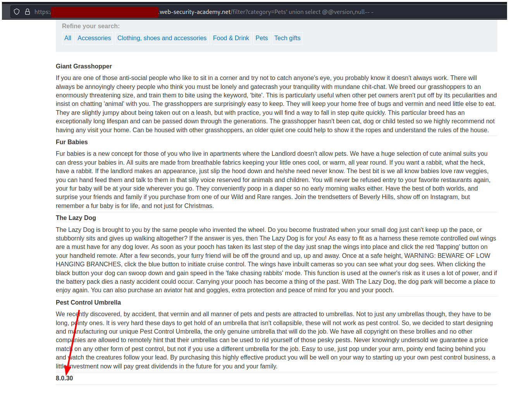

# PortSwigger - SQL injection


## Lab: SQL injection attack, querying the database type and version on MySQL and Microsoft


## Solución

Primero seleccionamos el botón **Pets** o cualquier otro.



Podemos notar que en la url se agrega `filter=category=Pets`, esta parte del laboratorio es vulnerable a SQL injection.



Antes que nada debemos enumerar el número de columnas que existen. Para eso escribimos la siguiente query:

```sql
' ODER BY 1 -- -
```

Con esta query le decimos al servidor que queremos ordenar por 1 columna, como siempre existirá 1 columna entonces la página responde correctamente. 


Seguimos enumerando hasta llegar a 3 columnas.

```sql
' ODER BY 1,2,3 -- -
```

Como la página nos devuelve un error podemos identificar que solo hay 2 columnas.


Como hay 2 columnas entonces podemos armar nuestra query.

```sql
' UNION SELECT null,null -- -
```



Para finalizar debemos revisar el [cheat shett](https://portswigger.net/web-security/sql-injection/cheat-sheet) de PortSwigger o podemos googlear el comando para que las bases de datos MySQL y Microsoft muestren su version.

Nos encontramos con el comando `@@version`, por lo tanto debemos reemplazar un null por este comando.

```sql
' UNION SELECT @@version,null -- -
```



La version de la base de datos se puede ver al final de la página, en mi caso es **8.0.30**.



