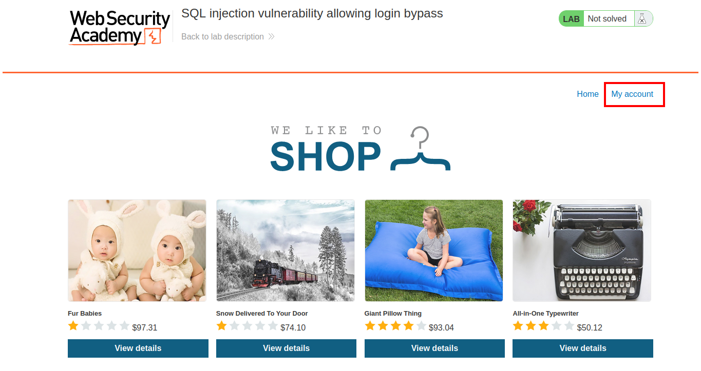
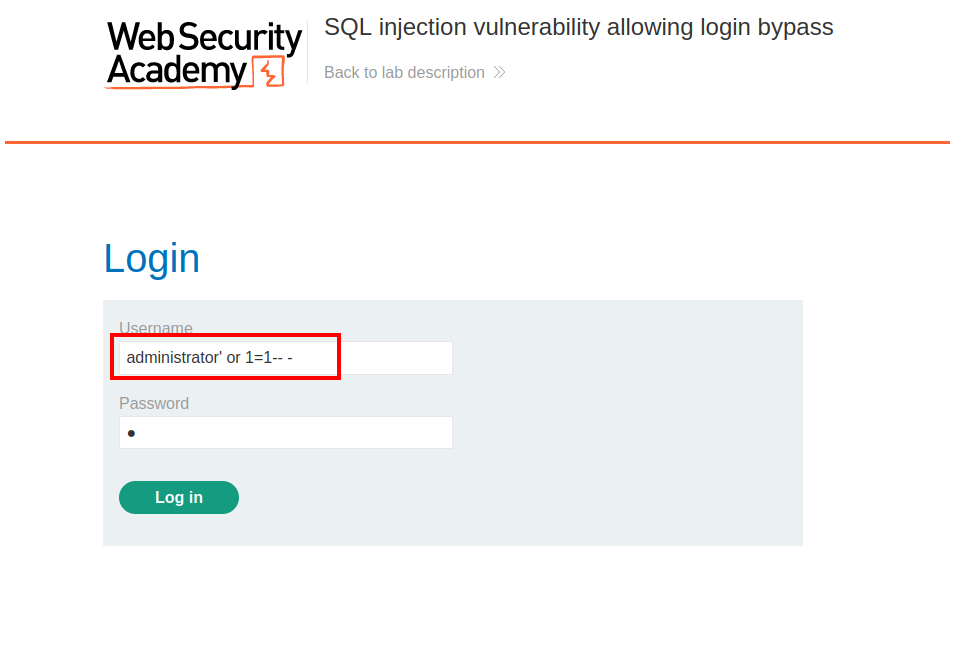
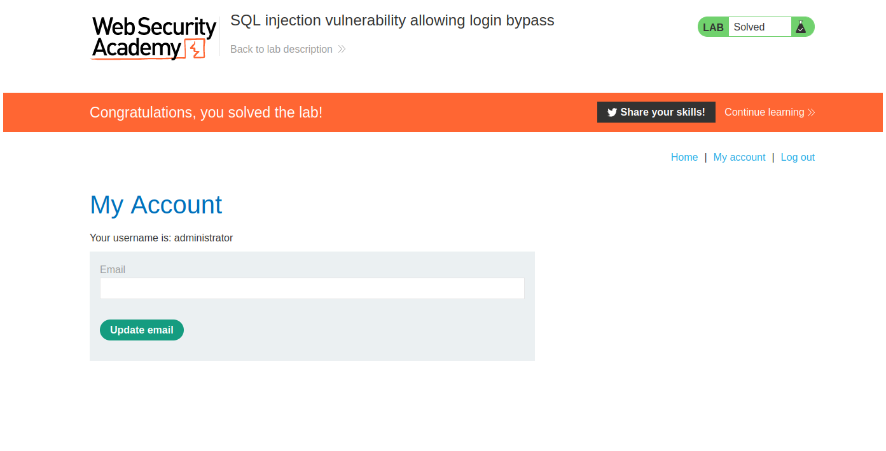

# PortSwigger - SQL injection

## Lab: SQL injection vulnerability allowing login bypass

## Solución

En la página principal tienes que hacer click en el botón que dice **My account**.

Luego en el campo de **Username** escribes `administrator' or 1=1-- -`, y en el campo de contraseña escribes cualquier cosa.

Luego haces click en el botón **Login in** y ya estás en la cuenta de administrador.

