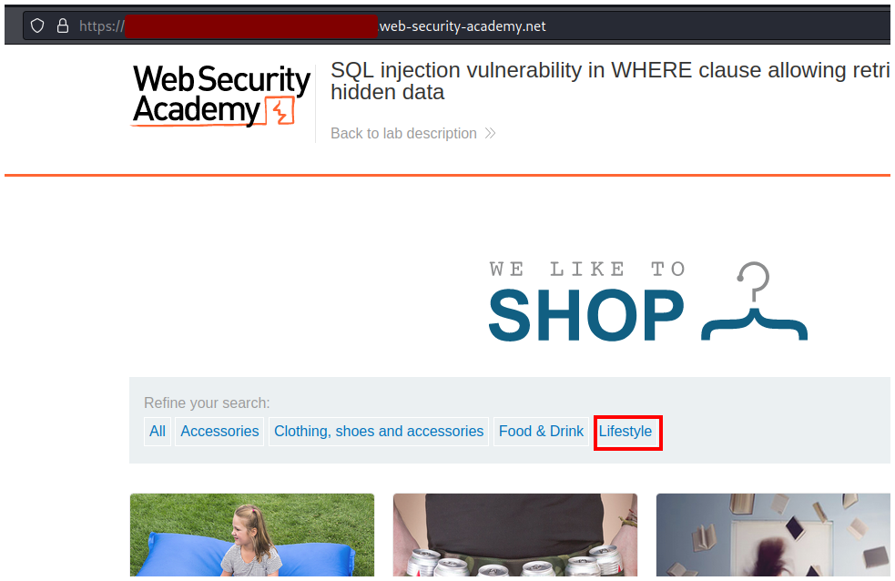
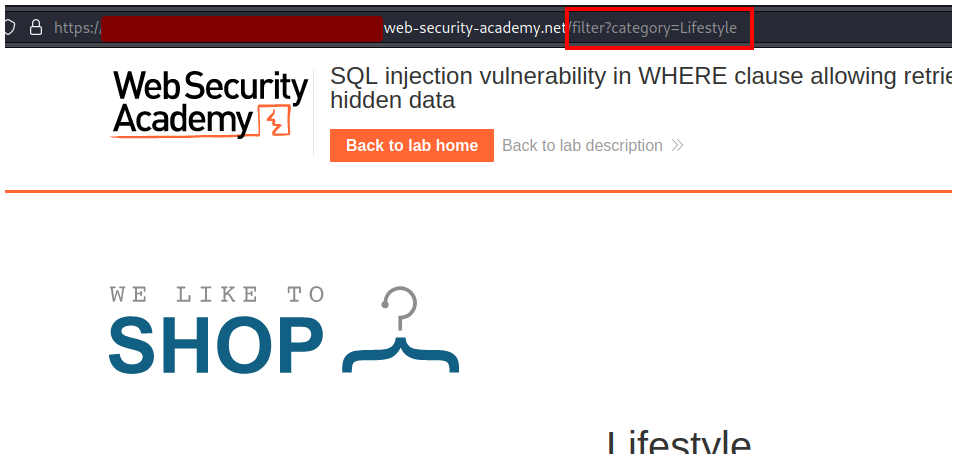
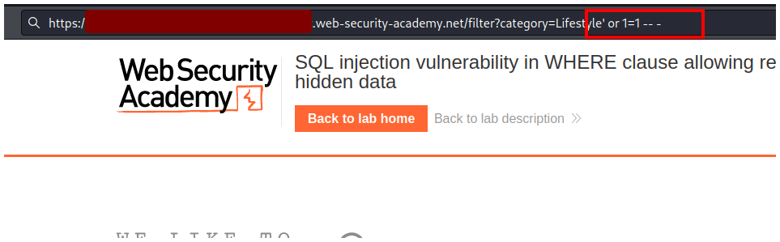
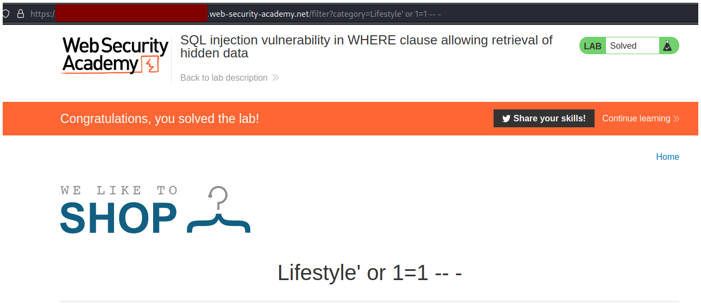

# PortSwigger - SQL injection

## Lab: SQL injection vulnerability in WHERE clause allowing retrieval of hidden data

## Solución

En la página principal debes hacer click en alguna de las opciones de búsqueda, yo voy a hacer click en **Lifestyle**.

En la url verás que se agrega `filter?category=Lifestyle`.

Esta es la parte del reto que es vulnerable a SQLi, por lo tante debes agregar `' or 1=1 -- -` al final.

Si lo envias completas el lab.

