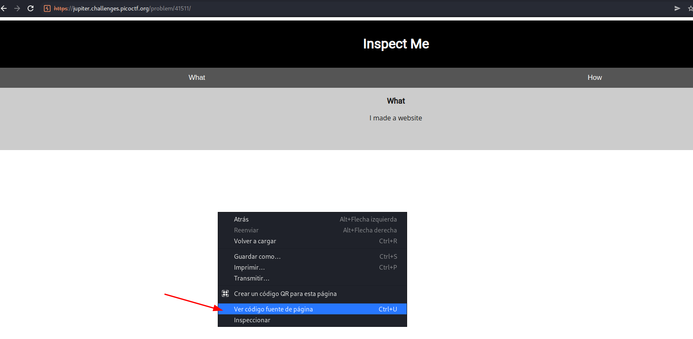
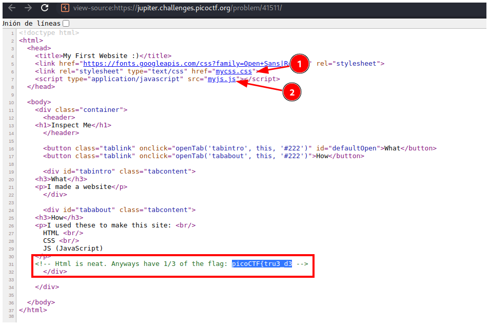
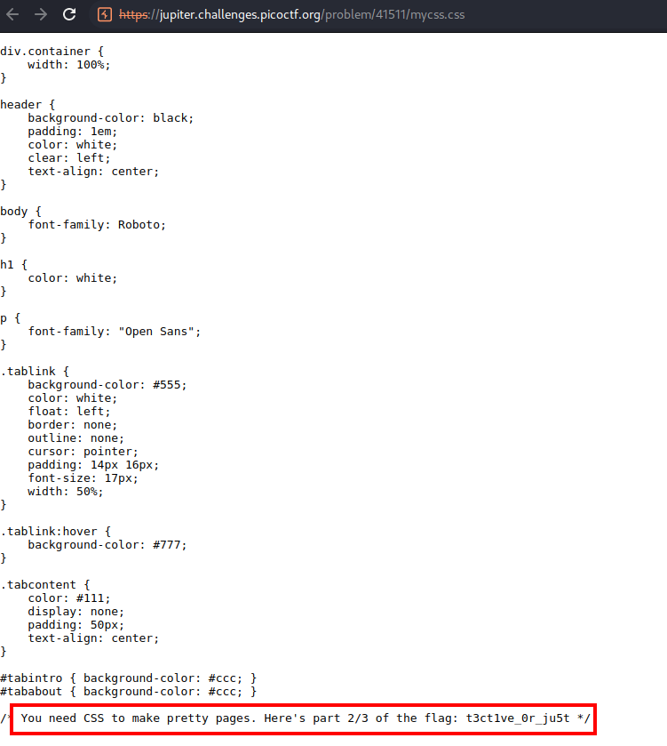
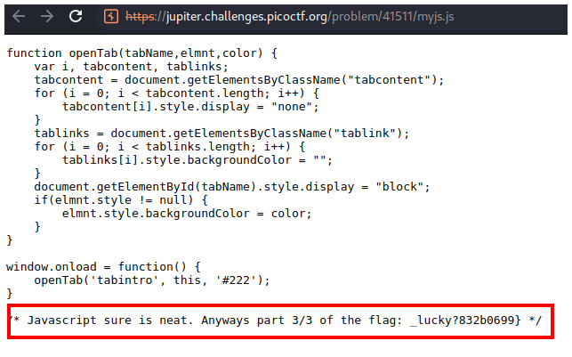

# PicoCTF 2019 - Insp3ct0r

## Descripción
Kishor Balan tipped us off that the following code may need inspection.

## Hints
- How do you inspect web code on a browser?
- There's 3 parts

## Solución
En la página principal presionas click derecho y luego "Ver código fuente de la página".

En un comentario al final de la página está la primera parte de la flag `picoCTF{tru3_d3`. El resto de la flag está en los archivos **mycss.css** y **myjs.js**.

En **mycss.css** vemos la segunda parte.

La tercera parte está en **myjs.js**.

## Flag
`picoCTF{tru3_d3t3ct1ve_0r_ju5t_lucky?832b0699}`