# PicoCTF2019 - Irish-Name-Repo 3

## Descripción

There is a secure website running at  _Link_. Try to see if you can login as admin!

## Hints

Seems like the password is encrypted.

## Solución

En la página principal hacemos click en el botón **Admin Login**.

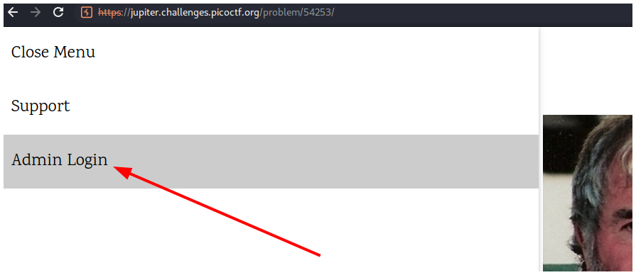

No tenemos ninguna pista útil, así que miramos el código fuente de la página haciendo click derecho y en **Inspeccionar**.

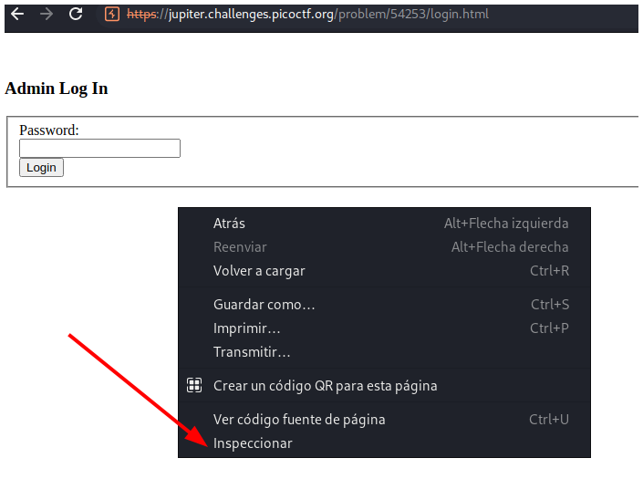

Luego seleccionamos la parte de **body** del cógido HTML, hacemos click derecho y seleccionamos **Expandir de manera recurrente** para poder ver todo el código fuente.

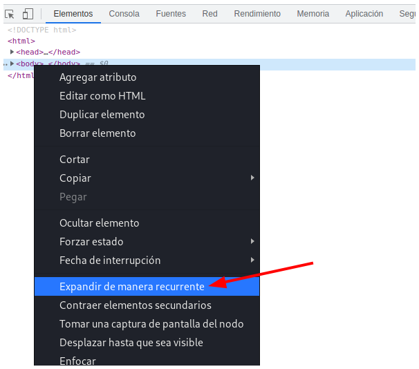

Notamos un **Input** que es de tipo **hidden** y tiene como nombre **debug**.

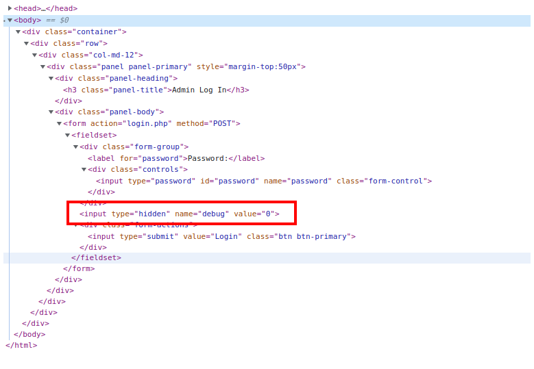

Para hacerlo visible simplemente eliminamos el texto **hidden**.

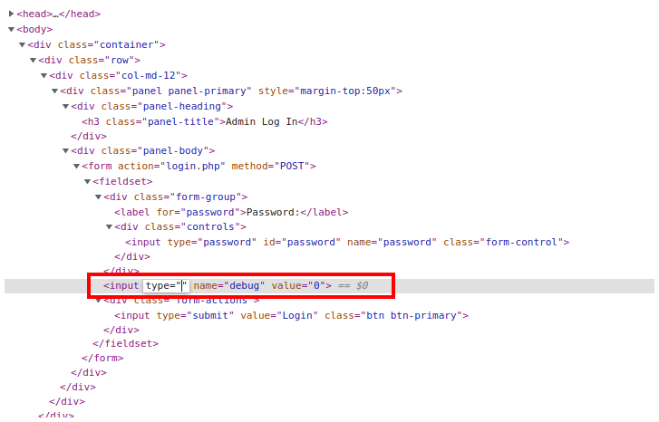

Recargamos la página y vemos un nuevo input con el número 0. 

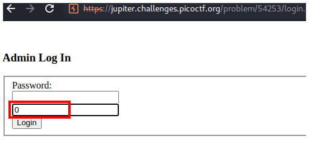

Si escribimos nuestro payload de SQLi `' or 1=1-- -`, cambiamos el 0 a un 1 y hacemos click en login veremos información extra sobre la petición.

Podemos ver cómo se ejecuta la query en el servidor. Vemos que transforma nuestro `or` a `be`.

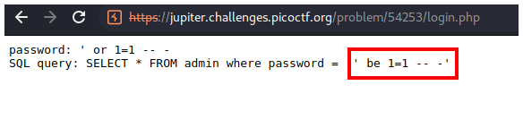

Si escribimos todo el abecedario nos damos cuenta que las letras están desfasadas un número de espacios.

Si escribimos `abcdefghijklmnopqrstuvwxyz`, el servidor lo trasforma a `nopqrstuvwxyzabcdefghijklm`, por lo tanto, podemos notar que es rot13.

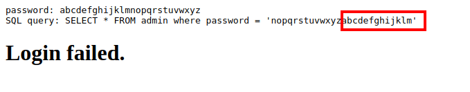

Para combrobarlo vamos a [CyberChef][https://gchq.github.io/CyberChef/], y en el campo de **Input** escribimos `or`.

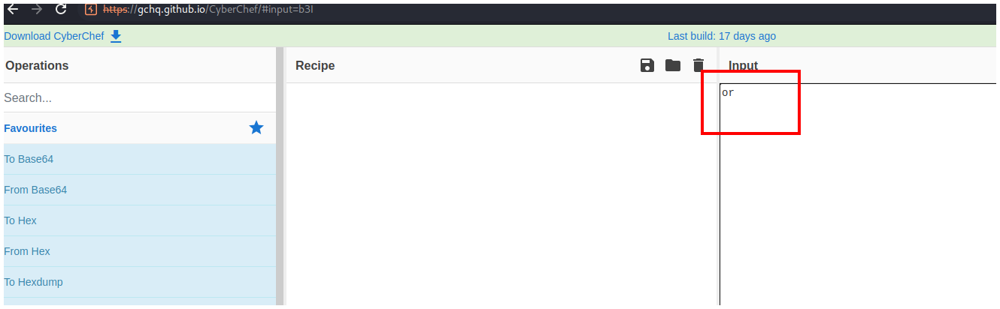

Después escribimos `rot13` en **Operations** y arrastramos ROT13 a **Recipe**.

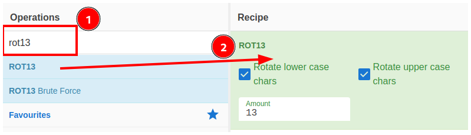

Comprobamos que es rot13 porque anteriormente escribimos **or** y el servidor nos mostraba **be**.

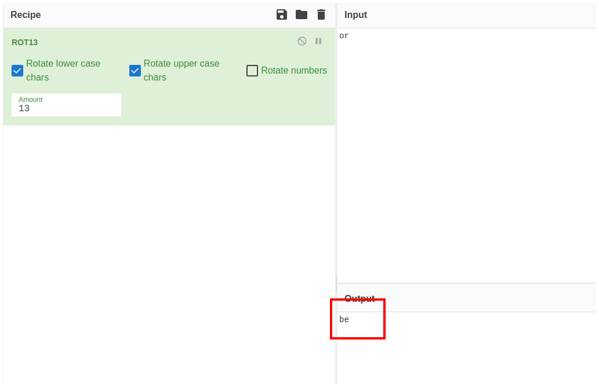

Y si ahora escribimos **be** podemos ver que nos devuelve **or**.

	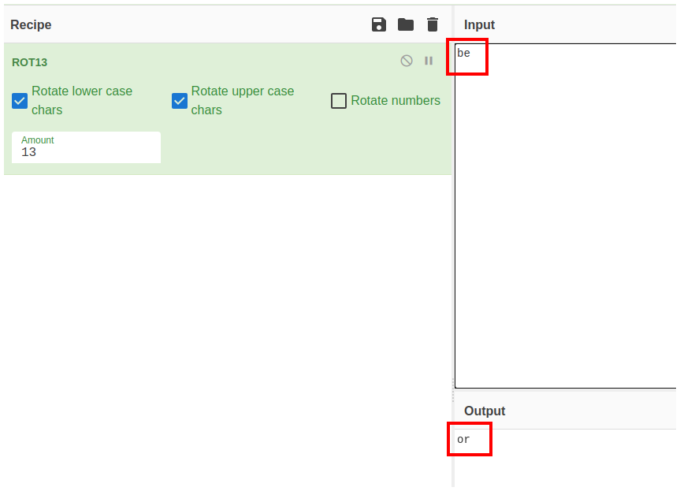

Con esto en mente, nuestro payload quedaría así: 
`' be 1=1 -- -`

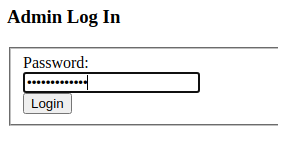

Y podemos iniciar sesión.

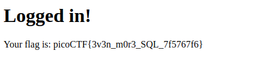

## Flag

`picoCTF{3v3n_m0r3_SQL_7f5767f6}`