# PicoCTF2019 - JaWT Scratchpad


## Descripción

Check the admin scratchpad! 


## Hints

- What is that cookie?
- Have you heard of JWT?


## Solución

Primero iniciamos sesión con cualquier nombre, en mi caso escribí **hola**.

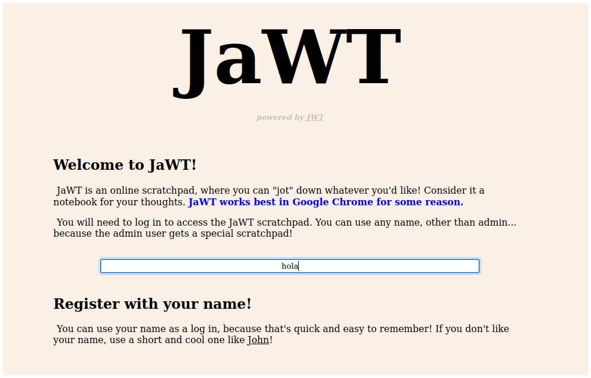

Y podemos ver un scratchpad, pero nada más.


La propia página nos da pistas. 

Primero, el nombre de la aplicación es JaWT, si juntamos las letras mayúsculas nos queda JWT que son las siglas de Json Web Token. Romper un JWT es muy común en CTFs. 

Segundo, nos marca el nombre **John**. John es una herramienta para realizar ataques de fuerza bruta, entonces es seguro que tendremos que encontrar el secreto del JWT con este método, y luego crear un JWT para hacernos pasar por el usuario **admin**.

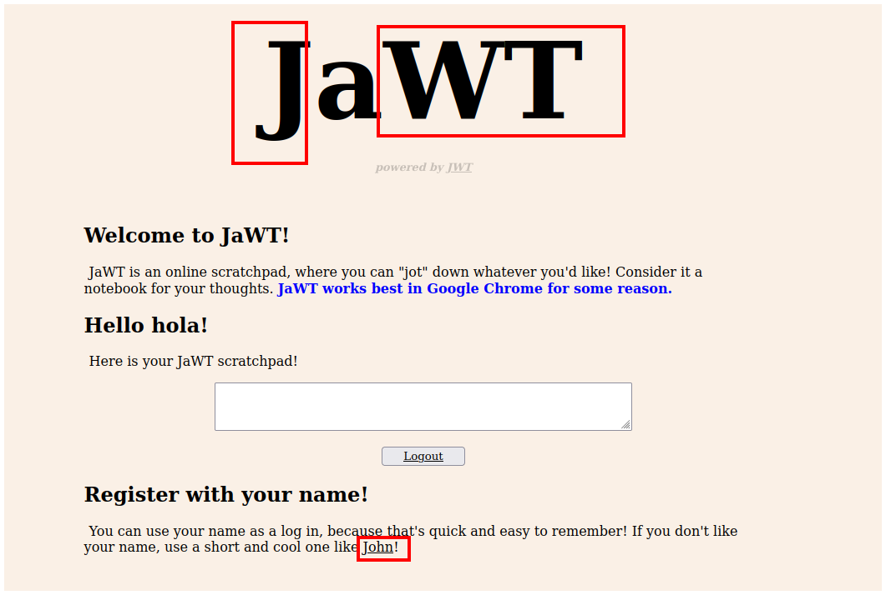

Si inspeccionamos la página y vamos a la pestaña **Storage**, veremos el valor del jwt.

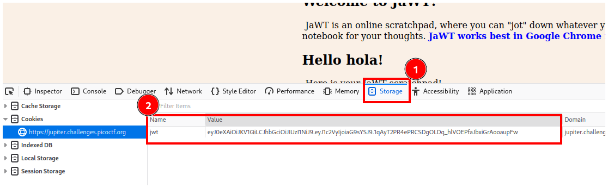

Copiamos el valor del jwt, nos vamos a [jwt.io][https://jwt.io/] y pegamos el valor de nuestro jwt en el campo **Encoded**.

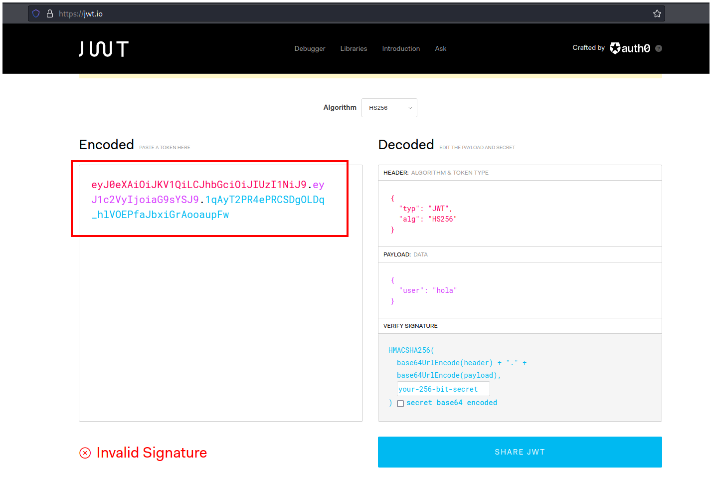

Podemos ver 2 cosas importantes, el algoritmo y el usuario. Con el algoritmo podemos decirle a john el formato que debe usar para realizar su ataque, y si encontramos el secreto podremos cambiar el nombre de usuario a **admin**.

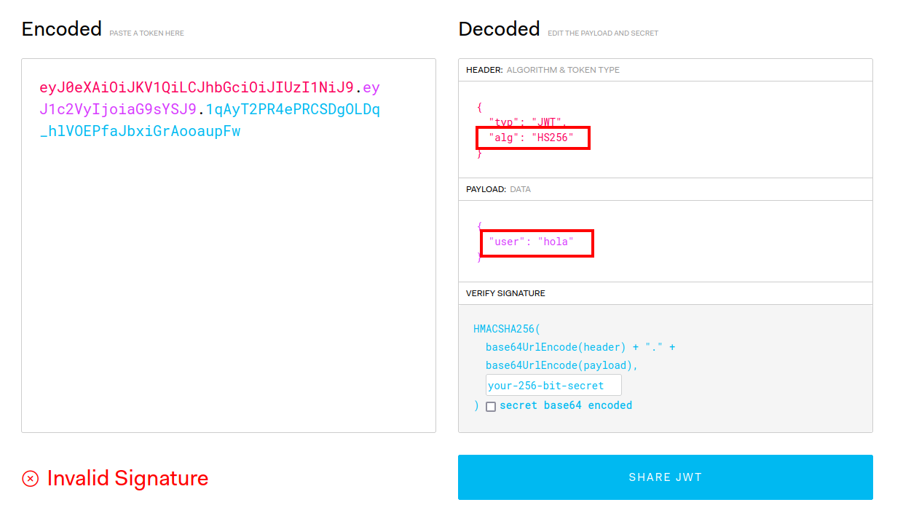

Primero guardaremos el valor de nuestro jwt en un archivo llamado **jwt.txt**.

```bash
$ echo -n "el_valor_del_jwt" > jwt.txt
```

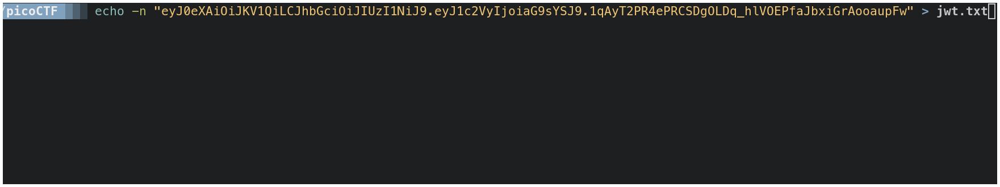

Y después ejecutaremos john para que realize su ataque de fuerza bruta, especificándole el nombre de nuestro archivo, el nombre del diccionario, y el formato HMAC-SHA256 porque anteriormente vimos que está ocupando el algoritmo **HS256**.

```bash
$ john jwt.txt --wordlist="el_diccionario_que_utilizarás" --format=HMAC-SHA256 
```

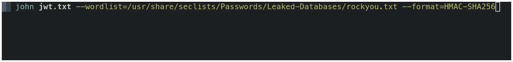

Vemos que el secreto es `ilovepico`.

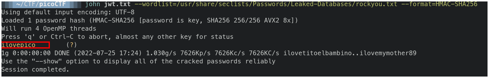

Colocamos este secreto en la pestaña **VERIFY SIGNATURE**.

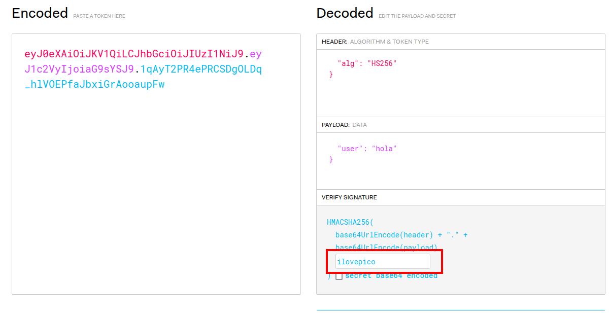

Y ahora podemos cambiar nuestro nombre de usuario a **admin**.

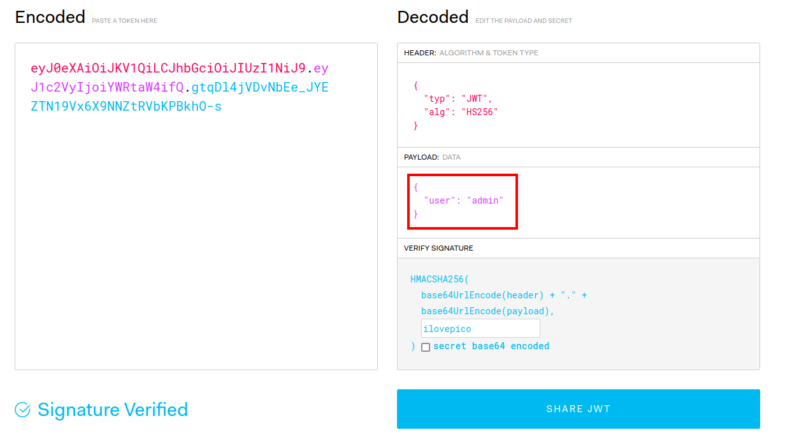

Copiamos todo lo que está en la pestaña **Encoded**, vamos a la página del reto y borramos el campo **Value**.

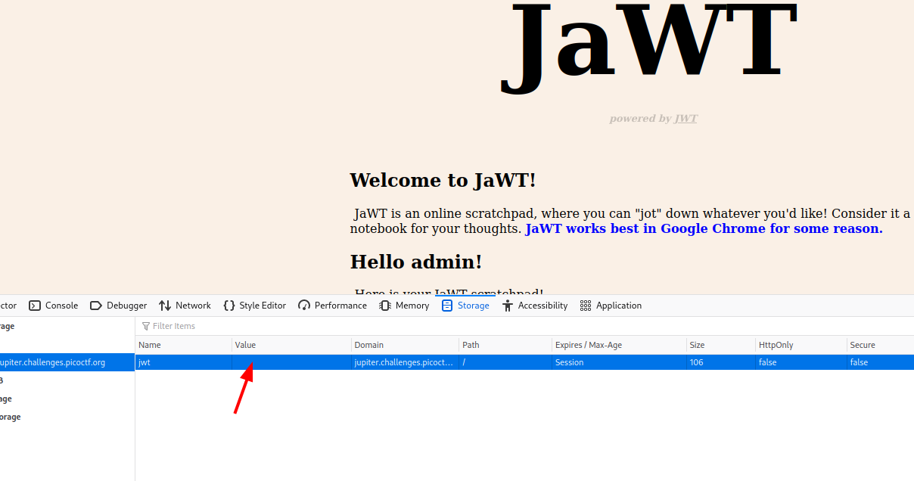

Ahora pegamos lo que anteriormente copiamos.

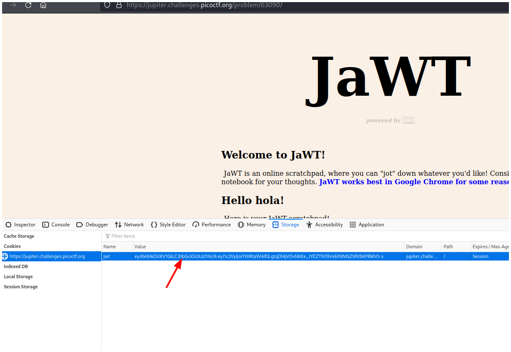

Finalmente recargamos la página y podemos ver la flag.

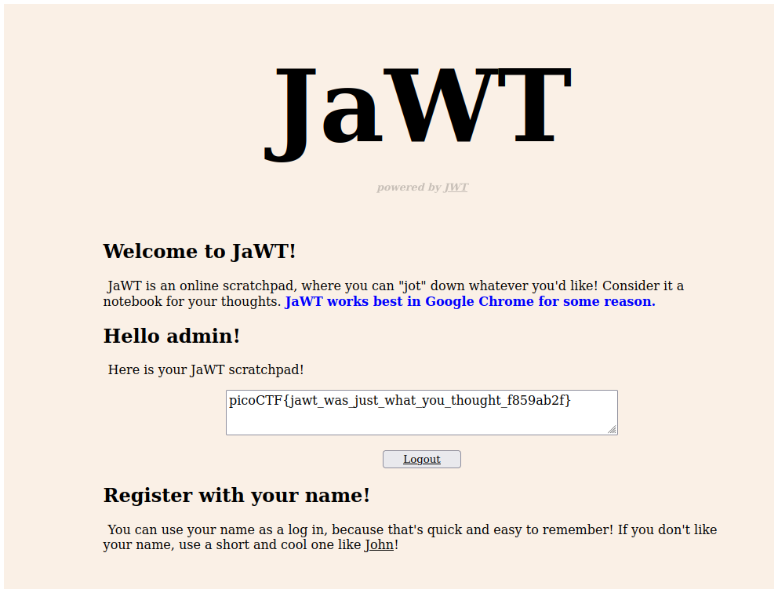


## Flag

`picoCTF{jawt_was_just_what_you_thought_f859ab2f}`