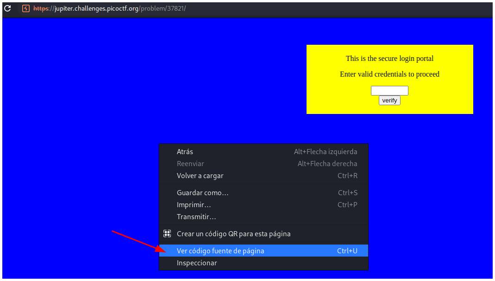

# PicoCTF 2019 - dont-use-client-side

## Descripción

Can you break into this super secure portal? 

## Hints

Never trust the client

## Solución

Estando en la página principal debes hacer doble click y seleccionar **Ver código fuente de la página**.

En el código fuente se puede ver la flag dividida en varias partes.

## Flag

`picoCTF{no_clients_plz_1a3c89}`