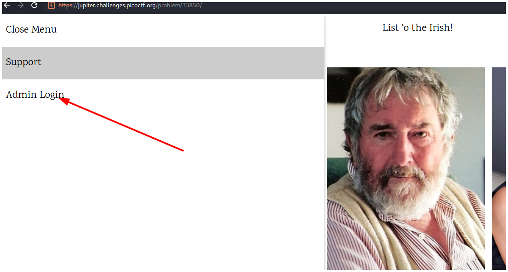
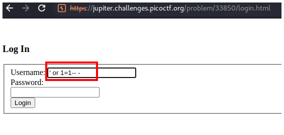
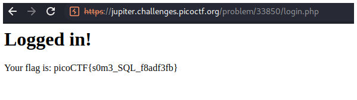

# PicoCTF2019 - Irish-Name-Repo 1

## Descripción

There is a website running at _Link_. Do you think you can log us in? Try to see if you can login!

## Hints
- There doesn't seem to be many ways to interact with this. I wonder if the users are kept in a database?
- Try to think about how the website verifies your login.

## Solución

En la página principal nos vamos a **Admin Login**.

En el campo de **Username** escribimos un payload de sqli muy simple `' or 1=1-- -` y hacemos click en **Login**.

Y podemos visualizar la flag.

## Flag

`picoCTF{s0m3_SQL_f8adf3fb}`