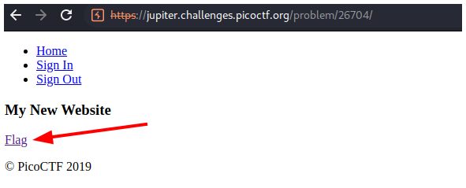
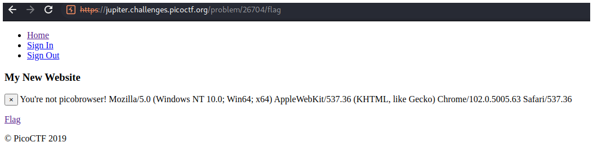
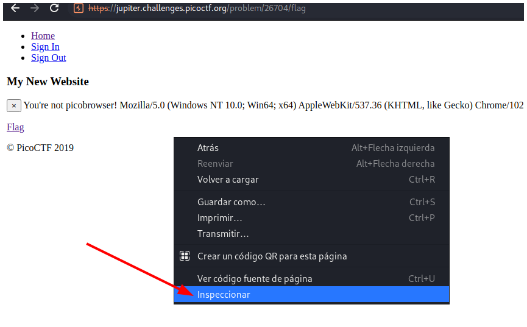
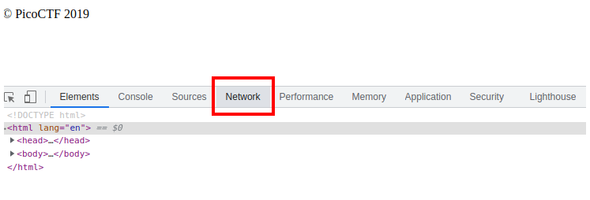
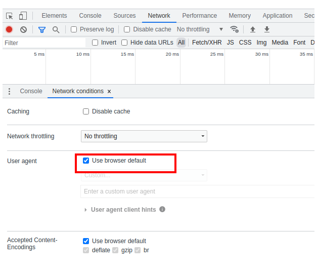
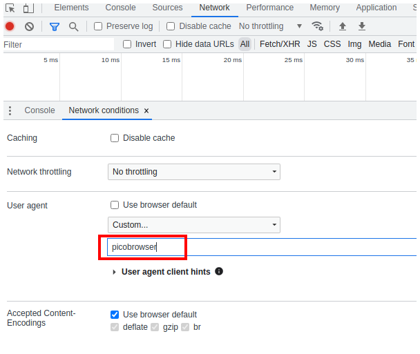
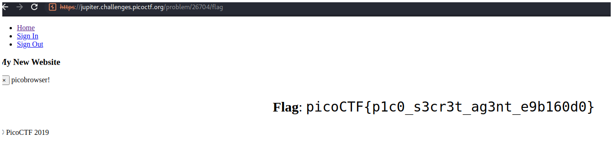

# PicoCTF - picobrowser

## Descripción

This website can be rendered only by picobrowser, go and catch the flag! 

## Hints

You don't need to download a new web browser

## Solución

Primero debemos irnos a la página donde está la flag haciendo click en el link.

Pero al entrar en la página nos dice que nuestro navegador no es **picobrowser**, como nos especificaron en la descripción, para visualizar la flag nuestro navegador debe ser picobrowser.

Para decirle a la página que nuestro navegador en **picobrowser** debemos ir a **Inspeccionar**.

Luego en irnos a la pestaña **Network**.

Y hacer click en el botón con símbolo de WIFI.

Nos aparecerá una pestaña más abajo donde debemos deshabilitar la opción **Use browser default**.

Y rellenar el campo vació con el nombre del navegador que queremos suplantar.

Si recargamos la página podemos ver la flag.

## Flag

`picoCTF{p1c0_s3cr3t_ag3nt_e9b160d0}`