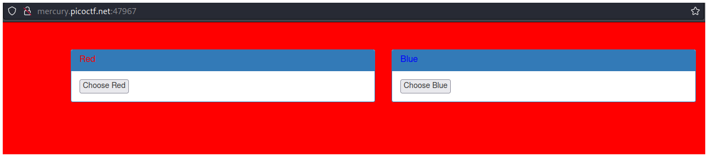
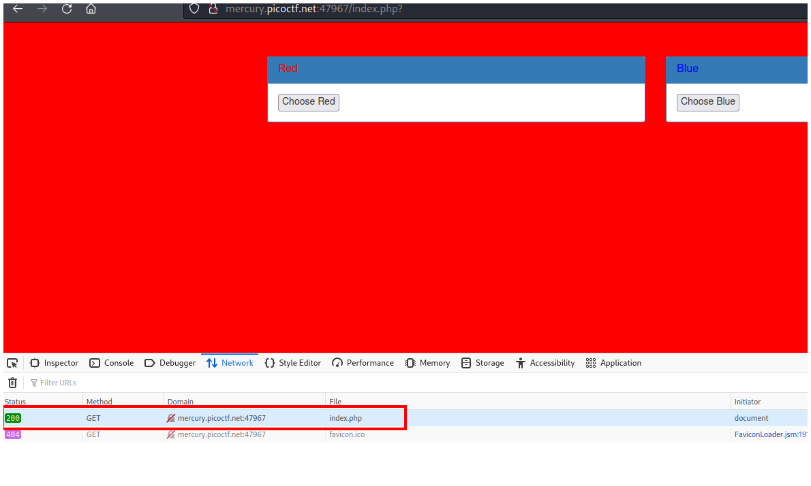
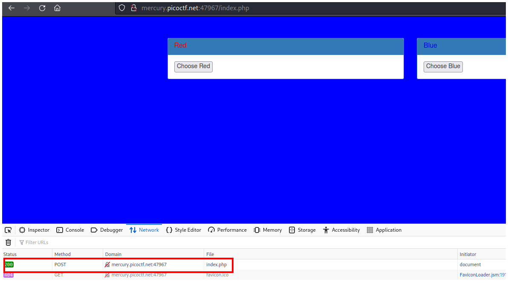
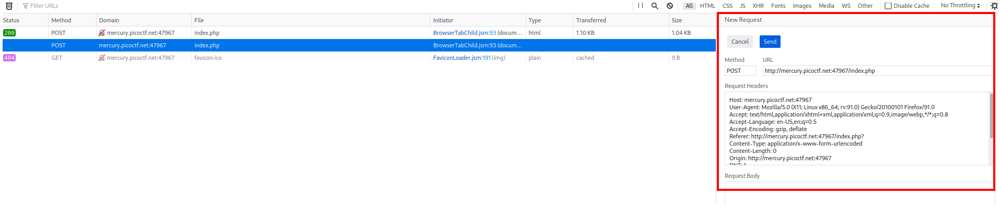
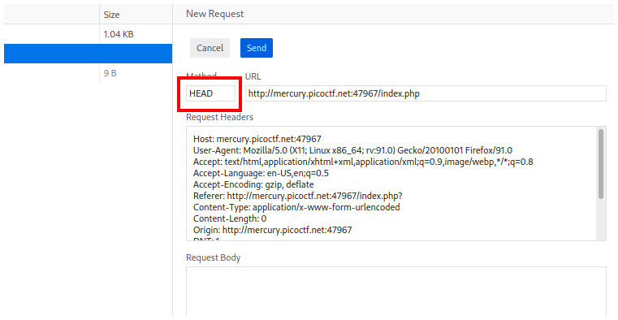
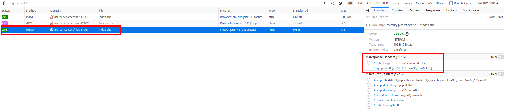

# PicoCTF2021 - GET aHEAD

## Descripción

Find the flag being held on this server to get ahead of the competition

## Hints

- Maybe you have more than 2 choices
- Check out tools like Burpsuite to modify your requests and look at the responses

## Solución

La página principal no es nada más que 2 botones que cambian el color del fondo.

Si vamos a las herramientas de desarrollador y observamos las peticiones en la pestaña **Network**, podemos notar que cada botón utiliza un **método** distinto.

El botón rojo utiliza el método GET y el botón azul utiliza el método POST.

Si hacemos click derecho y seleccionamos editar petición nos saldrá un cuadro a la derecha de la pantalla.

Podemos probar los distintos métodos que existen, pero como el challenge se llama **GET aHEAD** vamos a escribir en el recuadro **Method** el método **HEAD**.

Hacemos click en el botón **Send** y veremos que nuestra nueva petición ha sido realizada correctamente. Si hacemos click en la petición podemos ver la flag en la pestaña **Response Headers**.

## Flag

`picoCTF{r3j3ct_th3_du4l1ty_cca66bd3}`