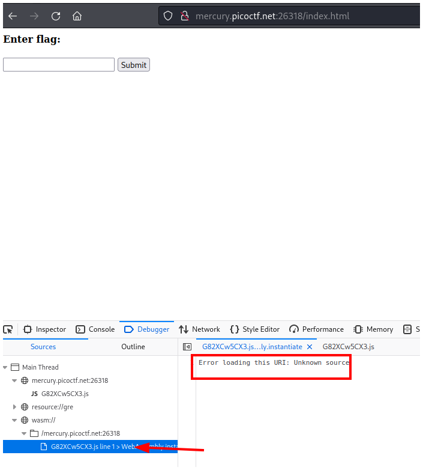
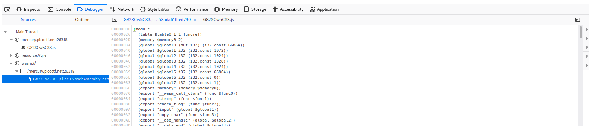
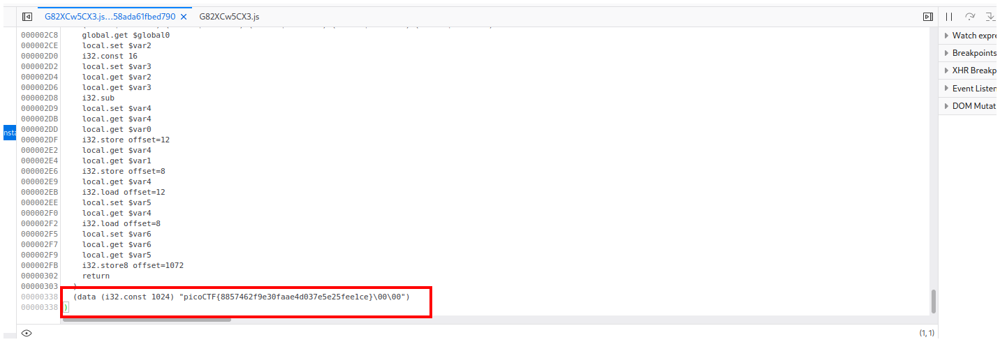

# PicoCTF2021 - Some Assembly Required 1

## Solución

Como no hay descripción entonces vemos los archivos que tiene la página en las **herramientas de desarrollador** y luego en la pestaña **Debugger**.

Después nos vamos a la pestaña que dice **wasm://** y vemos que hay un archivo wasm dentro. Si no te muestra el archivo como a mí, debes recargar la página.

Podemos ver un archivo wasm.

Si vamos al final del archivo veremos la flag.

## Flag

`picoCTF{8857462f9e30faae4d037e5e25fee1ce}`