# PicoCTF2021 - Who are you?

## Descripción

Let me in. Let me iiiiiiinnnnnnnnnnnnnnnnnnnn 

## Hints

- It ain't much, but it's an RFC https://tools.ietf.org/html/rfc2616

## Solución

Primero vamos a Burpsuite y abrimos el navegador.

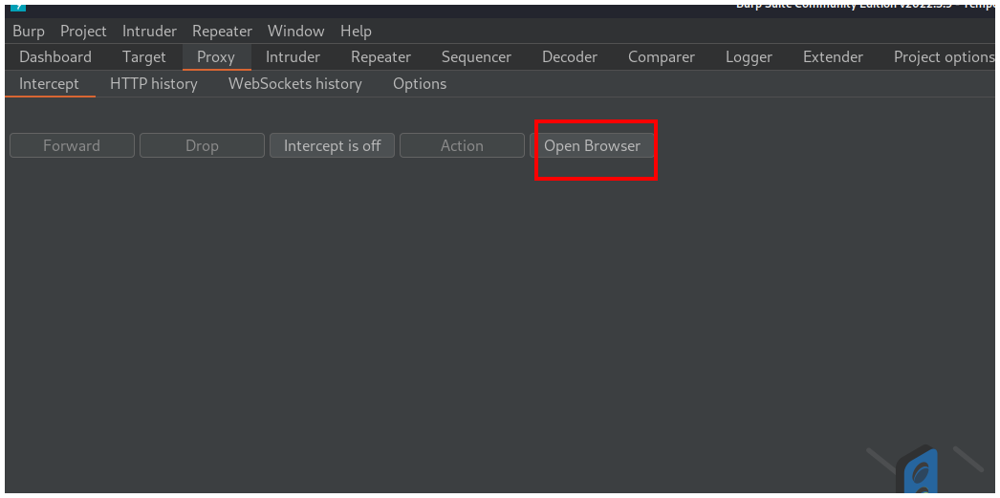

En el navegador vamos a la página del reto.

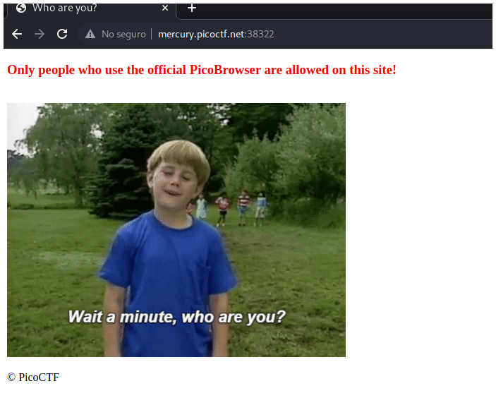

Hacemos click en el botón **Intercept is off** para que cambie a **Intercept is on** y así poder interceptar la petición con la que vamos a trabajar.

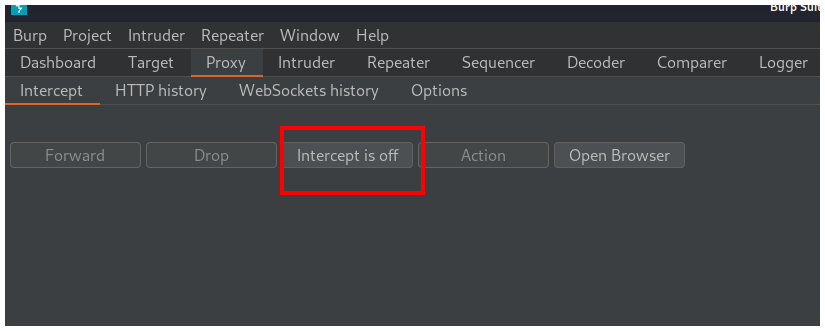

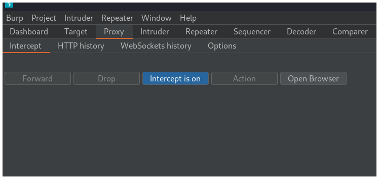

Vamos al navegador, recargamos la página y vemos la petición en Burpsuite. Después hacemos click derecho sobre la petición y la enviamos al **Repeater**.

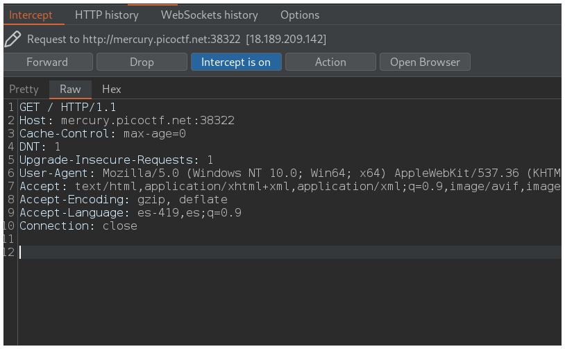

Nos vamos a la pestaña **Repeater**, hacemos click en **Send** y debajo de **Response** nos vamos a la pestaña  **Render**.

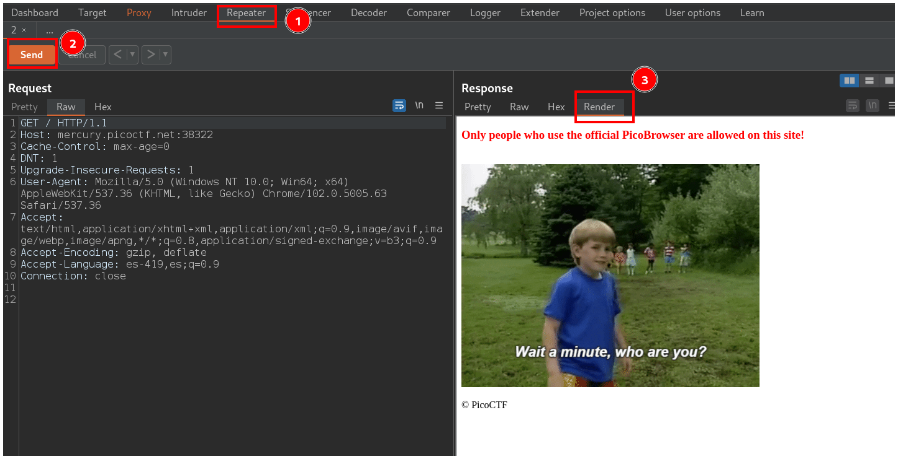

La página nos dice que nuestro navegador debe ser **PicoBrowser**, entonces debemos cambiar el header **User-Agent** para que diga **PicoBrowser**

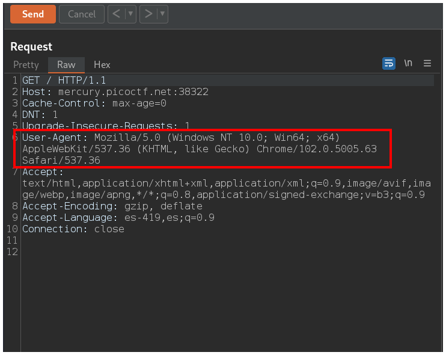

Después de cambiar el **User-Agent** y hacer click en **Send**, la página nos dice que no confía en usuarios que vengan de otro sitio.

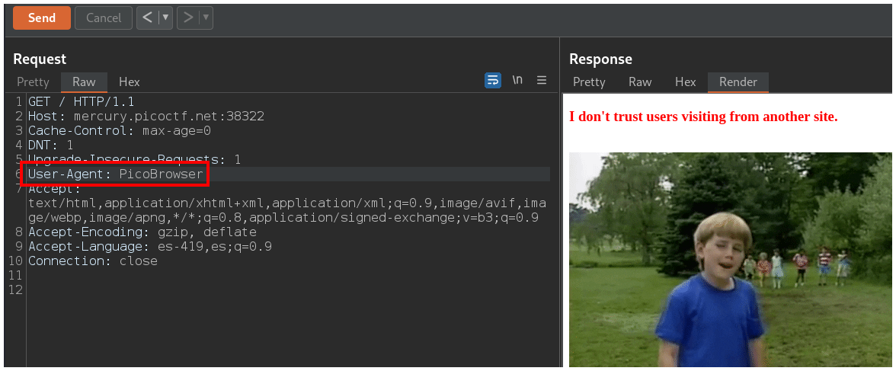

Como nos dice que debemos venir desde el mismo sitio, agregamos una cabecera llamada **Referer** y le colocamos la misma dirección de la cabecera **Host**.
 
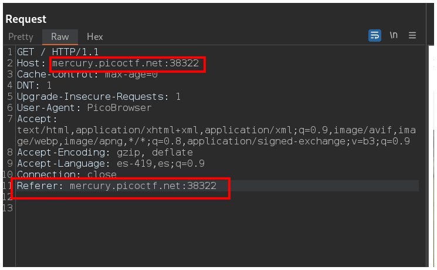

Ahora nos dice que el sitio solo funcionaba en el 2018.

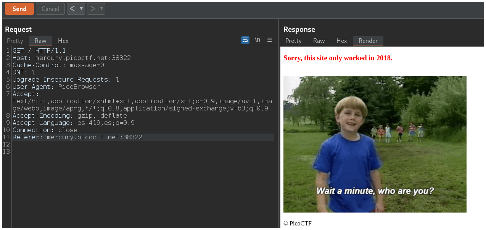

Para resolver esto, le agregamos otra cabecera llamada **Date**, le agregamos una fecha como la que coloqué yo, y que tenga de año el 2018. Finalmente hacemos click en el botón **Send**.

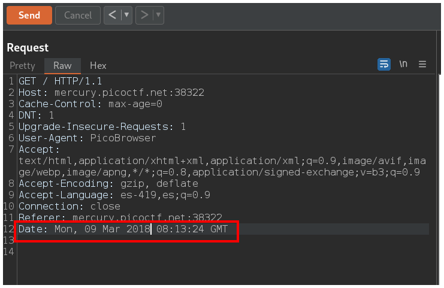

Ahora nos dice que la página solo acepta gente de Suecia.

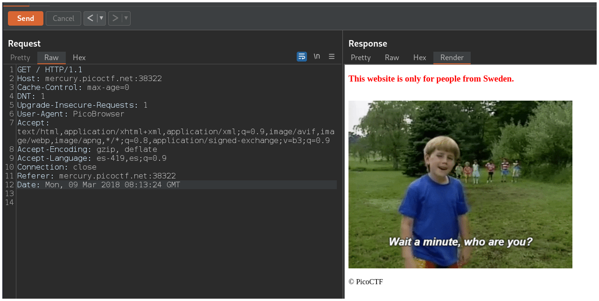

Necesitamos agregar otra cabecera llamada **X-Forwarded-For** y agregar cualquier dirección **ip** de Suecia. 

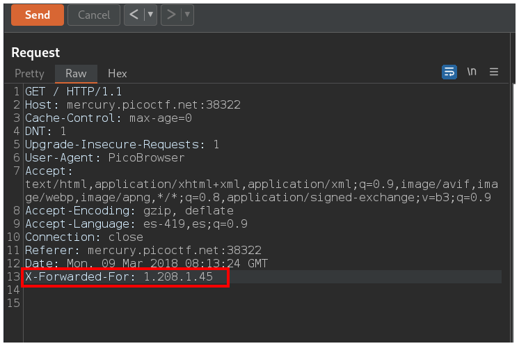

Hacemos click en el botón **Send** y ahora la página nos pregunta que por qué no hablamos sueco.

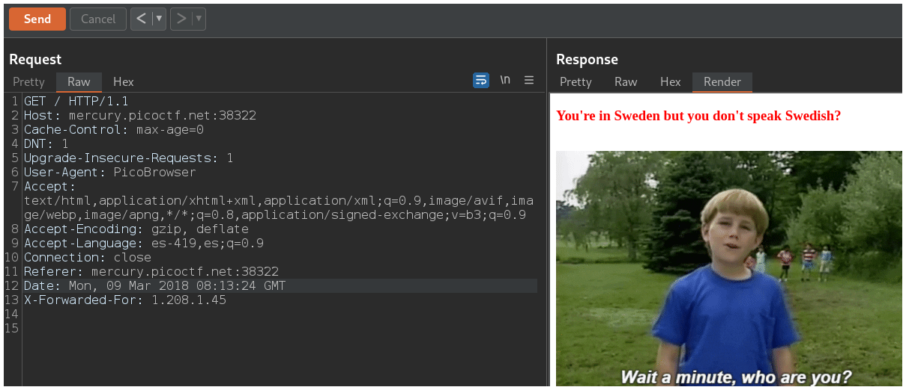

Para solucionar esto agregamos las siglas **sv** al final de la cabecera **Accept-Language** separado por una coma.

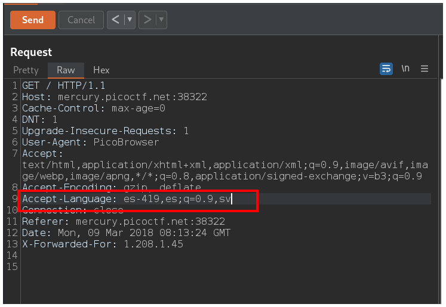

Hacemos click en el botón **Send** y podemos ver la flag.

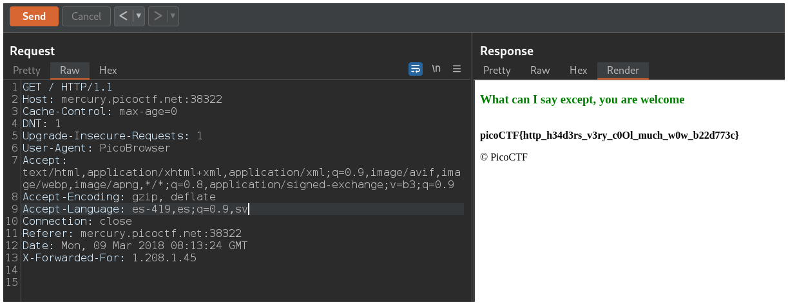

Para copiarla simplemente nos vamos a la pestaña **Raw** que está a la izquierda de **Render** y bajamos un poco.

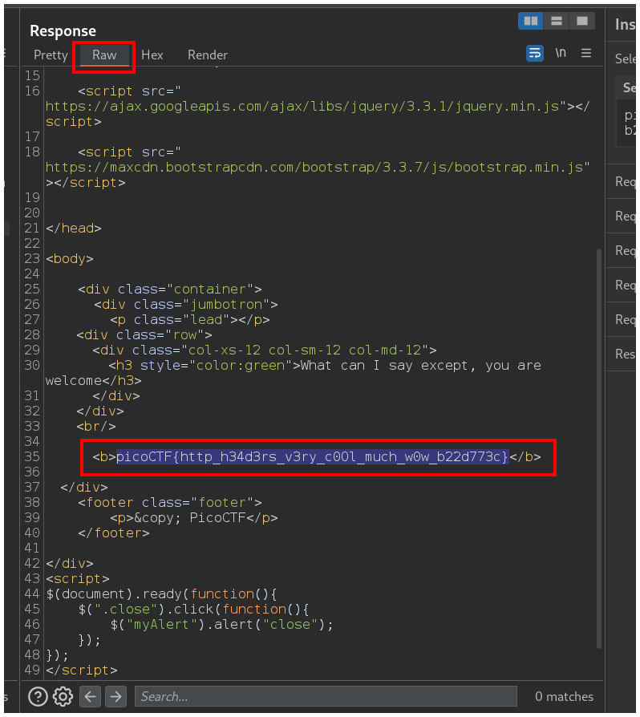

## Flag

`picoCTF{http_h34d3rs_v3ry_c0Ol_much_w0w_b22d773c}`