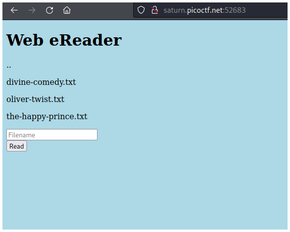
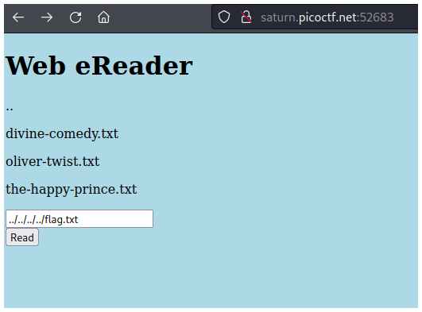
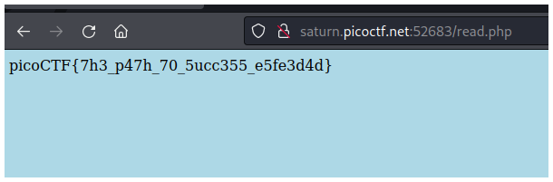

# PicoCTF2022 - Forbidden Paths

## Descripción

We know that the website files live in `/usr/share/nginx/html/` and the flag is at `/flag.txt` but the website is filtering absolute file paths. Can you get past the filter to read the flag?

## Solución

Según la descripción nos encontramos en `/ush/share/nginx/html` y debemos llegar hasta `/flag`.

Para esto debemos imaginar cómo abririamos el archivo flag desde la ruta en la que nos encontramos. Debemos ir 4 carpetas hacia atrás hasta llegar a la raíz y abrir flag.txt, para esto agregamos 4 `../` y escribimos flag.txt.

Si le damos al botón **Read** veremos la flag.

## Flag

`picoCTF{7h3_p47h_70_5ucc355_e5fe3d4d}`