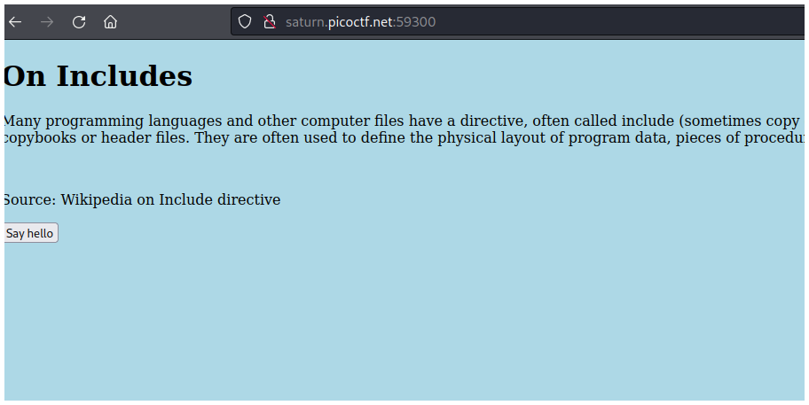
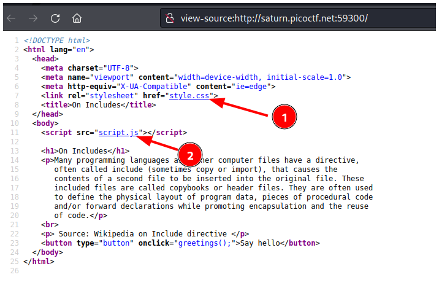
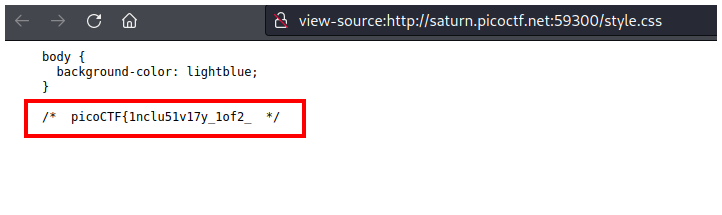
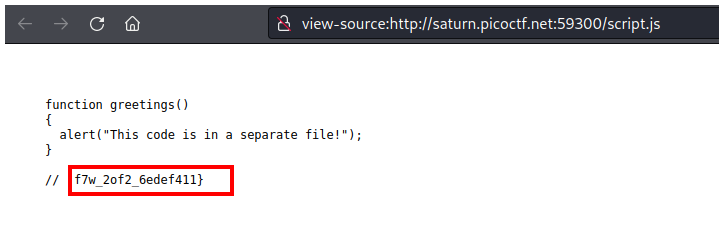

# PicoCTF2022 - Includes

## Descripción

Can you get the flag? Go to this website and see what you can discover.

## Hints

- Is there more code than what the inspector initially shows?

## Solución

Primero tienes que presionar `CTRL + u` para ver el código fuente de la página.

En el código fuente puedes ver 2 archivos **style.css** y **script.js**.

La primera parte está en **style.css**.

Y la segunta está en **script.js**.

## Flag
`picoCTF{1nclu51v17y_1of2_f7w_2of2_6edef411}`