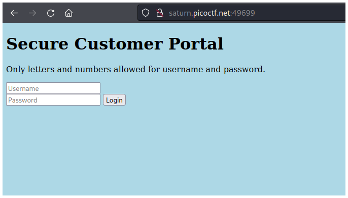
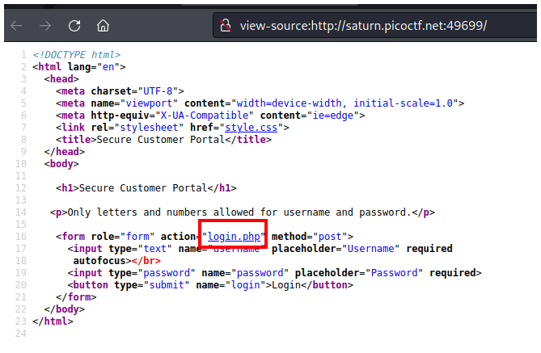
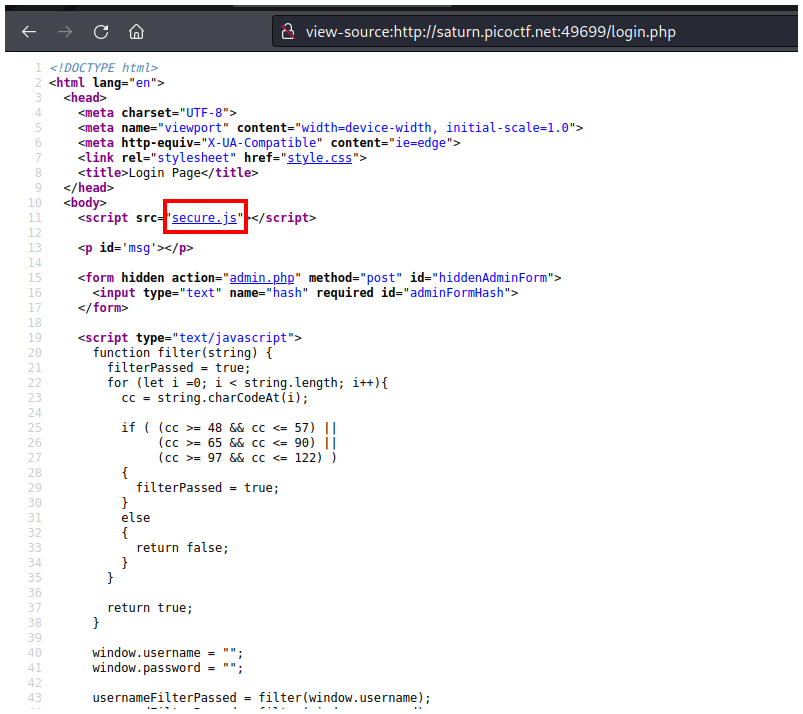
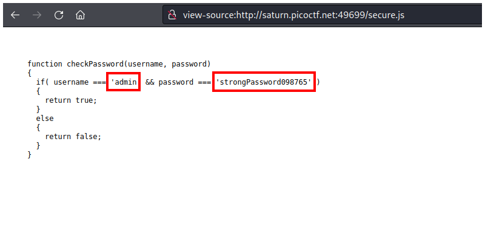
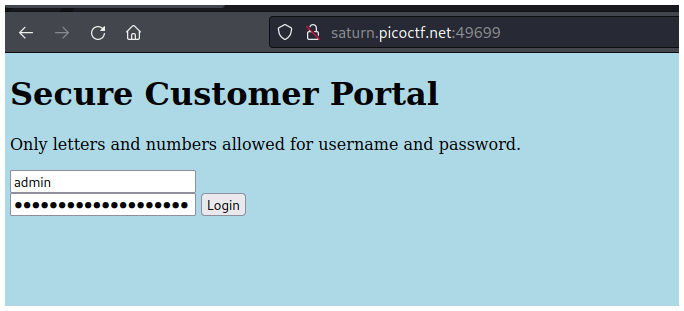

# PicoCTF2022 - Local Authority

## Descripción

Can you get the flag? Go to this website and see what you can discover.

## Hints

- How is the password checked on this website?

## Solución

Primero debes ir al código fuente de la página presionando `CTRL + u`.

Ahí verás un archivo **login.php** que debes abrir.

En el código fuente de **login.php** puedes ver otro archivo interesante llamado **secure.js**.

Si lo abres verás el usuario y contraseña.

Este usuario y contraseña debes ingresarlo en la página principal.

Si haces click en **login** verás la contraseña.

## Flag

`picoCTF{j5_15_7r4n5p4r3n7_05df90c8}`