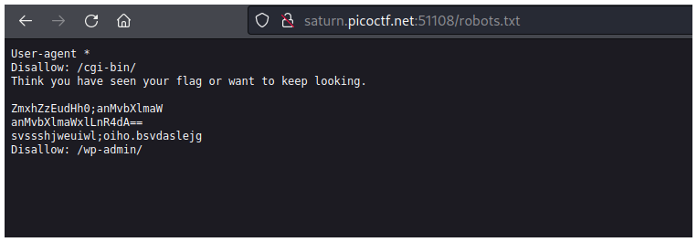
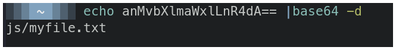
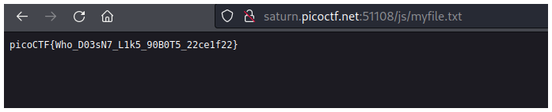

# PicoCTF2022 - Roboto Sans

## Descripción

The flag is somewhere on this web application not necessarily on the website. Find it.

## Solución

La página principal no nos muestra nada interesante, pero como el reto se llama roboto seguramente encontraremos algo en el archivo **robots.txt**.

Encontramos unas cadenas de texto codificadas en base64.

Si decodificamos la segunda línea podemos ver un archivo.

Si vamos a ese archivo en la página web podemos ver la flag.

## Flag

`picoCTF{Who_D03sN7_L1k5_90B0T5_22ce1f22}`