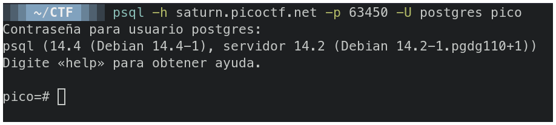
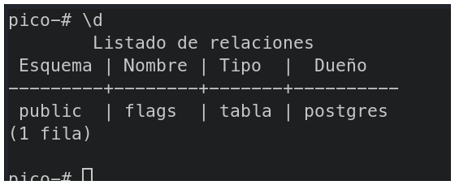
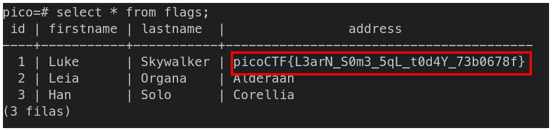

# PicoCTF2022 - SQL Direct


## Descripción

Connect to this PostgreSQL server and find the flag!


## Hints

- What does a SQL database contain?


## Solución

Primero debemos conectarnos a la base de datos con el comando y contraseña que nos entrega la página.



Cuando entremos en la base de datos escribimos `\d` para listar las tablas que existen. Podemos ver una que se llama **Flags**.



Para listar el contenido de esta tabla usamos el siguiente comando:

```sql
select * from flags;
```

Y podemos ver la flag.




## Flag

`picoCTF{L3arN_S0m3_5qL_t0d4Y_73b0678f}`