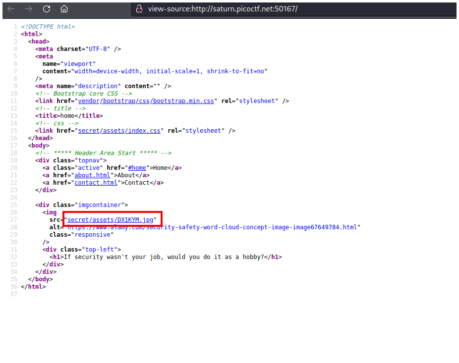
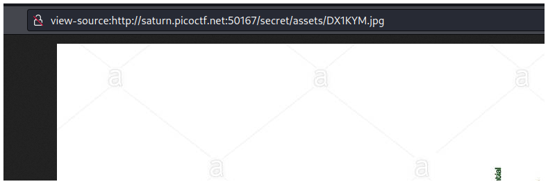
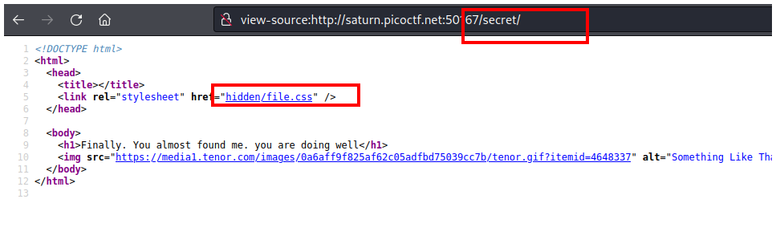
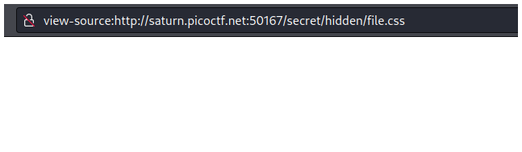
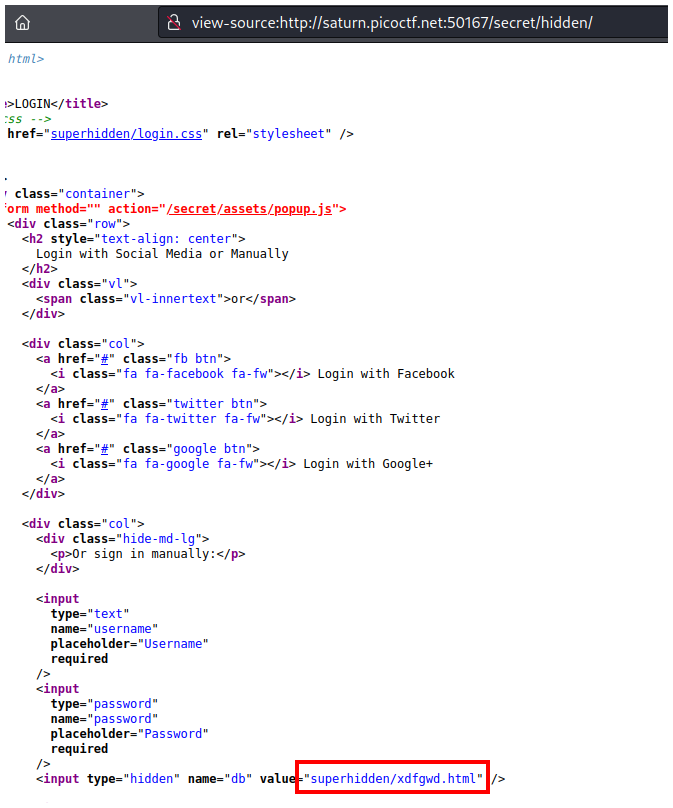
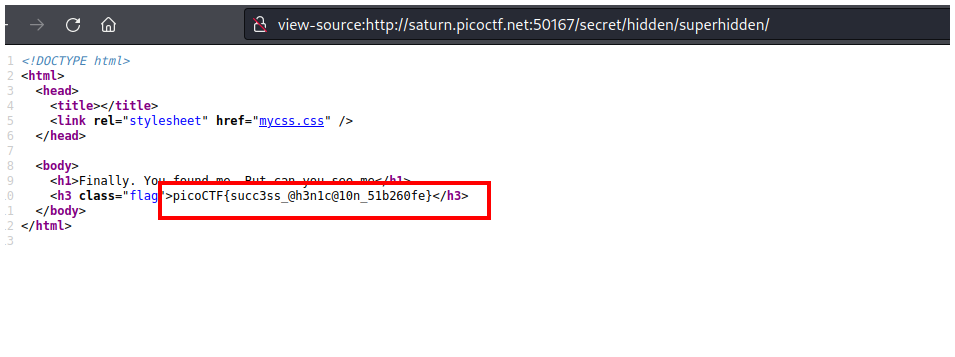

# PicoCTF2022 - Secrets

## Descripción

We have several pages hidden. Can you find the one with the flag?

## Hints

- folders folders folders

## Solución

En la página principal no vemos nada, entences apretamos `CTRL + u` para ver el código fuente de la página.

En el código fuente vemos un archivo que nos llama la atención `secret/assets/DX1KYM.jpg`.

Si vamos al archivo solo vemos una imagen.

Pero si vamos a la ruta `secrets` vemos otro archivo que nos llama la atención `hidden/file.css`.

Si vamos al archivo no vemos nada.

Pero si vamos a la ruta `secrets/hidden` veremos contenido y al final de la página veremos otro archivo llamado `superhidden/xdfgwd.html`.

Si vamos al archivo nuevamente no veremos nada.

Pero si vamos a la ruta `secret/hidden/superhidden` veremos la flag.

## Flag

`picoCTF{succ3ss_@h3n1c@10n_51b260fe}`