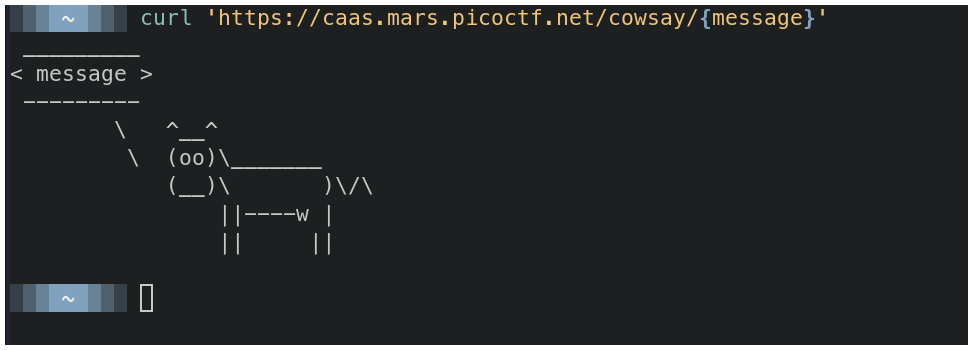
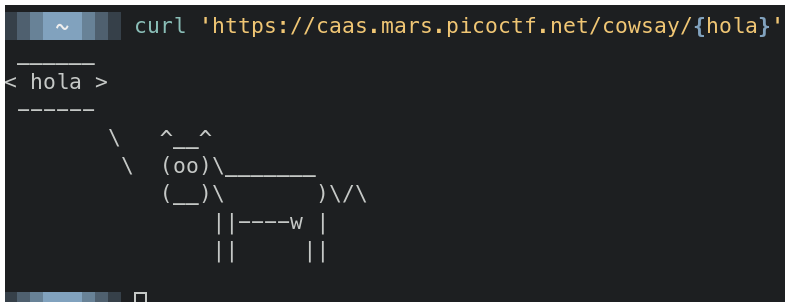
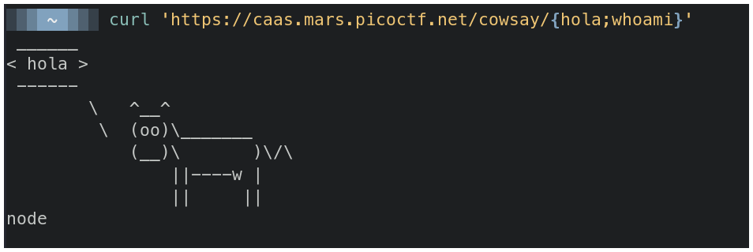
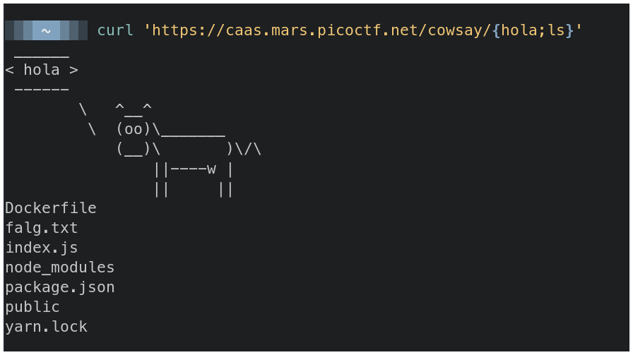
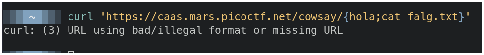
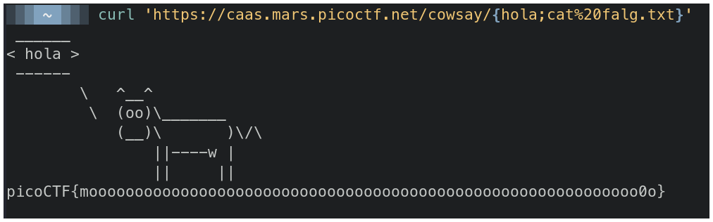

# PicoMini by redpwn - caas

## Descripción

Now presenting cowsay as a service

## Solución

En la página principal vemos una url.

En la termina usamos el comando **curl** contra esta url y vemos una vaca que devuelve el mensaje que escribimos entre las llaves **{}**.

Si agregamos un punto y coma y luego un comando comprobamos que tenemos ejecución de comandos.

Con **ls** vemos los archivos que se encuentran en la máquina y vemos uno que nos llama la atención: **falg.txt**.

Con el comando **cat falg.txt** deberiamos ver el contenido y obtener la flag, pero tenemos un error.

Esto es porque **curl** (según lo que entiendo) termina la url hasta que ve un espacio, así que la url terminaría en **cat** y no leería **falg.txt}**. 

Para solucionar esto, cambiamos el espacio que hay entre el comando **cat** y el archivo **falg.txt** por el espacio pero de forma **URL Encoded** que sería `%20`, así el servidor puede interpretar el espacio de forma correcta.

## Flag

`picoCTF{moooooooooooooooooooooooooooooooooooooooooooooooooooooooooooo0o}`